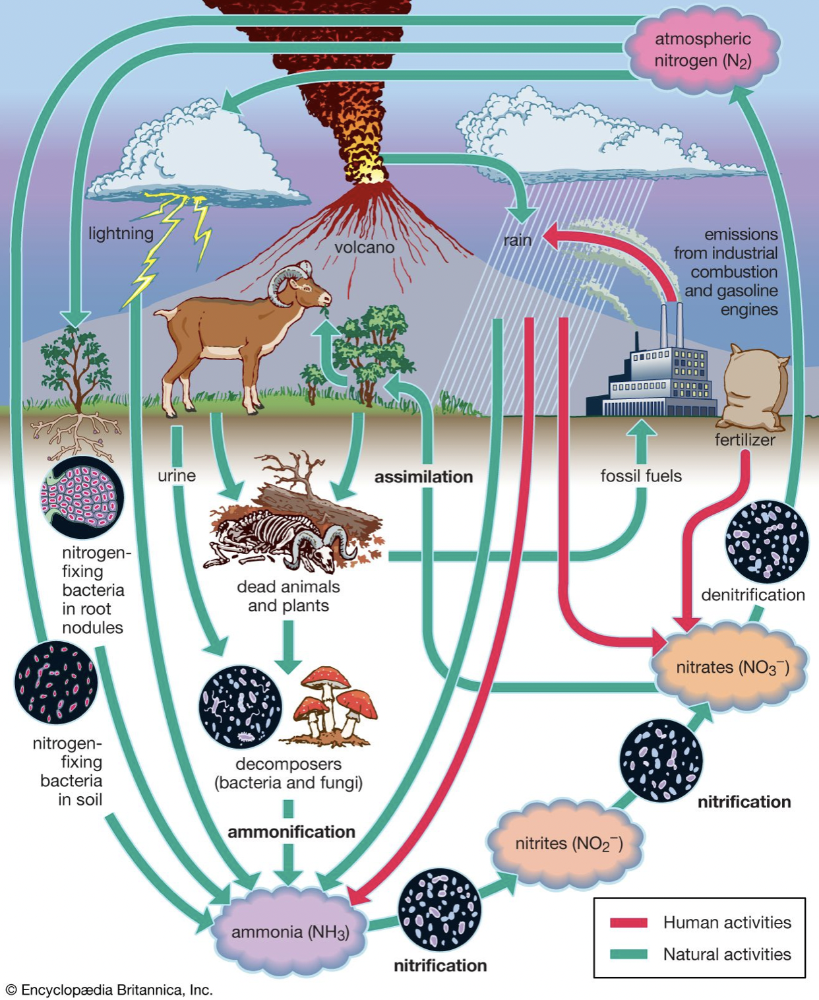
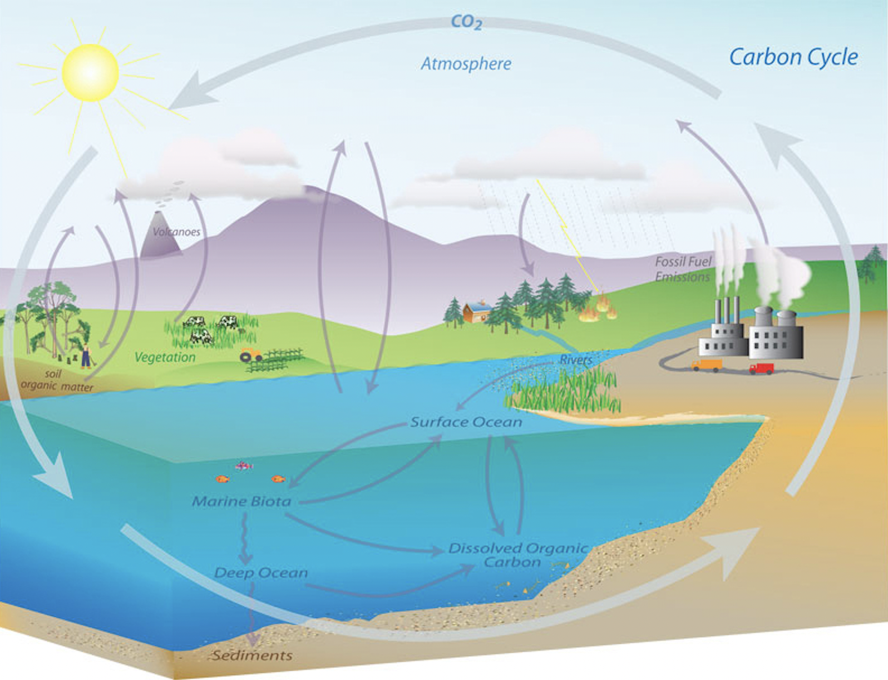
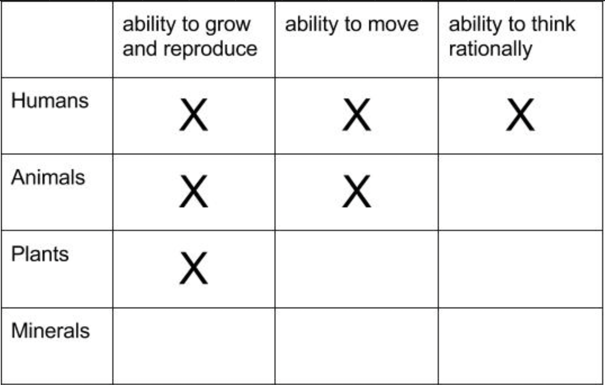
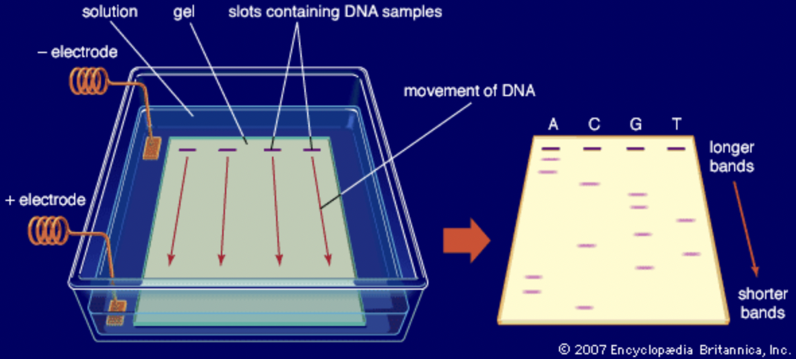
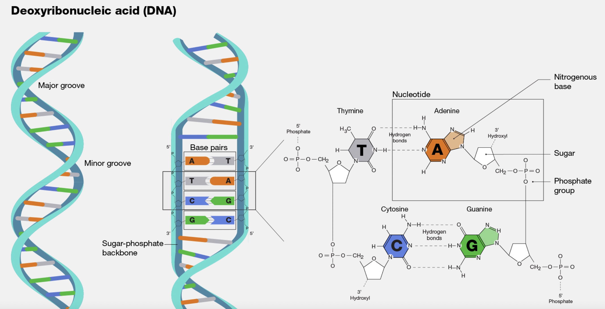
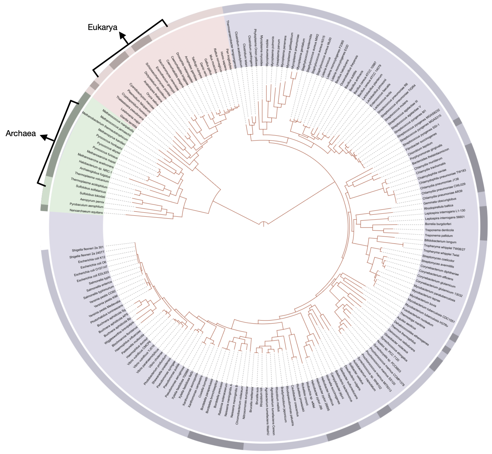
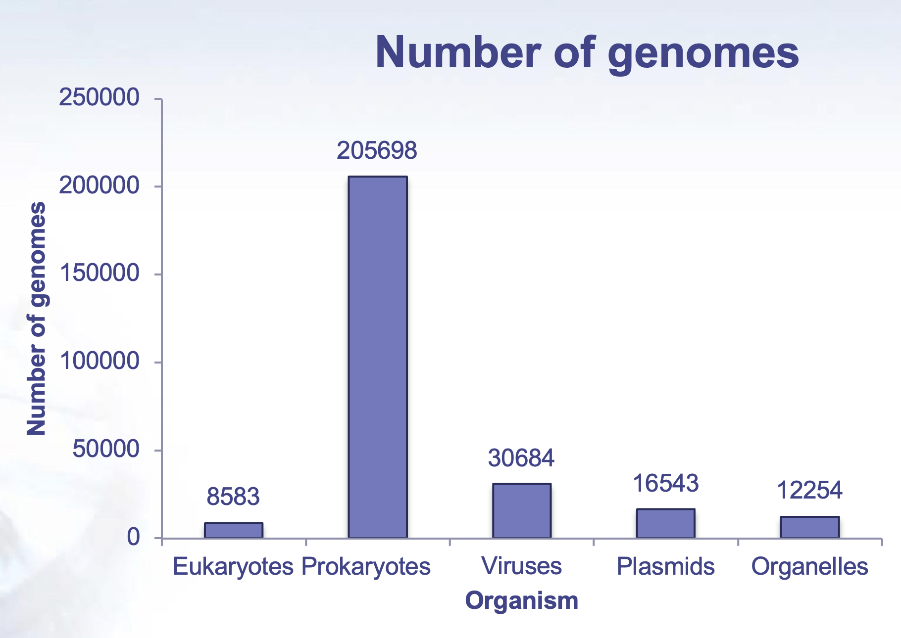

# Community Profiling Part I

## Microbes were the first life forms on this planet

1. Earth declares its independence about 4600 MYA

{width=100%}

2. First photosynthetic bacteria 3.4 billion years ago (BYA)
+ Used sunlight for energy to create biomass
+ Anaerobic (anoxic photosynthesis)

{width=60%}

{width=60%}

3. 2.7 BYA first oxygen producers emerge
+ Oxygen as waste product during respiration
+ Most of the oxygen was sequestered and not readily available
4. 2.3 BYA atmosphere has oxygen
5. 500 million year ago (MYA) first terrestrial plants
6. 200 MYA mammals emerged
7. 13 MYA one of us makes all of us proud by learning how to fly
8. 10 MYA the branch of life currently called homo emerges
9. 400 years ago humans observe the first microbe under
a simple scope

#### THERE WOULD BE NO LIFE WITHOUT MICROBES{-}

### Microbes enable habitability on Earth by catalyzing reactions of biogeochemical cycles

1. The amount or % of elements on Earth remains constant
2. Recycling of these elements, flux, and bio-availability is
largely taken care of by microbes
3. Best example to illustrate – nitrogen

+ 78% of Earths atm is N2
+ Required for important biological processes
+ In gaseous form it is unavailable
+ In fact many processes are N2 limited
+ Making N2 bioavailable in a form that can be
by eukaryotes is completely on the shoulders of microbes

#### Nitrogen Cycle
 
{width=80%}

https://cdn.britannica.com/37/6537-050-CF14602B/ammonia-Nitrogen-fixation-nitrogen-form-means-nitrates-1909.jpg

#### Carbon Cycle

{width=80%}

{width=80%}

https://www.pmel.noaa.gov/co2/story/Carbon+Cycle

How many microbes??

1. 40 million microbes in a gram of soil
2. One million microbes in a ml of fresh water
3. One trillion in a human body

#### MICROBES ARE ABUNDANT......AND EXTREMELY DIVERSE!{-}

## How many kinds of living beings are there?

1. Aristotle’s Scala naturae
= **350 BC**

{width=55%}
{width=40%}

https://sites.google.com/site/aristotlethebiologist/aristotle-s-biology/great-chain-of-being

{width=60%}

https://upload.wikimedia.org/wikipedia/commons/e/e9/Die_Leiter_des_Auf-_und_Abstiegs.jpg

### 2000 yrs later{-}

2. Edward Hitchcock
    + 1840

{width=80%}

https://upload.wikimedia.org/wikipedia/commons/8/8f/Edward_Hitchcock_Paleontological_Chart.jpg

3. Ernst Haeckel
    + 1879

{width=80%}

https://upload.wikimedia.org/wikipedia/commons/d/de/Tree_of_life_by_Haeckel.jpg

4. Charles Darwin 
    + 1837
    + The idea that species could have evolved from an ancestor
    + This could have happened through transmutations
    + Premise for trees today
    + ALL METHODS DEPEND ON **OBSERVABLE MORPHOLOGICAL TRAITS** FOR CATEGORIZATION

{width=80%}

## What happened when we found out about microbes?

{width=40%}

https://hms.harvard.edu/news/diet-gut-microbes-immunity

### Roadmap to where we are now with determining microbial diversity{-}

1. Leeuwenhoek
+ Father of microbiology
+ Late 1600’s
+ Microscope

{width=80%}

{width=80%}

2. Robert Koch
+ 1890
+ First time bringing microbes to the lab
+ Cultivation of microbes

{width=80%}
{width=80%}

3. Discovery of DNA structure
+ Rosiland Franklin
    + 1951

{width=80%}

{width=80%}

+ Frederick Sanger
    + 1975
    
{width=80%}

+ Carl Woese
    + 1977
    + Archaea
    + Phylogenetic tree based on Woese et al. rRNA analysis. The vertical line at bottom represents the last universal common ancestor (LUCA).

{width=80%}

#### DNA Structure{-}

{width=80%}

https://youtu.be/L9NriBoubWE

## Tree of Life

{width=80%}

“Visible organisms represent the smallest sliver of life’s diversity. Bacteria are the true lords of the world. They have been on this planet for billions of years and have irrevocably changed it, while diversifying into endless forms most wonderful and most beautiful.” (The Atlantic)

Life just got weird!

{width=100%}

## What Makes Microbes so Special?

1. -15oC/4oF to 130oC/266oF temperatures
2. 0 to 12.8 pH acidity
3. More than 200 atm pressure
4. 4 miles deep into Earth’s crust
5. Up to 5kGy radiation

###  Grand Prismatic Spring – YNP – 183oC{-}

1. Validates the importance of microbes and sums up life on Earth with boundaries.

{width=80%}

2. Microbes are constantly trying to evolve and get deeper and deeper into the hot springs

3. Eukaryotes only surround this spring – cannot survive close to the hot spring

### The great “plate count” anomaly

1. Cultivation based cell counts are orders of magnitude lower than direct microscopic observation

{width=80%}

2. As microbiologists, we are able to cultivate only a small minority of naturally occurring microbes

3. Our nucleic acid derived understanding of microbial diversity has rapidly outpaced our ability to culture new microbes

### Total number of genomes at NCBI

**Most Prokaryotes:**

1. Haploid genome
2. Single circular chromosome, plasmids
3. Metabolic diversity
4. Genetic malleability
5. No nucleus
6. Easy interspecies gene transfer

{width=80%}

https://www.ncbi.nlm.nih.gov/genome/browse/#!/overview/

## Roadmap to Culture Independent Techniques

1. rRNA as an evolutionary marker 
+ 1977 
+ (Woese and Fox, PNAS)
2. Polymerase Chain Reaction
+ 1985
+ (K. Mullis, Science)
3. “Universal Primers” for rRNA sequencing
+ 1985
+ (N. Pace, PNAS)
4. PCR amplification of 16S rRNA gene
+ 1989
+ (Bottger, FEMS Microbiol)
5. Curation and hosting of RDP
+ Early 1990’s
+ (rRNA database) FTP
6. Term ‘microbiome’
+ 2001
+ coined by Lederberg and McCray

## Microbiomes and their significance
+ Microbes do not work or function as a single entity
+ Most microbial activities are performed by complex communities of microorganisms
    + **Microbiome**

### What is a microbiome

1. Totality of microbes in a defined environment, and their intricate interactions with each other and the surrounding environment
+ A population of a single species is a culture(monoculture), extremely rare outside of lab and in some infections
+ A microbiome is a mixed population of different microbial species
+ MIXED COMMUNITY IS THE NORM!
 
### Why Study Microbiomes
 
1. Microbes modulate and maintain the atmosphere
+ Critical elemental cycles (carbon, nitrogen, sulfur, iron,...)
+ Pollution control, clean up fuel leaks
2. Microbes keep us healthy
+ Protection from pathogens
+ Absorption/production of nutrients in the gut
+ Role in chronic diseases (obesity, Crohn’s/IBD, arthritis...)
3. Microbes support plant growth and suppress plant disease
+ Most complex communities reside in soil
+ Crop productivity

### Why is Microbiome Research New?

1. Bias for microbes (especially pathogens) that are
cultivable
+ Culture-based methods do not detect majority of microbes
+ Only pathogens are easily detected
+ And most microbes are not pathogens
2. Availability of tools
+ Discovery of culture independent techniques
+ Amplicon sequencing and DNA sequencing

{width=100%}

   
### Biodiversity and functional genomics in the human microbiome      
      

{width=80%}
{width=80%}

1. Recovered over 150,000 microbial genomes from ~10,000 metagenomes

2. 70,178 genomes assembled with higher than 90% completeness

3. 3,796 SGBs (species-level genome bins) identified -77% of the total representing species without any publicly available genomes
 
### Microbiome Projects and Databases

1. American Gut Project
2. Earth microbiome Project
3. Human Oral Microbiome Database
4. CardioBiome
5. Human Microbiome Studies – JCVI
6. MetaSub – Metagenomics and metadesign of Subways and Urban Biomes
7. Gut microbiota for Health
8. NASA: Study of the impact of long term space travel in the Astronaut’s
microbiome
9. Michigan microbiome project
10. Coral microbiome project 
11. Seagrass microbiome project
