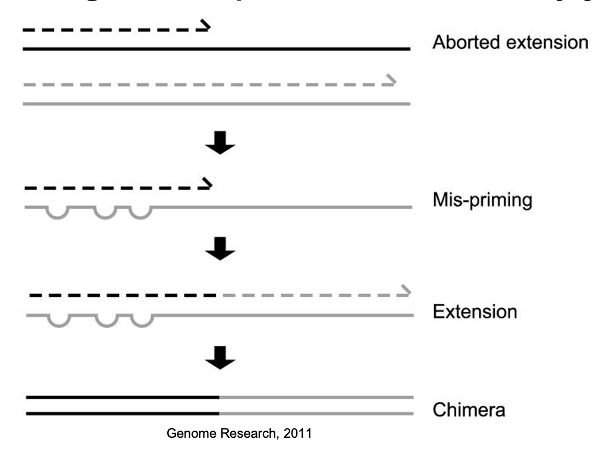
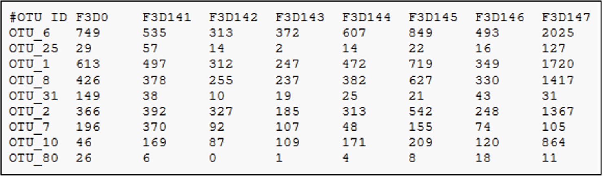
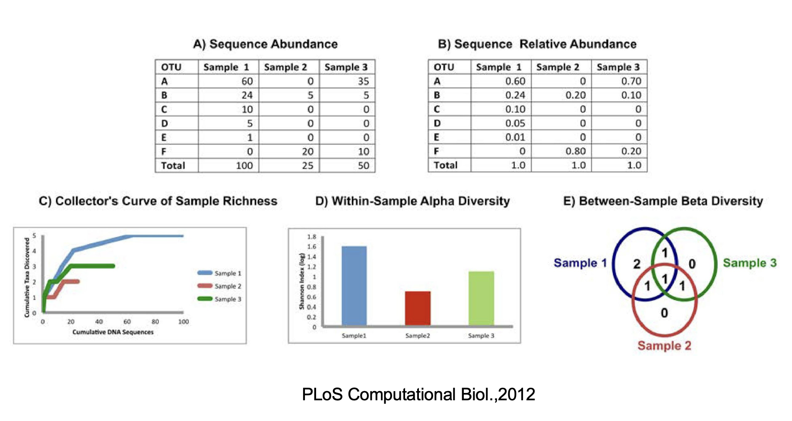
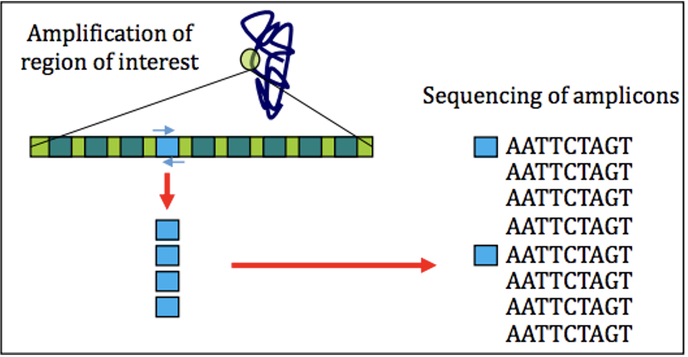
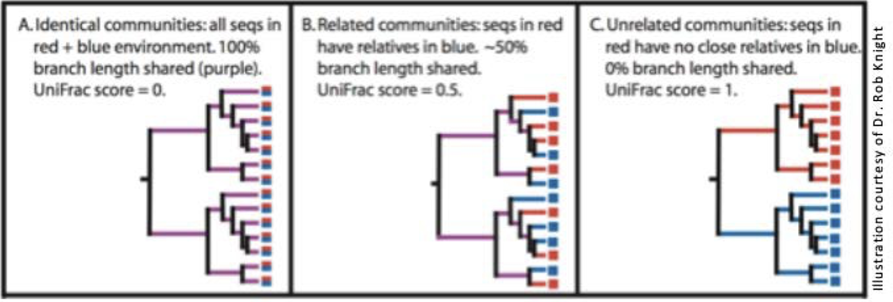

# Data Processing

## FastQC

{width=80%}

1. Many tools/options to filter and trim data
2. Trimming does not always improve things as valuable information
can be lost!
3. Removal of adapters is critical for downstream analysis

## Dereplication

1. In this process all the quality-filtered sequences are collapsed into a set of unique reads, which are then clustered into OTUs
2. Dereplication step significantly reduces computation time by eliminating redundant sequences

What's an OTU?

https://www.youtube.com/watch?v=azI9taClDhQ

## Chimera detection and removal of non-bacterial sequences

Chimeras as artifact sequences formed by two or more biological sequences incorrectly joined together
 
{width=80%}

Incomplete extensions during PCR allow subsequent PCR cycles to use a partially extended strand to bind to the template of a different, but similar, sequence. This partially extended strand then acts as a primer to extend and form a chimeric sequence.

## Clustering

1. Analysis of 16S rRNA relies on clustering of related sequences at a particular level of identity and counting the representatives of each cluster

{width=80%}

Some level of sequence divergence should be allowed – 95% (genus-level, partial 16S gene), 97% (species-level) or 99% typical similarity cutoffs used in
practice and the resulting cluster of nearly identical tags (assumedly identical genomes) is referred to as an OTU (Operational Taxonomic Unit)

## Create OTU tables

OTU table is a matrix that gives the number of reads per sample per OTU

{width=80%}

## Bin OTUs into Taxonomy (assign taxonomy)

1. Accuracy of assigning taxonomy depends on the
reference database chosen
+ Ribosomal Database Project
+ GreenGenes
+ SILVA
2. Accuracy depends on the completeness of databases

{width=80%}

## Assess Population Diversity: **alpha diversity**

1. Assessment of diversity involves two aspects
+ Species richness (# of species present in a sample)
+ Species evenness (distribution of relative abundance of species)

2. Total community diversity of a single sample/environment is given by alpha-diversity and represented using rarefaction curves

3. Quantitative methods such as Shannon or Simpson indices measure evenness of the alpha- diversity
 
{width=50%}

## Assess Beta Diversity

1. Beta-diversity measures community structure differences (taxon composition and relative abundance) between two or more samples
+ For example, beta-diversity indices can compare similarities and differences in microbial communities in healthy and diseases states
2. Many qualitative (presence/absence taxa) and
quantitative(taxon abundance) measures of community
distance are available using several tools
+ LIBHUFF, TreeClimber, DPCoA, UniFrac (QIIME)
 
## Measuring Population Diversity: **alpha and beta diversity**

{width=100%}

## Diversity Measurements with 16s rRNA sequencing

1. Overall Benefits
+ Cost effective
+ Data analysis can be performed by established pipelines
+ Large body of archived data is available for reference

2. Overall Limitations
+ Sequences only a single region of the genome
+ Classifications often lack accuracy at the
species level
+ Copy number per genome can vary. While they
tend to be taxon specific, variation among
strains is possible
+ Relative abundance measurements are
unreliable because of amplification biases
+ Diversity of the gene tends to overinflate
diversity estimates

3. FastQC for 16S rRNA dataset
+ Extremely biased per base sequence content
+ Extremely narrow distribution of GC content
+ Very high sequence duplication levels
+ Abundance of overrepresented sequences
+ In cases where the PCR target is shorter than the read length, the sequence will read through into adapters

## Taxonomy: Expectation vs Reality

{width=80%}

## Beta Diversity - UniFrac

1. Measures how different two samples’ component  sequences are

{width=40%}

2. Weighted Unifrac: takes abundance of each sequence  into account

## Results from Paper

1. Main phyla: Firmicutes, Bacteroidetes, Proteobacteria,  Actinobacteria, Fusobacteria with differences bw samples
2. Sputum (patient) samples had highest diversity followed  by oropharynx samples followed by nasal
3. Healthy controls (N and O) more diverse than samples  from TB patients
4. Between-group comparisons?
5. Phyla differences?
