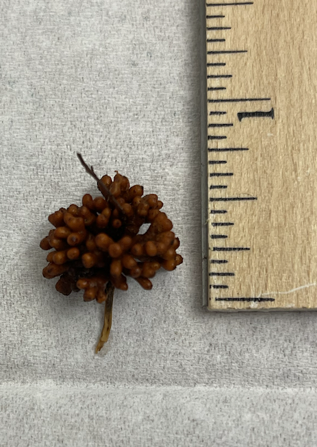
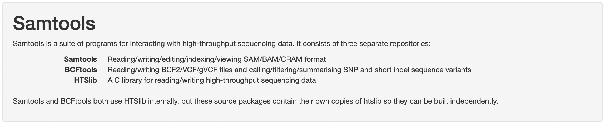

# Filter Host Reads

{width=40%}
{width=40%}


In order to focus on sequencing reads from the microbes in the nodule, we will filter out reads that align to the red alder genome as follows:

1. Align the fastq-formatted reads to the red alder genome using minimap2.  
2. Extract reads that do not align to red alder and sort them using samtools.  
3. Create a fastq file with only the unaligned reads using samtools bam2fastq.  
4. Compress the fastq file using gzip.  

## Setup


Activate the environment that contains minimap2 and samtools

{width=80%}

```{bash,eval=FALSE}
conda activate filter-reads
```

Make a directory and go into it

```{bash,eval=FALSE}
mkdir ~/microbe_fastq
cd ~/microbe_fastq
```

Link to the merged minion reads

```{bash,eval=FALSE}
ln -s /home/data/metagenomics-2310/red-alder-reads/3469-3.all.fastq .
```

## Alignment

Run Minimap2 to align the MinION reads to the red alder genome  

+ The -x map-ont parameter (allows ~10% error + divergence)

```{bash,eval=FALSE}
minimap2 -x map-ont -L -t 8 -a \
/home/data/metagenomics-2310/red-alder-reads/red-alder-genome.fasta \
3469-3.all.fastq > 3469-3-minionxredalder.mm2.sam
```

## Get microbial reads

Now we will use samtools, which is available in the same environment, to pull out reads that didn't align to red alder.

{width=80%}


Convert the unmapped reads in the alignment file (sam) to a fastq file
    + The -f4 includes only reads with the 4 flag (unmapped)

```{bash,eval=FALSE}
samtools fastq -f4 3469-3-minionxredalder.mm2.sam > 3469-3.microbe.fq
```

Compress the new fastq file 
    + (note that it will automatically add the extension .gz)

```{bash,eval=FALSE}
gzip 3469-3.microbe.fq
```

### Now run these steps with 4956-3{-}

Reads are here: 

```{bash,eval=FALSE}
/home/data/metagenomics-2310/red-alder-reads/4956-3.all.fastq
```

