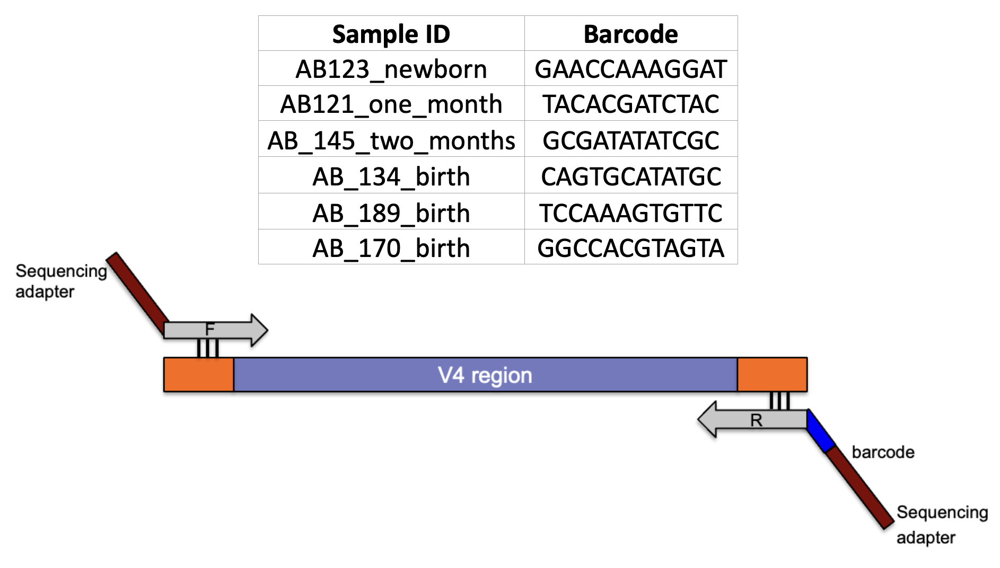
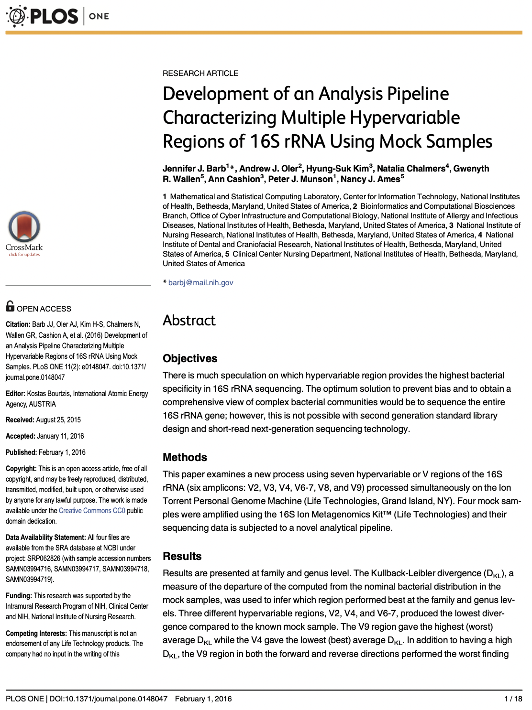
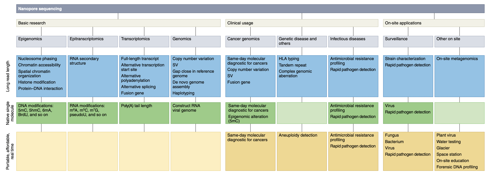
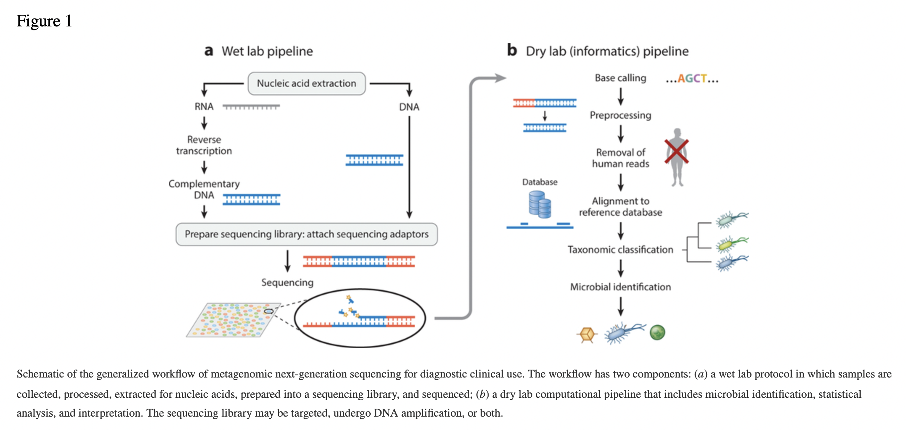
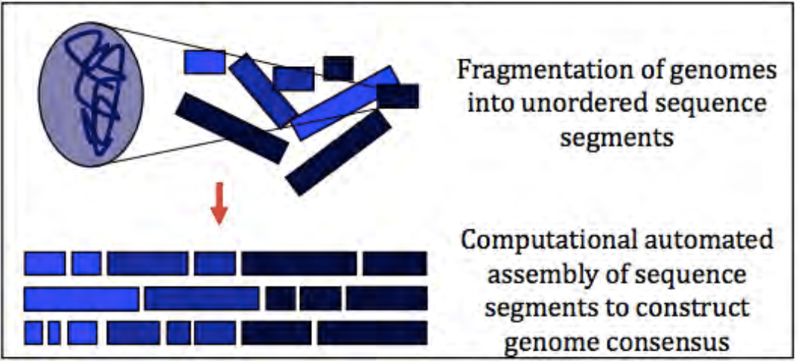
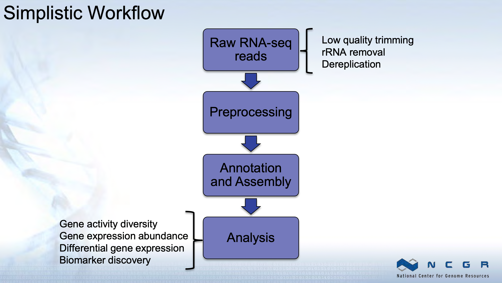
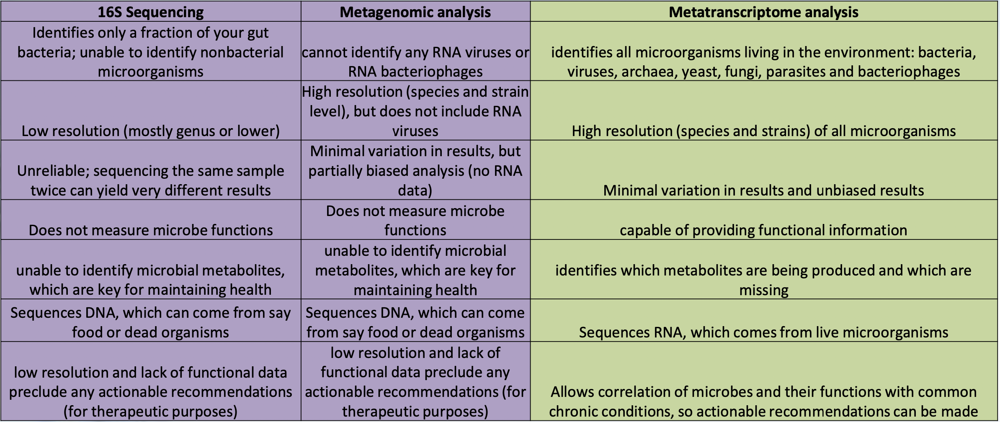

# Community Profiling

## Amplicon-based metagenomics

Amplicon-based metagenomics targets specific genes to understand which community members are present and to quantify community members (community profiling). Usually 16S or 18S are the genes that are amplified using polymerase chain reaction (PCR).

### 16S rRNA as an evolutionary chronometer

{width=80%}

1. Ubiquitous – present in all known life (excluding viruses)
2. Functionally constant wrt translation and secondary structure
3. Evolves very slowly – mutations are extremely rare
4. Large enough to extract information for evolutionary inference
5. Limited exchange – limited examples of rRNA gene sharing between organisms


### 16S rRNA hypervariable regions

{width=80%}

{width=80%}

Illustration of different hypervariable regions of 16S rRNA


### Addressing the ‘fine print’ while generating 16S rRNA gene amplicon libraries

1. Sample Collection
+ Sample collection significantly influences the microbiome profiler 
after sequencing
+ Sample storage
2. DNA isolation
+ Template concentration
+ Template extraction protocol
3. PCR amplification
+ PCR bias and inhibitors
+ Amplification of contaminants

J. Microbiol Methods (2018), App. Environ. Microbiol. (2014), Microbiome (2015)

### Steps Involved

1. Experimental Design: How many samples can be included in the sequencing run?
+ By using barcoded primers, numerous samples can be sequenced simultaneously (multiplexing)

{width=80%}

### Samples

1. More the number of samples, more cost effective the run (sequencing depth will be compromised)

Comparison of multiplexing capacity by sequencing system

{width=80%}

2. It is critical to have a ‘library prep manifest’ to document the position of each sample with its associated barcode along with additional metadata information

https://www.youtube.com/watch?v=3SEz-i517Oo&t=5s

### Include Controls

1. Between run repeat (process any sample in duplicate per run to measure reproducibility across runs)
2. Within run repeat (process any sample in duplicate per plate to measure reproducibility)
3. Water used during PCR (water blank- to determine if any contaminant was introduced during PCR reaction)
4. Water spiked with known bacterial DNA (mock bacterial communities- enables quantification of sequencing errors, minimizes bias during sampling and library preparation )


### Selection of primers and region of 16S gene influence microbial profile


<!--{width=80%}-->

V2, V4, V6-V7 regions produced consistent results

1. V2, V3 and V6 contain maximum nucleotide heterogeneity
2. V6 is the shortest hypervariable region
with the maximum sequence
heterogeneity
3. V1 is best target for distinguishing
pathogenic S aureus
4. V2 and V3 are excellent targets for
speciation among Staph and Strep pathogens as well as Clostridium and Neisseria species
5. V2 especially useful for speciation of Mycobacterium sp. and detection of E coli O157:H7
6. V3 useful for speciation of
Haemophilus sp
7. V6 best target for probe based PCR assays to identify CDC select agents (bio-terrorism agents)

https://journals.plos.org/plosone/article?id=10.1371/journal.pone.0148047


## Oxford Nanopore Sequencing

{width=80%}

### How does it work?

1. Proetin pore
    + nanoscale
    + biosensor
    + motor protein ratchets DNA/RNA through
    
2. Ionic current
    + constant voltage
    + in electrolytic solution
    + disrupted by nucleotide sequence
    + changes in current correspond to sequence

Watch the video below and answer questions:

https://www.youtube.com/watch?v=RcP85JHLmnI

1. How does the DNA bind to the pore?
2. Does something help guide the DNA to the pore?
3. What is the signal produced by the DNA?

https://www.youtube.com/watch?v=E9-Rm5AoZGw

Applications for ONT sequencing:


{width=100%}


## Metagenomics and Metatranscriptomics 

**Metagenomics:** Untargeted sequencing of all microbial genomes present in a sample.

### Shotgun Metagenomics

+ Study design and experimental protocol
+ Computational pre-processing
+ Sequence analysis
+ Post-processing
+ Validation

{width=100%}

### Sample collection and DNA extraction

1. Sample collection and preservation methods can affect quality and accuracy of metagenomic data
    + Collect sufficient biomass
    + Minimize contamination
    + Enrichment methods where applicable
2. DNA extraction methods can affect the composition of downstream sequence data
+ Method must be effective for diverse microbial taxa
    + Mechanical lysis (bead beating) method is considered superior,
however, data will be biased for easy-to-lyse microbes
    + Bead beating will result in short DNA fragments and lead to DNA loss during library prep methods.

### Sources of contamination
1. Kit or lab reagents
2. Low biomass samples are vulnerable to contamination as there is less ‘real’ signal to compete with low levels of contamination
    + Use ultraclean kits
    + Include blank sequencing controls
3. Cross- over from previous sequencing runs
4. PhiX control DNA
5. Human/ host DNA

### Coverage and Sequencing considerations

1. No published guidelines for ‘correct’ amount of coverage for a given environment

+ Choose a system that maximizes output in order to recover sequences from as many low-abundance members of the microbiome as possible

+ HiSeq 2500 or 4000, NextSeq and NovaSeq produce high volume data (120Gb- 1.5 Tb per run) – suited for metagenomics study

+ Multiplexing prudently will enable desired per-sample sequencing depth

### Illumina Sequencers and Yield

https://www.illumina.com/systems/sequencing-platforms.html

{width=100%}


### Generalized workflow of metagenomic next-generation sequencing for diagnostic clinical use


{width=100%}


### Generic Analysis Workflow

{width=100%}

### Strengths and weaknesses of assembly-based and read-based metagenomics analysis

{width=100%}

### Tools and web servers related to gut microbiome studies.

{width=100%}

### Benefits and limitations of whole genome metagenomics

**Benefits**

+ Integrative meta-omics
+ Strain-level profiling
+ Longitudinal study design
+ Capability of sequencing large regions or entire genome
+ Identification of organisms in addition to bacteria, archaea
+ Increased prediction of genes and functional pathways

**Limitations**

+ Expensive
+ Compute intensive 
+ Incomplete databases
+ Biases in functional profiling
+ Unvalidated data in the public space
+ Live or dead dilemma

{width=60%}

“What are they doing?” - Metatranscriptomics

{width=100%}

{width=100%}

### Benefits of Metatranscriptomics


{width=100%}


```
knitr::write_bib(c(
  .packages(), 'bookdown', 'knitr', 'rmarkdown'
), 'packages.bib')
```

