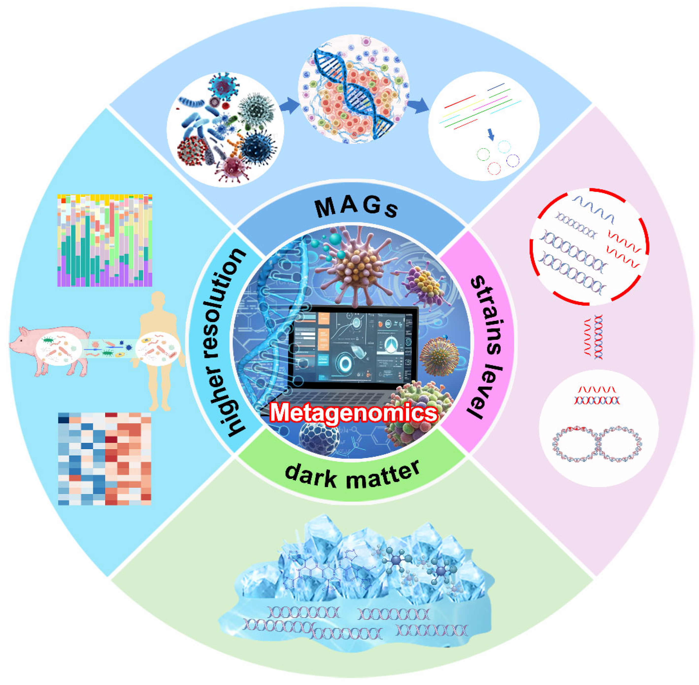
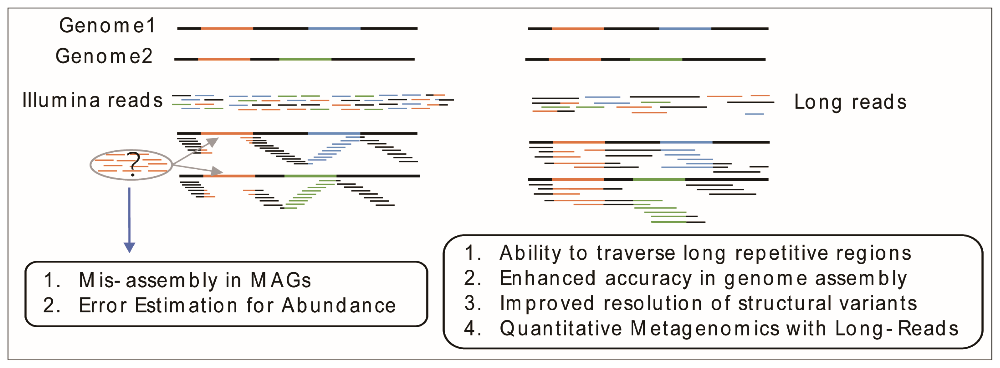

<!--We should probably update the databases that we pre-prepare for the students in 2025-->

# Illumina Shotgun Metagenomics (Community Analysis)

Shotgun metagenomics attempts to sequence all of the DNA present in a community. This has several advantages over 16S or other amplicon-based strategies, including obtaining functional as well as taxonomic information, covering a broader taxonomic range, and having less dependence on databases of known organisms.

{width=70%}
https://www.mdpi.com/2076-2607/12/12/2482


We will focus on community profiling using Centrifuge. You will learn how to assemble shotgun metagenomic data later on using long reads. While it is possible to assemble short read metagenomes, the resulting assemblies are very choppy. So, if assembly is your goal, it is best to start with long reads.

{width=70%}


## What is Centrifuge?

"Centrifuge is a very rapid and memory-efficient system for the classification of DNA sequences from microbial
samples, with better sensitivity than and comparable accuracy to other leading systems. The system uses a
novel indexing scheme based on the Burrows-Wheeler transform (BWT) and the Ferragina-Manzini (FM) index,
optimized specifically for the metagenomic classification problem".

https://ccb.jhu.edu/software/centrifuge/

## Data

We will use data from this publication: “Metagenomic Characterization of the Human Intestinal Microbiota in Fecal Samples from STEC-Infected Patients” (https://www.frontiersin.org/articles/10.3389/fcimb.2018.00025/). Data were retrieved from the NCBI BioProject PRJEB23207.

Illumina whole genome metagenomic sequencing of the intestinal microbiome (feces samples).

**11 samples**  
Shiga toxin-producing E. Coli (STEC) infection (N = 2)  
Crohn’s Patients (N = 4)  
Healthy (N = 2)  
Healed controls (N = 3) 

Can you identify the STEC positive samples?  
Can you identify the specific strain of STEC?


## Classification

Because of large time and space requirements to build indexes, we will use pre-built indexes that contain complete RefSeq genomes for archea, bacteria, viruses and fungi. The human chromosome level reference genome was included and we also added the Eukaryotic Pathogens Database (EuPathDB) as well. We'll kick off the Centrifuge classification and while it is running we will teach you how to create a small database and also go over the commands we used to create the big database.

<!--Each file will use about 36 GB of RAM, so not every one can run
samples at the same time. But inbre01 has 1Tb of memory.-->

Go into a screen.

```{bash, eval=FALSE}
screen -S centrifuge
```

Make a directory to store your results.

```{bash, eval=FALSE}
mkdir -p ~/centrifuge/centrifuge_results
```


### Centrifuge

Now let's run Centrifuge (it will take 10 - 20 minutes per sample to run).  

First, activate the environment.

```{bash, eval=FALSE}
conda activate centrifuge
```

**Parameters**

-x &nbsp;&nbsp; Path to the indexes (/home/data/metagenomics-2310/centrifuge/complete_genomes/Arc_Bac_Vir_Hum_Eupath_v2)  

-1 &nbsp;&nbsp; Read 1 fastq file  

-2 &nbsp;&nbsp; Read 2 fastq file  

-t &nbsp;&nbsp; Print wall-clock time taken by search phase  

-p &nbsp;&nbsp; Number of alignment threads to launch  

\-\-met-file <path> &nbsp;&nbsp; Send metrics to file at \<path\>  

\-\-met-stderr &nbsp;&nbsp; Send metrics to stderr  

-S &nbsp;&nbsp; Output file name


  --met-file <path>     send metrics to file at <path> (off)
  --met-stderr          send metrics to stderr (off)


```{bash, eval=FALSE}
centrifuge \
  -x /home/data/metagenomics/centrifuge/complete_genomes/Arc_Bac_Vir_Hum_Eupath_v2 \
  -1 /home/data/metagenomics/centrifuge/ERR2271042_1.fastq \
  -2 /home/data/metagenomics/centrifuge/ERR2271042_2.fastq -t \
  -p 10 \
  --met-file ~/centrifuge/centrifuge_results/ERR2271042_meta.txt \
  --met-stderr -S ~/centrifuge/centrifuge_results/ERR2271042_cent.out
```


You can also run all the samples together using a for loop.

```{bash, eval=FALSE}
for i in /home/data/metagenomics/centrifuge/*_1.fastq; do
  bn=`basename $i _1.fastq`
  centrifuge \
  -x /home/data/metagenomics/centrifuge/complete_genomes/Arc_Bac_Vir_Hum_Eupath_v2 \
  -1 /home/data/metagenomics/centrifuge/${bn}_1.fastq \
  -2 /home/data/metagenomics/centrifuge/${bn}_2.fastq -t \
  -p 10 \
  --met-file ~/centrifuge/centrifuge_results/${bn}_meta.txt \
  --met-stderr -S ~/centrifuge/centrifuge_results/${bn}_cent.out
done
```


### Kraken-style reports

Now let's create a Kraken-style report from the Centrifuge output using the centrifuge-kreport command (~1 min).

**Parameters**

-x &nbsp; &nbsp; Path to the indexes

You also feed in the _cent.out file we generated when we ran Centrifuge.

Make a directory to store your results

```{bash, eval=FALSE}
mkdir -p ~/centrifuge/centrifuge_krn_results
```


Create the report. We will use a for loop to generate the report for all the samples.

```{bash, eval=FALSE}
for i in ~/centrifuge/centrifuge_results/*_cent.out; do
  bn=`basename $i _cent.out`
  centrifuge-kreport \
  -x /home/data/metagenomics/centrifuge/complete_genomes/Arc_Bac_Vir_Hum_Eupath_v2 \
  $i \
  > ~/centrifuge/centrifuge_krn_results/${bn}_cent.out.krn
done
```


### Parse Metadata

Use awk to extract columns 2, 10, and 18 from the PRJEB23207 metadata file. Then, pipe the output to grep and exclude samples that were sequenced with the “Ion Torrent PGM” platform

```{bash, eval=FALSE}
awk -F'\t' '{print $2,$10,$18}' /home/data/metagenomics/centrifuge/PRJEB23207_metadata.txt | grep -i -v "ion"
```

## Visualize the Kraken Reports with Pavian

First, download all *.krn files to your computer.

If you are using RStudio, open it up and type "pavian::runApp(port=5000)" in the console.

Or go to the website: https://fbreitwieser.shinyapps.io/pavian/

Here are some things to try:

• Drag the .krn files to the "Browse" bar under the "Upload files" tab.

• Click on the “Results Overview” tab on the left side of the screen.

• Click on the “Sample” tab on the left side of the screen. You will notice an interactive Sankey chart that displays different classified taxa. You can click and drag nodes to reorder the nodes if you want. You can select different samples by clicking on the down arrow next to the “Select sample” header. Select sample ERR2270960 or ERR2270961 since we know that
these two samples are likely infected with STEC.

• From the “Sample” page, click on the “Table” tab. You should see an interactive, filterable and searchable table that summarizes the results of Centrifuge. For example, type “Escherichia coli” into the “Search:” box. A histogram will appear that displays the numbers of reads across all samples that were classified as “Escherichia coli”. Sort the table by the most abundant taxa by clicking on the up arrow next to “TaxonReads”.

• Can you can you identify the strain(s) of STEC that samples ERR2270960 and ERR2270961 likely contain?

## Practice Database

We will create a small database that has only fungi and human genomes so that you learn how to create Centrifuge databases. In the "Full Database" section we have the commands we used to create the database we used above but we will not run them. If you need to create an updated database for your own research, you can run them at a later time.

Go into the centrifuge directory.

```{bash, eval=FALSE}
cd ~/centrifuge
```

### Taxonomy files

First create a centrifuge directory and another directory inside that called taxonomy.

```{bash, eval=FALSE}
# Create a directory to store results
# The -p directory creates parent directories (in this case "centrifuge") as needed

mkdir -p ~/centrifuge/taxonomy
```


Centrifuge provides a few scripts that will allow you to download the NCBI taxonomy tree and RefSeq reference genomes. In addition to the reference fasta files, we need the taxonomy tree files:

* nodes.dmp:   Links taxonomy IDs to their parents

* names.dmp:   Links taxonomy IDs to their scientific name

* seqid2taxid.map: Links sequence IDs to taxonomy IDs

If you are using custom taxonomy or sequence files for the database, please refer to the manual (https://ccb.jhu.edu/software/centrifuge/manual.shtml)

Let's download the taxonomy files (~20 seconds). This gets the nodes.dmp and the names.dmp files.

**Parameters**  
-o &nbsp;&nbsp; specifies the folder to which the files are downloaded  
taxonomy &nbsp;&nbsp; database to download (refseq, genbank, contaminants or taxonomy)

```{bash, eval=FALSE}
centrifuge-download -o ~/centrifuge/taxonomy taxonomy
```


### Fungal genomes

Now lets download complete **fungal** genomes from RefSeq (~1 min). This will also make the seqid2taxid.map file.

**Parameters**  
-a &nbsp; &nbsp; Only download genomes with the specified assembly level. Default: 'Complete Genome'. If you want any assembly level, use 'Any'  
-m &nbsp; &nbsp; Mask low-complexity regions using dustmasker  
-P &nbsp; &nbsp; Number of threads or processes to use when downloading  
-d &nbsp; &nbsp; What domain to download (bacteria, viral, archaea, fungi, protozoa, invertebrate, plant, vertebrate_mammalian, vertebrate_other); comma-separated  
refseq &nbsp; &nbsp; Tells the program to use the refseq database  
-o &nbsp; &nbsp; Output directory

```{bash, eval=FALSE}
centrifuge-download -o ~/centrifuge/library -a "Complete Genome" -m -P 4 -d "fungi" refseq > ~/centrifuge/seqid2taxid.map
```


### Human genome

Download the RefSeq **human** genome (~14 min). This is our host since we have human samples. It will also create the seqid2taxid.map which we will append to the seqid2taxid.map file that we just made with fungal genomes.

**Additional parameters**  

-t &nbsp; &nbsp; Only download the specified taxonomy IDs, comma separated. Default: any. 9606 is the taxonomy id for Human  
-c &nbsp; &nbsp; Only download genomes in the specified RefSeq category. Default: any.


```{bash, eval=FALSE}
centrifuge-download -o ~/centrifuge/library -a "Chromosome" -m -P 4 -d "vertebrate_mammalian" \
-t 9606 -c "reference genome" refseq >> ~/centrifuge/seqid2taxid.map
```


## Eukaryotic Pathogens

We will add in **Eukaryotic Pathogens**, which can be helpful for medical metagenomic samples. To save time, we will use data we previously downloaded. Instructions for downloading it are in the "Full Database" section. If you use this database for your own research, you might want to download it later on to make sure it is up to date.

Here is the link to the publication: https://doi.org/10.1371/journal.pcbi.1006277

Here is the webpage for the data download https://ccb.jhu.edu/data/eupathDB/


First, make a directory to put the eupath data in.

```{bash, eval=FALSE}
mkdir -p ~/centrifuge/eupath
cd ~/centrifuge/eupath
```

Copy our already downloaded file.
<!-- This was downloaded 11/8/2024 and took approximately 17 minutes-->

```{bash, eval=FALSE}
cp /home/data/metagenomics/centrifuge/eupath/eupathDB.tar.gz .
```

This is a compressed tarball file that contains several files. Let's uncompress it and look into the library files it created.

```{bash, eval=FALSE}
tar -zxvf eupathDB.tar.gz

ls library
```

How many genomes are there?

Create a directory in the centrifuge library directory that has our fungal and human data and move the fasta files from this library directory there.

```{bash, eval=FALSE}
mkdir ~/centrifuge/library/eupath

mv ~/centrifuge/eupath/library/*.fna ~/centrifuge/library/eupath/
```


Because we didn't do this through centrifuge-download, we have to create the information for the seqid2taxid.map file. We'll extract it from the prelim_map.txt file that came with the eupath data.

```{bash, eval=FALSE}
awk -F'\t' '{print $2,$3}' ~/centrifuge/eupath/library/prelim_map.txt | \
  awk -F'|' '{print $1,$3}' | awk -F' ' '{print $1"\t"$2}' \
  >> ~/centrifuge/seqid2taxid.map
```


Now we will concatenate all the reference genome fasta files (fungal, human, eukaryotic pathogens) that we downloaded. We'll make sure we are in the library directory first.

```{bash, eval=FALSE}
cd ~/centrifuge/library/

cat */*.fna > allgenomes.fna
```

Centrifuge doesn't like the header format of some sequences so let's reformat the headers.

```{bash, eval=FALSE}
sed 's/|kraken[^|]*|/ /' allgenomes.fna > allgenomes_fixed.fna
```


### Build database indices

Now, let's build the database indices (~39 min).

**Parameters**

-p &nbsp;&nbsp; The number of processes/threads to use for creating the index  
--conversion-table &nbsp;&nbsp; The seqid2taxid.map file that you created with the centrifuge-download commands  
--taxonomy-tree &nbsp;&nbsp; The nodes.dmp file that was downloaded with the first centrifuge-download command  
--name-table &nbsp;&nbsp; The names.dmp file that was downloaded with the first centrifuge-download command

```{bash, eval=FALSE}
centrifuge-build -p 10 --conversion-table ~/centrifuge/seqid2taxid.map \
--taxonomy-tree ~/centrifuge/taxonomy/nodes.dmp \
--name-table ~/centrifuge/taxonomy/names.dmp \
~/centrifuge/library/allgenomes_fixed.fna \
~/centrifuge/allgenomes_indices
```


## Full Database

Due to time and space considerations, do not run this. If you need to update this database or want to create a similar database for your research, these commands should help you do that at a later date. Refer to the "Practice Database" section for more information on each command.

This database will include archaea, bacteria, viral and fungal genomes from RefSeq. At the time of download, there were 289 Archea, 13,287 bacterial, 8,583 viral, and 10 fungal genomes.

```{bash, eval=FALSE}
# Create a directory to store results

mkdir -p ~/centrifuge_fulldb/taxonomy

# Download microbial genomes

centrifuge-download -o ~/centrifuge_fulldb/library -a "Complete Genome" -m -P 30 -d "archaea,bacteria,viral,fungi" refseq > seqid2taxid.map

# Download the host genome (human in our case) and append info to the seqid2taxid.map file

centrifuge-download -o ~/centrifuge_fulldb/library -a "Chromosome" -m -P 4 -d "vertebrate_mammalian" \
-t 9606 -c "reference genome" refseq >> seqid2taxid.map

# Get eupath since we have medical metagenomes (wget downloads the data)

mkdir -p ~/centrifuge_fulldb/eupath

cd ~/centrifuge_fulldb/eupath

wget http://ccb.jhu.edu/data/eupathDB/dl/eupathDB.tar.gz

# Extract the eupath data and move fasta files to the centrifuge library directory

tar -zxvf eupathDB.tar.gz

mkdir ~/centrifuge_fulldb/library/eupath

mv ~/centrifuge_fulldb/eupath/library/*.fna ~/centrifuge/library/eupath/

# Add info to the seqid2taxid.map file

awk -F'\t' '{print $2,$3}' ~/centrifuge_fulldb/eupath/library/prelim_map.txt | \
  awk -F'|' '{print $1,$3}' | awk -F' ' '{print $1"\t"$2}' \
  >> ~/centrifuge_fulldb/seqid2taxid.map

# Cat the downloaded genomes together

cd ~/centrifuge_fulldb/library/

cat */*.fna > allgenomes.fna

# Reformat the headers

sed 's/|kraken[^|]*|/ /' allgenomes.fna > allgenomes_fixed.fna

# Build the database indices (~14 hr and ~410 GB of RAM using 30 threads)

centrifuge-build -p 30 --conversion-table ~/centrifuge_fulldb/seqid2taxid.map \
--taxonomy-tree ~/centrifuge_fulldb/taxonomy/nodes.dmp \
--name-table ~/centrifuge_fulldb/taxonomy/names.dmp \
~/centrifuge_fulldb/library/allgenomes_fixed.fna \
~/centrifuge_fulldb/allgenomes_indices

```

NOTE: the Centrifuge developers have provided various premade indexes that you can download here, ftp://ftp.ccb.jhu.edu/pub/infphilo/centrifuge/data/p+h+v.tar.gz
using wget.

<!--
Build the Centrifuge indexes using the centrifuge-build command. This has been done for you already. It took 14 hrs and ~ 410 GBs of RAM using 30 threads to build this database index on the server. And, this was just using the “Complete Genome” Refseq genomes for archea, bacteria, viruses, fungi, human, and EuPathDB. I attempted to build a Centrifuge index using “All” RefSeq genomes for archea, bacteria, viruses, fungi, human plus the EuPAthDB but ran out of memory on a high memory server and Centrifuge
was using 890 GBs of RAM before I killed the program. So, unless you have high-capacity compute you
may not be able to build the indexes on your system. But, the Centrifuge developers have provided various premade
indexes that you can download here, ftp://ftp.ccb.jhu.edu/pub/infphilo/centrifuge/data/p+h+v.tar.gz,
with wget.


## References

Gigliucci F, von Meijenfeldt FAB, Knijn A, Michelacci V, Scavia G, Minelli F, Dutilh BE, Ahmad HM, Raangs GC, Friedrich
AW, Rossen JWA, Morabito S. Metagenomic Characterization of the Human Intestinal Microbiota in Fecal Samples from STECInfected
Patients. Front Cell Infect Microbiol. 2018 Feb 6;8:25. doi: 10.3389/fcimb.2018.00025. eCollection 2018. PubMed
PMID: 29468143; PubMed Central PMCID: PMC5808120.

Kim D, Song L, Breitwieser FP, Salzberg SL. Centrifuge: rapid and sensitive classification of metagenomic sequences. Genome
Res. 2016 Dec;26(12):1721-1729. Epub 2016 Oct 17. PubMed PMID: 27852649; PubMed Central PMCID: PMC5131823.

Lu J, Salzberg SL. Removing contaminants from databases of draft genomes. PLoS Comput Biol. 2018 Jun 25;14(6):e1006277.
doi: 10.1371/journal.pcbi.1006277. eCollection 2018 Jun. PubMed PMID: 29939994; PubMed Central PMCID: PMC6034898.
-->
