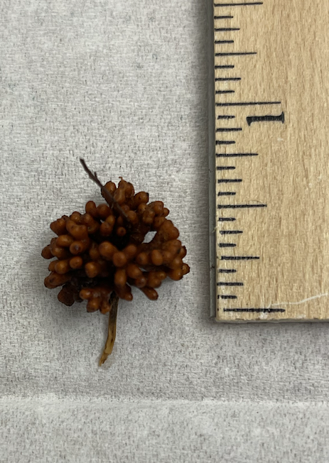

# Read Processing (ONT)

## Oxford Nanopore Sequencing (ONT)

{width=80%}

https://www.youtube.com/watch?v=E9-Rm5AoZGw

## Read Processing

### Filter Host DNA

# Filter Host Reads

{width=40%}
{width=40%}


In order to focus on sequencing reads from the microbes in the nodule, we will filter out reads that align to the red alder genome as follows:

1. Align the fastq-formatted reads to the red alder genome using minimap2.  
2. Extract reads that do not align to red alder and sort them using samtools.  
3. Create a fastq file with only the unaligned reads using samtools bam2fastq.  
4. Compress the fastq file using gzip.  

## Setup


Activate the environment that contains minimap2 and samtools

{width=80%}

```{bash,eval=FALSE}
conda activate filter-reads
```

Make a directory and go into it

```{bash,eval=FALSE}
mkdir ~/microbe_fastq
cd ~/microbe_fastq
```

Link to the merged minion reads

```{bash,eval=FALSE}
ln -s /home/data/metagenomics/red-alder-reads/3469-3.all.fastq .
```

## Alignment

Run Minimap2 to align the MinION reads to the red alder genome  

+ The -x map-ont parameter (allows ~10% error + divergence)

```{bash,eval=FALSE}
minimap2 -x map-ont -L -t 8 -a \
/home/data/metagenomics/red-alder-reads/red-alder-genome.fasta \
3469-3.all.fastq > 3469-3-minionxredalder.mm2.sam
```

## Get microbial reads

Now we will use samtools, which is available in the same environment, to pull out reads that didn't align to red alder.

{width=80%}


Convert the unmapped reads in the alignment file (sam) to a fastq file  

+ The -f4 includes only reads with the 4 flag (unmapped)

```{bash,eval=FALSE}
samtools fastq -f4 3469-3-minionxredalder.mm2.sam > 3469-3.microbe.fq
```

Compress the new fastq file  

+ (note that it will automatically add the extension .gz)

```{bash,eval=FALSE}
gzip 3469-3.microbe.fq
```

### Now filter host reads from sample 4956-3{-}

Reads are here: 

```{bash,eval=FALSE}
/home/data/metagenomics/red-alder-reads/4956-3.all.fastq
```


### Quality Control

# Nanopore Read QC

### Quality Control{-}

+ “PycoQC computes metrics and generates interactive QC plots for Oxford Nanopore technologies sequencing data” (https://a-slide.github.io/pycoQC/ )

{width=25%}

1. What do we need in order to run a Quality Control Check?
+ Sequencing Summary File 
    + Automatically produced by the MinIon basecaller.
+ PycoQC package + dependencies 
    + Already downloaded for you in Ghostwheel.
+ Line of code to produce .html file.
+ Line of code to secure copy file to your computer.

## Sequencing Summary File
 
Where is it?

```{bash,eval=FALSE}
/home/data/metagenomics/red-alder-reads/sequencing_summary_FAS21661_9ac87089.txt
```

## PycoQC package & code

1. Where is it? How to activate it?
+ Log in to Ghostwheel
+ Stay in your home directory (check with pwd)
+ Type the following: 
		
```{bash,eval=FALSE}
source activate pycoQC
pycoQC
pycoQC –f inputfilename.txt –o outputfilename.html
```

## Secure Copy 

1. What terminal to copy from? What is the code?

+ Open new Terminal window but don't connect to the linux server	
+ Type:

```{bash,eval=FALSE}
scp -P 2310 <username>@inbre.ncgr.org:/home/<username>/outputfile.html ~/Desktop/
```

## Open your URL

Find your file on your desktop.

Double-click to open, or right-click to select browser


{width=100%}


### Normalization

With normalization we are trying to get the correct relative gene expression abundances between cells. 

Gene expression between cells is based on count data.

What does a count in a count matrix represent?

-	mRNA Capture
-	Reverse transcription of mRNA
-	sequencing of a molecule of mRNA

The most common normalization protocol is:

-	count depth scaling
-	aka CPM or counts per million
-	it assumes that all cells in the dataset initially contain an equal number of mRNA molecules
-	it assumes that count depth differences arise from sampling

Normalize complete 

-	But wait!
-	We still have unwanted variability in the data.
-	What kind of unwanted variability?
-	What is the solution? Data Correction. 

### Data correction and integration

Biological Covariates

-	Cell-Cycle effects
-	Batch
-	Dropout

Which Covariates to Consider?

-	Depends on downstream analysis
-	Correct for biological and technical to be considered separately
-	Corrections are used for different purposes
-	Each approach to correction presents unique challenges

What are the Correction methods?

-	Regressing out biological effects
-	Regressing out technical effects
-	Batch effects and data integration
-	Expression recovery

