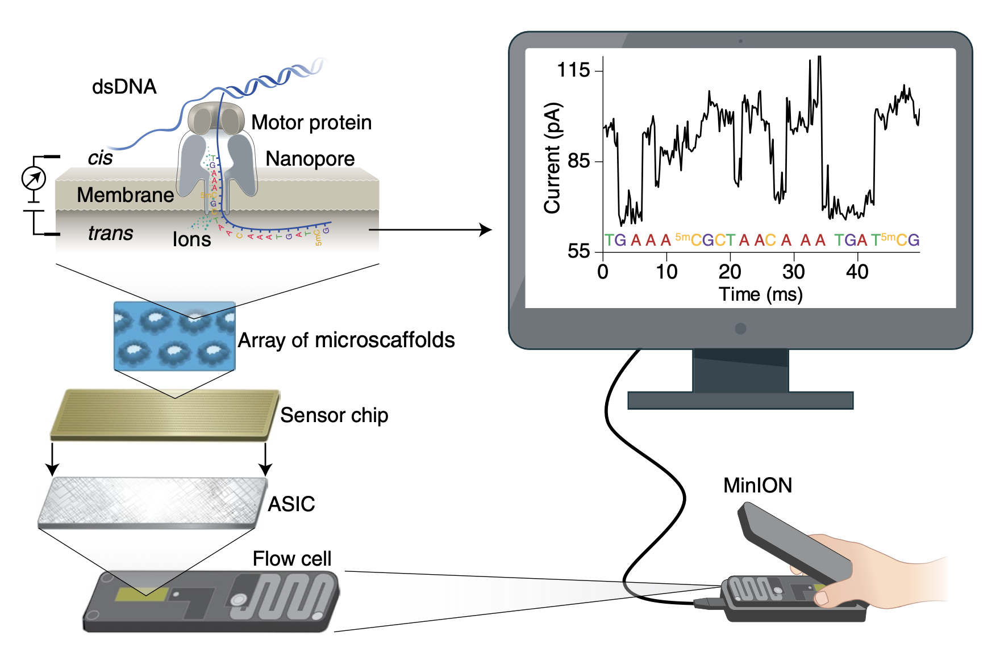

# Shotgun Metagenomics

## Long Reads

## Oxford Nanopore Sequencing

{width=80%}

https://www.youtube.com/watch?v=E9-Rm5AoZGw

### Strengths and weaknesses of assembly-based and read-based metagenomics analysis

{width=100%}

