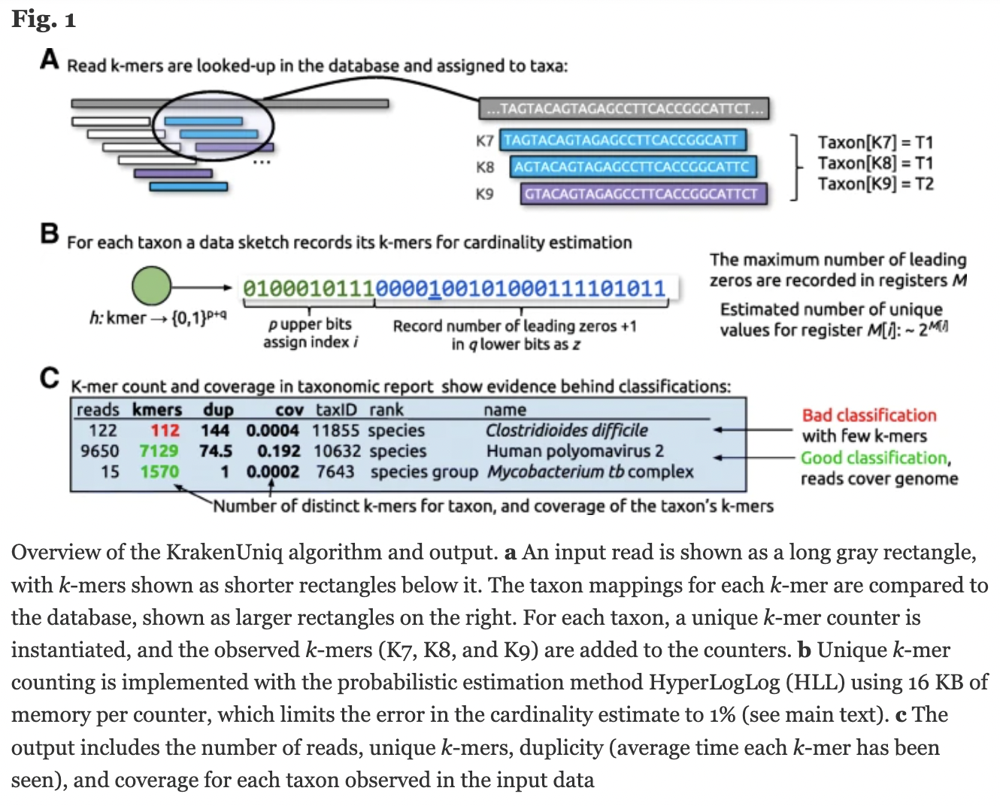
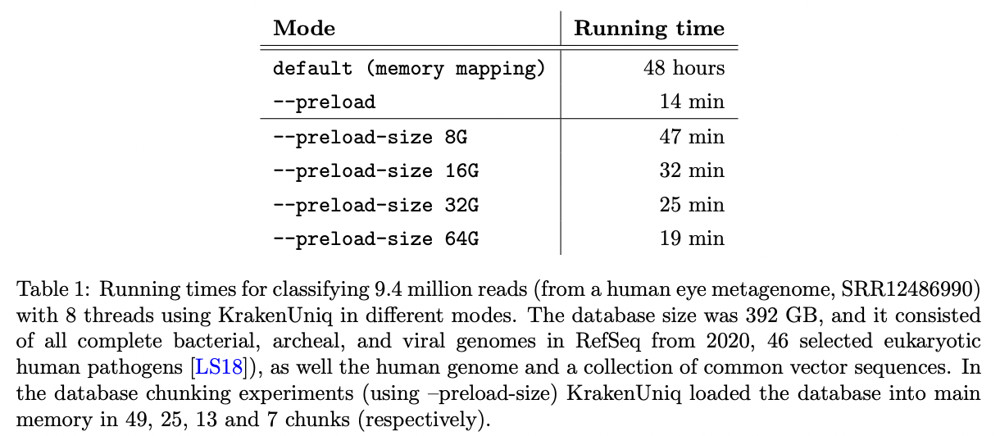
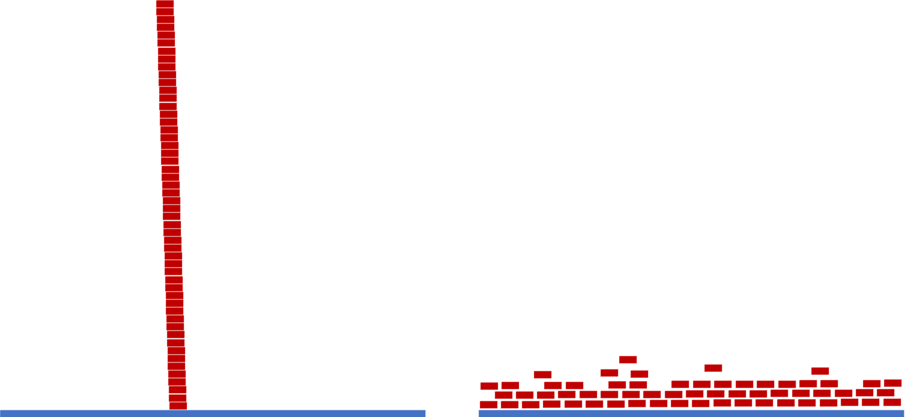

<!--The krakenuniq command takes less than 10 minutes. It will be considerably faster if all 32 threads requested can be used, which depends on how many people are running it at the same time.-->

# ONT Shotgun Metagenomics (Community Analysis)

KrakenUniq

"confident and fast metagenomics classification using unique k-mer counts"

Default kmer = 31


{width=60%}

https://genomebiology.biomedcentral.com/articles/10.1186/s13059-018-1568-0

https://github.com/fbreitwieser/krakenuniq

https://gitlab.umiacs.umd.edu/derek/krakenuniq/-/blob/master/MANUAL.md


## Kraken/Centrifuge Family

**Kraken 1** is obsolete.

**Centrifuge** was written to improve Kraken's memory issues. It is completely new code with a different classification index. Its databases are also much smaller. Centrifuge can assign a sequence to multiple taxa. We'll use centrifuge later in the workshop.

**KrakenUniq** is based on Kraken 1. It adds an efficient algorithm to assess coverage of unique kmers, running at the same speed and with only slightly more memory than Kraken 1. KrakenUniq distinguishes low abundance organisms from false positives.

**Kraken 2** uses "probabilistic data structures" to reduce memory and increase speed at the expense of lower accuracy that leads to false positives during the classifications ("a few dozen out of millions").

**KrakenUniq** was updated in May 2022 (v0.7+) to help to deal with the large databases on computers without enough RAM to load them into memory. Databases can be read in chunks that fit in RAM.


{width=50%}


KrakenUniq gives you k-mer coverage information, reporting the number and percentage k-mers in an organism that were hit by reads. This helps to differentiate between false positives and good classifications.

{width=50%}


https://www.biorxiv.org/content/10.1101/2022.06.01.494344v1.full.pdf

http://ccb.jhu.edu/software/choosing-a-metagenomics-classifier/#:~:text=However%2C%20while%20Kraken%20provides%20only,1%20databases%2C%20not%20Kraken%202.

https://github.com/fbreitwieser/krakenuniq/blob/master/MANUAL.md


## KrakenUniq databases

Make sure you are in a screen. You can open a new screen or re-enter a screen you already have.

```{bash,eval=FALSE}
screen -S krakenuniq
```


KrakenUniq requires Kraken1 not Kraken2 databases

We won't build a database since it can take several days, but let's look at the documentation:  
https://github.com/fbreitwieser/krakenuniq#database-building

You can also get prebuilt databases:  
https://benlangmead.github.io/aws-indexes/k2

We will use a bacterial databases located here:  
/home/data/metagenomics/krakenuniq

Make a working directory and go into it.
```{bash,eval=FALSE}
mkdir ~/krakenuniq
cd ~/krakenuniq
```

The taxa it contains are here:
/home/data/metagenomics/krakenuniq/library/bacteria/library_headers.orig

Take a look at the file using head.

<details>
  <summary>Click for Answer</summary>
```{bash,eval=FALSE}
head /home/data/metagenomics/krakenuniq/library/bacteria/library_headers.orig
```
</details>\

<!--Point out that the first sequences are Rhizobium, which is a nitrogen fixer.-->

How many sequences are there?
<details>
  <summary>Click for Answer</summary>
```{bash,eval=FALSE}
wc -l /home/data/metagenomics/krakenuniq/library/bacteria/library_headers.orig
```
</details>\

How many sequences are Frankia?
<details>
  <summary>Click for Answer</summary>
```{bash,eval=FALSE}
grep -c Frankia /home/data/metagenomics/krakenuniq/library/bacteria/library_headers.orig
```
</details>\

How many genera (field 2)?
<details>
  <summary>Click for Answer</summary>
```{bash,eval=FALSE}
awk '{print $2}' /home/data/metagenomics/krakenuniq/library/bacteria/library_headers.orig | sort -u| wc -l
```
Note: this doesn't strictly give us the number of genera as some genera are written as Frankia_* and are counted independently even though they are all part of the Frankia genus.
</details>\

And how many of each genera?
<details>
  <summary>Click for Answer</summary>
```{bash,eval=FALSE}
awk '{print $2}' /home/data/metagenomics/krakenuniq/library/bacteria/library_headers.orig | sort | uniq -c | less
```
</details>\

## Link to the krakenuniq database

```{bash,eval=FALSE}
ln -s /home/data/metagenomics/krakenuniq/ .
```

## Run KrakenUniq

Activate the KrakenUniq environment.
```{bash,eval=FALSE}
conda activate krakenuniq
```

Run Kraken on sample 3469-3. This will take 15+ minutes.
```{bash,eval=FALSE}
krakenuniq \
	--db /home/data/metagenomics/krakenuniq \
	--threads 32 \
	--report-file 3469-3.report \
	--unclassified-out 3469-3.unclassified.fq \
	--classified-out 3469-3.classified.fq \
	~/microbe_fastq/3469-3.microbe.fq.gz \
	> 3469-3.krakenuniqoutput
```


Make sure you got the following files:\
3469-3.classified.fq\
3469-3.krakenuniqoutput\
3469-3.report\
3469-3.unclassified.fq

This command should show you all of them and give you their sizes so you can make sure none of them are empty.

```{bash,eval=FALSE}
ls -l 3469*
```

Use the less command to look at each of them.


Take a closer look at the report and make sure that you understand each column (see below).

<!--Have the students explain some of these using actual data in the file.-->

____________

**%**\
percent reads belonging to that taxa (including its decsendants)\

**reads**\
reads belonging to that taxa (including its descendants)\

<!--The reads makes the most sense biologically, not the taxreads. It looks like the other columns are based off of reads and not taxreads.-->

**taxreads**\
reads assigned to this taxonomic level (and not to its descendants)

**kmers**\
number of unique kmers

**dup**\
average kmer count

**cov**\
coverage of the kmers of the database clade\

__________

How many classified and unclassified reads are there?\
Note: there are many ways to do this and you should get the same numbers no matter which file you look at.


What percentage of the reads are from the Frankia genus?

<details>
  <summary>Click for Answer</summary>
```{bash,eval=FALSE}
# You can just look at the file

less 3469-3.report

# or

grep Frankia 3469-3.report |grep genus
## 51.04	1262819	420785	1309307	45.3	0.008317	1854	genus	                Frankia

## 51.04% of the reads are from Frankia.
```
</details>\


What is the next most frequent genus? What percentage of the reads belong to this genus?

<details>
  <summary>Click for Answer</summary>
```{bash,eval=FALSE}
# You can just look at the file or

grep genus 3469-3.report|sort -g
```

<!--Have the students figure out what the -g is (general numerical sort) using the man command. It allows you to sort the regular and scientific notation together.-->

Now run it on the other sample (4956-3) and compare it to 3469-3.

<!--I put the students in groups for this.-->


## Pavian

Copy the reports to your computer.

Let's open them in Pavian. You 
<!--We haven't produced bam files for the alignment viewer. We do have sam files of reads aligned to the red alder genome but these aren't what is needed.-->


If you haven't installed Pavian, visit the installs section above.

Once you have Pavian installed, in your local Rstudio, type:\
pavian::runApp(port=5000)

You can load more than one sample by shift-clicking when you choose files to load.

More information on things you can do in Pavian is in the Centrifuge chapter.


Deactivate the environment

```{bash,eval=FALSE}
conda deactivate
```
