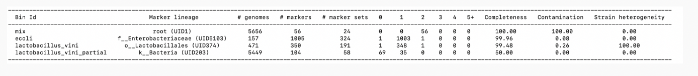

# ONT Shotgun Assembly

## Assembly

Metagenomic assemblies can help you recover genes and pathways present in a community. They can also be fed into community analysis. On the other hand, you can miss some of the more rare members of the community.

Let's do an assembly of the Oxford Nanopore (ONT) reads from the red alder nodules. We will use the reads that have had red alder removed so we are only assembling the microbes. We'll use the metagenomics module of the Flye assembler, which adjusts parameters to be able to assemble when uneven coverage is present. The Flye assembler is specifically designed for assembling single-molecule sequencing reads (ie. PacBio and ONT).

https://github.com/mikolmogorov/Flye


Make sure you are in a screen.

```{bash,eval=FALSE}
screen -S assembly
```


Create a space to work and then go into it. We need to make a specific directory for this sample since flye has generic naming for the output (for instance, the assembly is names assembly.fasta). So you can't run multiple samples in the same directory without them overwriting each other.

```{bash,eval=FALSE}
mkdir ~/nodule-assembly/3469-3
cd ~/nodule-assembly/3469-3
```


Activate the environment.

```{bash,eval=FALSE}
conda activate flye
```

Assemble the metagenome with metaFlye. Don't forget the dot at the end. That tells the program to put the output in the current directory.

**Parameters**  
--nano-raw &nbsp;&nbsp; ONT raw reads
--iterations &nbsp;&nbsp; number of polishing iterations (default: 1)
--meta &nbsp;&nbsp; metagenome / uneven coverage mode
--threads &nbsp;&nbsp; number of parallel threads (default: 1)
--out-dir &nbsp;&nbsp; Output directory path

```{bash,eval=FALSE}
flye --nano-raw ~/microbe_fastq/3469-3.microbe.fq.gz --iterations 1 --meta \
  --threads 20 -o .
```

Now make a link to assembly in the parent directory (~/nodule-assembly/), where we can collect assemblies from multiple samples. We'll make sure the sample name is part of the filename.

```{bash,eval=FALSE}
cd ..

ln -s 3469-3/assembly.fasta assembly-3469-3.fasta
```

### Now assemble reads from sample 4956-3{-}

You should already have the host reads filtered out in ~/microbe_fastq/4956-3.microbe.fq.gz


Change into the directory with the assembly links that include the sample names.

```{bash,eval=FALSE}
cd ~/nodule-assembly
```

Compare the assembly stats from the 2 samples.
```{bash,eval=FALSE}
tail */flye.log
```


## Assembly Completeness and Contamination

We will feed in the whole assembly since it is mostly Frankia but later you will learn how to bin your assembly into the different organisms that it represents.

CheckM allows you to assess completeness and contamination of MAGs (Metagenome-assembled genomes). It is in the same environment (flye).

CheckM puts each of your sequences in a phylogenetic tree (if needed) and then looks for single-copy genes that should be in each sequence. The percentage of expected genes it finds is a measure of completeness. The number or multi-copy genes it finds are a measure of contamination (the presence of closely related or more distantly related organisms in your bin).

CheckM \
https://www.ncbi.nlm.nih.gov/pmc/articles/PMC4484387/pdf/1043.pdf \
https://ecogenomics.github.io/CheckM/


Here is a test output using 2 genomes from NCBI, a partial genome of one of them, and the 2 genomes catted together.

{width=100%}

Video explanation:  
https://onestopdataanalysis.com/checkm-completeness-contamination/


CheckM at the genus level. We will use taxonomy_wf (wf stands for workflow) which allows us to feed in the Frankia genus that we know is there.

checkm taxonomy_wf [parameters] <taxonomy_level> <taxon> <assembly_bin_dir> <output_dir>

**Parameters**

-x &nbsp;&nbsp;&nbsp;&nbsp; extension (extension of the assembly bins, ie fasta;   checkm will run on all the files in the assembly_bin_dir that have that extension)  
-t &nbsp;&nbsp;&nbsp;&nbsp; number of threads  
-f &nbsp;&nbsp;&nbsp;&nbsp; output file (default: STDOUT)

For additional parameters:
```{bash,eval=FALSE}
checkm taxonomy_wf --help
```

Run checkm.

```{bash,eval=FALSE}
checkm taxonomy_wf -x fasta -t 8 -f ./checkm_tax_results.txt genus Frankia ~/nodule-assembly ./checkm
```

Note: You can also used the lineage_wf if you don't know the taxa. It will place sequences on a tree and calculate their lineages.

Let's look at the assembly metrics generated by checkM.

```{bash,eval=FALSE}
less ~/nodule-assembly/checkm/storage/bin_stats.analyze.tsv
```

Look at the checkm taxonomy results.

```{bash,eval=FALSE}
less checkm_tax_results.txt
```

Plot the genome completeness, contamination and strain heterogeneity stats.

checkm marker_plot [parameters] <results_dir> <assembly_bin_dir> <output_dir>

**Parameters**

-x &nbsp;&nbsp;&nbsp;&nbsp; extension (extension of the assembly bins, ie fasta; checkm will run on all the files in the assembly_bin_dir that have that extension)  
--image_type &nbsp;&nbsp;&nbsp;&nbsp; format of image (eps,pdf,png,ps,or svg; default: png)  
--dpi <dpi> &nbsp;&nbsp;&nbsp;&nbsp; dots per inch resolution for output file (default: 600)  
--font_size <size> &nbsp;&nbsp;&nbsp;&nbsp; font size (default: 8)  
--height <height> &nbsp;&nbsp;&nbsp;&nbsp; height in inches (default: 6.5)

```{bash,eval=FALSE}
checkm marker_plot -x fasta --image_type png --dpi 600 --font_size 14 --height 5 \
~/nodule-assembly/checkm ~/nodule-assembly ~/nodule-assembly/checkm
```


Deactivate the environment.

```{bash,eval=FALSE}
conda deactivate
```

Download the png files in ~/nodule-assembly/checkm to your computer. There should be one for each sample. Take a look at it.


Note: You can also classify the assembly contigs using KrakenUniq or Centrifuge. Some of the rare organisms will have some reads but not enough to assemble, so you might lose some of the rarer taxa.


### Strengths and weaknesses of assembly-based and read-based metagenomics analysis

{width=100%}


<!--Potential extra data for ONT assembly:
https://www.ncbi.nlm.nih.gov/bioproject/PRJNA1064698-->


