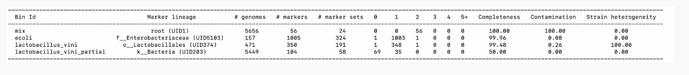

<!--The pdf from the summer workshop has instructions on classifying reads and assembly contigs with Centrifuge. We won't do it here since they will learn Centrifuge with the Illumina data and we have already done the reads with krakenuniq.-->

# Nanopore WGS Assembly (metaflye)\

## Assembly

Metagenomic assemblies can help you recover genes and pathways present in a community. They can also be fed into community analysis. On the other hand, you can miss some of the more rare members of the community.

Let's do an assembly of the Oxford Nanopore (ONT) reads from the red alder nodules. We will use the reads that have had red alder removed so we are only assembling the microbes. We'll use the metagenomics module of the Flye assembler.

Make sure you are in a screen.

```{bash,eval=FALSE}
screen -S assembly
```


Create a directory called nodule-assembly-3469-3 in your home directory. Then go into it.

```{bash,eval=FALSE}
mkdir ~/nodule-assembly-3469-3
cd ~/nodule-assembly-3469-3
```


Activate the environment.

```{bash,eval=FALSE}
conda activate flye
```

Assemble the metagenome with metaFlye. Don't forget the dot at the end. That tells the program to put the output in the current directory.

```{bash,eval=FALSE}
flye --nano-raw ~/microbe_fastq/3469-3.microbe.fq.gz -i 1 --meta -t 20 -g 45m -o .
```


## Assembly Completeness and Contamination

<!--We will feed in the whole assembly since it is mostly Frankia but you could pull out a MAG.-->


CheckM allows you to assess completeness and contamination of MAGs (Metagenome-assembled genomes). It is in the same environment (flye).

CheckM puts each of your sequences in a phylogenetic tree (if needed) and then looks for single-copy genes that should be in each sequence. The percentage of expected genes it finds is a measure of completeness. The number or multi-copy genes it finds are a measure of contamination (the presence of closely related or more distantly related organisms in your bin).

CheckM \
https://www.ncbi.nlm.nih.gov/pmc/articles/PMC4484387/pdf/1043.pdf \
https://ecogenomics.github.io/CheckM/


Here is a test output using 2 genomes from NCBI, a partial genome of one of them, and the 2 genomes catted together.

{width=100%}

Video explanation:
https://onestopdataanalysis.com/checkm-completeness-contamination/


CheckM at the genus level. We will use taxonomy_wf (wf stands for workflow) which allows us to feed in the Frankia genus that we know is there.

```{bash,eval=FALSE}
checkm taxonomy_wf genus Frankia ~/nodule-assembly-3469-3 ./checkm -x fasta -t 8 -f ./3469-3_tax_results.txt
```

Note: We can also used the lineage_wf if we don't give it the Frankia taxonomy. It will place sequences on a tree and calculate their lineages.

Plot the genome completeness, contamination and strain heterogeneity stats.

```{bash,eval=FALSE}
checkm marker_plot -x fasta --image_type png --dpi 600 --font_size 14 --height 5 \
~/nodule-assembly-3469-3/checkm ~/nodule-assembly-3469-3 ~/nodule-assembly-3469-3/checkm
```

Let's look at the assembly metrics generated by checkM.

```{bash,eval=FALSE}
less ~/nodule-assembly-3469-3/checkm/storage/bin_stats.analyze.tsv
```

Deactivate the environment.

```{bash,eval=FALSE}
conda deactivate
```

Download the marker_plot (it is in the ) to your computer using scp, moba-xterm, or filezilla and take a look at it.


Note: You can also classify the assembly contigs using KrakenUniq or Centrifuge. You will learn how to use centrifuge when we work on Illumina whole genome (shotgun) data so we won't do it here.
