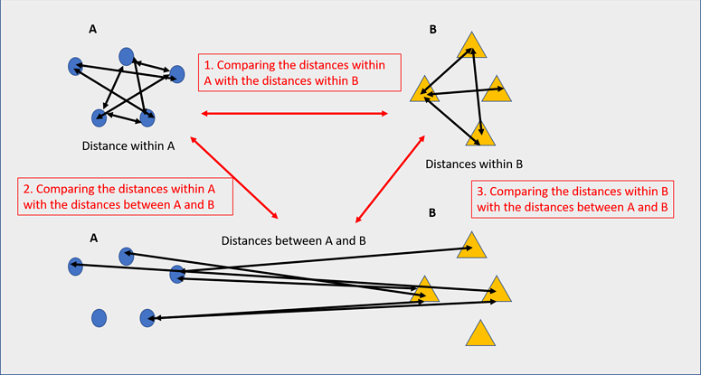

# QIIME2
Command Line Tutorial

## Logging on to the server

Make it a practice to start a screen before you begin analysis.

```{bash, eval=FALSE}
ssh -p2310 <USERNAME>@inbre.ncgr.org

screen -S QIIME2
```
## Setting up a working directory for QIIME2 analysis
```{bash, eval=FALSE}
cd /home/$USER/

mkdir QIIME2_Analysis

cd QIIME2_Analysis
```

## Dataset for analysis

For this tutorial, we will use data from the following published manuscript:
https://microbiomejournal.biomedcentral.com/articles/10.1186/2049-2618-2-29

Respiratory tract clinical sample selection for microbiota analysis in patients with pulmonary tuberculosis

Pulmonary Tuberculosis (The Human Microbiome in the Fight Against Tuberculosis, 2017)

{width=100%}
Why study microbiome in relation to TB?
1. Microbiome composition is a potential risk factors for TB infection and disease susceptibility, disease progression,
and treatment outcomes
2. TB infection and disease can affect microbiome, subsequently impacting health via alteration of immune responses

This pilot study was carried out using sputum, oropharynx, and nasal respiratory tract samples collected from patients
with pulmonary tuberculosis and healthy control individuals, in order to compare sample types and their usefulness in
assessing changes in bacterial and fungal communities.

## Data download

Data was downloaded from the National Center for Biotechnology Information (NCBI) based on the SRA accession
numbers reported in the manuscript - PRJNA242354.
A program called fastq-dump version 2.10.0 was used to download the data directly from NCBI SRA database. The
following exercise will help you use fastq-dump for your own projects too.

```{bash, eval=FALSE}
source activate fastqdump
# MAKE SURE YOU ARE IN THE FOLLOWING FOLDER
/home/$USER/QIIME2_Analysis
# CREATE A FOLDER FOR DOWNLOADING FASTQ FILES TO ANALYZE

mkdir input_data
cd input_data
# download takes about 5 minutes
/opt/sratoolkit.3.0.7-centos_linux64/bin/fasterq-dump --outdir ./ \
SRR1204628 SRR1204630 SRR1204627 SRR1204629 SRR1204626 SRR1204623 \
SRR1204625 SRR1204624 SRR1204622 SRR1204631 SRR1204638 SRR1204642 \
SRR1204633 SRR1204632 SRR1204634 SRR1204639 SRR1204646 SRR1204647 \
SRR1204641 SRR1204640 SRR1204636 SRR1204637 SRR1369696 SRR1369694 \
SRR1204635 SRR1204643 SRR1204644 SRR1204645 SRR1369709 SRR1369707 \
SRR1369690 SRR1369691 SRR1369692 SRR1369693 SRR1369710 SRR1369713 \
SRR1204650 SRR1204651 SRR1369688 SRR1369689 SRR1369695 SRR1204649 \
SRR1204648 SRR1369697 SRR1369704 SRR1369703 SRR1369706 SRR1369705 \
SRR1369708 SRR1369698 SRR1369699 SRR1369701 SRR1369700 SRR1369702 \
SRR1369714 SRR1369717 SRR1369716 SRR1369715 SRR1369711 SRR1369712
# --outdir -> Path to Output directory
# --gzip -> Compress output files using gzip

# After running this step, you will have 60 files in your input_data folder
# To check, cd into folder that has fastq files, type this command
ls| wc -l
# Optional exercise:
# Count the number of sequences in one of the fastq files.
```

## Quality Control
```{bash, eval=FALSE}
# Filter poor quality reads
source activate fastp

for file in *.gz; do fastp -i ${file} -o ${file}.filtered; done
conda deactivate
```
{width=100%}
Data was collected from 30 Individuals.

• 6 TB Patients - Nasal

• 6 TB Patients - oropharynx

• 6 TB Patients - Sputum

• 6 Healthy Controls - Nasal

• 6 Healthy Controls - oropharynx

DATA TABLE:

```
SAMPLE FASTA FILE 	                TOTAL NUMBER OF READS 
Control_1_Nasal_L001_R1_001.fasta 	41056
Control_1_Pharynx_L001_R1_001.fasta 119972
Control_2_Nasal_L001_R1_001.fasta 	32142
Control_2_Pharynx_L001_R1_001.fasta 42973
Control_3_Nasal_L001_R1_001.fasta 	32953
Control_3_Pharynx_L001_R1_001.fasta 39148
Control_4_Nasal_L001_R1_001.fasta 	83174
Control_4_Pharynx_L001_R1_001.fasta 17475
Control_5_Nasal_L001_R1_001.fasta 	29146
Control_5_Pharynx_L001_R1_001.fasta 32728
Control_6_Nasal_L001_R1_001.fasta 	32738
Control_6_Pharynx_L001_R1_001.fasta 15320
Patient_1_Nasal_L001_R1_001.fasta 	69995
Patient_1_Pharynx_L001_R1_001.fasta 59646
Patient_1_Sputum_L001_R1_001.fasta 	66725
Patient_2_Nasal_L001_R1_001.fasta 	61070
Patient_2_Pharynx_L001_R1_001.fasta 27106
Patient_2_Sputum_L001_R1_001.fasta 	71434
Patient_3_Nasal_L001_R1_001.fasta 	91920
Patient_3_Pharynx_L001_R1_001.fasta 36224
Patient_3_Sputum_L001_R1_001.fasta 	27533
Patient_4_Nasal_L001_R1_001.fasta 	28996
Patient_4_Pharynx_L001_R1_001.fasta 30713
Patient_4_Sputum_L001_R1_001.fasta 	59433
Patient_5_Nasal_L001_R1_001.fasta 	70843
Patient_5_Pharynx_L001_R1_001.fasta 39674
Patient_5_Sputum_L001_R1_001.fasta 	29576
Patient_6_Nasal_L001_R1_001.fasta 	106178
Patient_6_Pharynx_L001_R1_001.fasta 58956
Patient_6_Sputum_L001_R1_001.fasta 	35703
```

## What is QIIME2?
https://docs.qiime2.org/2020.11/about/

QIIME 2 is a powerful microbiome analysis package with a focus on data and analysis transparency. QIIME2 enables researchers to start an analysis with raw DNA sequence data and finish with publication-quality figures and statistical results.

Key features:

• Integrated and automatic tracking of data provenance

• Plugin system for extending microbiome analysis functionality

• Support for multiple types of user interfaces (e.g. API, command line, graphical)

Plugin availability - https://docs.qiime2.org/2020.11/plugins/available/

## Metadata setup

Metadata file that we will be using for our data set: (mappingFile.txt on logrus)

Here is how you will make a metadata file on your own: https://docs.qiime2.org/2017.6/tutorials/metadata/

```
#SampleID 	Treatment 	TreatmentSite 	TreatmentNumber 	Sex 	BodySite 	Description 
C_1_N 	C 	CN 	1	F 	Nasal 	    Control 1 Nasal 
C_1_P 	C 	CP 	2	F 	Oropharynx 	Control 1 Pharynx 
C_2_N 	C 	CN 	1	M 	Nasal 	    Control 2 Nasal 
C_2_P 	C 	CP 	2	M 	Oropharynx 	Control 2 Pharynx 
C_3_N 	C 	CN 	1	M 	Nasal 	    Control 3 Nasal 
C_3_P 	C 	CP 	2	M 	Oropharynx 	Control 3 Pharynx 
C_4_N 	C 	CN 	1	M 	Nasal 	    Control 4 Nasal 
C_4_P 	C 	CP 	2	M 	Oropharynx 	Control 4 Pharynx 
C_5_N 	C 	CN 	1	M 	Nasal 	    Control 5 Nasal 
C_5_P 	C 	CP 	2	M 	Oropharynx 	Control 5 Pharynx 
C_6_N 	C 	CN 	1	M 	Nasal 	    Control 6 Nasal 
C_6_P 	C 	CP 	2	M 	Oropharynx 	Control 6 Pharynx 
P_1_N 	P 	PN 	3	F 	Nasal 	    Patient 1 Nasal 
P_1_P 	P 	PP 	4	F 	Oropharynx 	Patient 1 Pharynx 
P_1_S 	P 	PS 	5	F 	Sputum 	    Patient 1 Sputum 
P_2_N 	P 	PN 	3	M 	Nasal 	    Patient 2 Nasal 
P_2_P 	P 	PP 	4	M 	Oropharynx 	Patient 2 Pharynx 
P_2_S 	P 	PS 	5	M 	Sputum 	    Patient 2 Sputum 
P_3_N 	P 	PN 	3	M 	Nasal 	    Patient 3 Nasal 
P_3_P 	P 	PP 	4	M 	Oropharynx 	Patient 3 Pharynx 
P_3_S 	P 	PS 	5	M 	Sputum 	    Patient 3 Sputum 
P_4_N 	P 	PN 	3	M 	Nasal 	    Patient 4 Nasal 
P_4_P 	P 	PP 	4	M 	Oropharynx 	Patient 4 Pharynx 
P_4_S 	P 	PS 	5	M 	Sputum 	    Patient 4 Sputum 
P_5_N 	P 	PN 	3	M 	Nasal 	    Patient 5 Nasal 
P_5_P 	P 	PP 	4	M 	Oropharynx 	Patient 5 Pharynx 
P_5_S 	P 	PS 	5	M 	Sputum 	    Patient 5 Sputum 
P_6_N 	P 	PN 	3	M 	Nasal 	    Patient 6 Nasal 
P_6_P 	P 	PP 	4	M 	Oropharynx 	Patient 6 Pharynx 
P_6_S 	P 	PS 	5	M 	Sputum 	    Patient 6 Sputum 
```

```{bash, eval=FALSE}
# Move out of the input_data directory

cd ../

# Copy metadata file from my workspace to your workspace,

cd /home/$USER/QIIME2_Analysis

cp /home/elavelle/QIIME2_Analysis/mappingFile.txt ./

less mappingFile.txt 
```

## Data import
We will be beginning our analysis with demultiplexed, quality controlled sequences.

For the purpose of this workshop we will not use the entire dataset per sample. We have created 1000 sequences per sample as subset. This will be your input dataset.

```{bash, eval=FALSE}
cd /home/$USER/QIIME2_Analysis

# Copy the subset file of sequences:

cp /home/metag/data/seqs.1000.fna ./

conda deactivate

source activate qiime2

# This command will vary depending input data type and format
# Here, we are importing .fasta reads (no quality scores)

qiime tools import \
--input-path seqs.1000.fna \
--output-path seqs.1000.qza \
--type 'SampleData[Sequences]'
```

## Dereplicate

From https://docs.qiime2.org/2021.2/tutorials/overview/#derep-denoise

• We dereplicate our sequences to reduce repetition and file size/memory requirements in downstream steps (Don’t worry, we keep count of each replicate). 

• We denoise to correct for stochastic sequencing effects and PCR error.

• We cluster sequences to collapse similar sequences (e.g., those that are ≥ 97% similar to each other) into single replicate sequences. This process, also known as OTU picking, was once a common procedure, used to simultaneously dereplicate but also perform a quick-and-dirty denoising procedure. Use denoising methods instead if you can. 

```{bash, eval=FALSE}

qiime vsearch dereplicate-sequences \
--i-sequences seqs.1000.qza \
--o-dereplicated-table table.qza \
--o-dereplicated-sequences rep-seqs.qza 
```


## Generating a feature table
The final products of all denoising and clustering methods/workflows are a FeatureTable[Frequency] (feature table) artifact and a FeatureData[Sequence] (representative sequences) artifact. These are two of the most important artifacts in an amplicon sequencing workflow, and are used for many downstream analyses, as discussed below. Indeed, feature tables are crucial to any QIIME2 analysis, as the central record of all observations per sample. 

{width=100%}
The feature-table summarize command will give you information on how many sequences are associated with each sample and with each feature, histograms of those distributions, and some related summary statistics. The feature-table and tabulate-seqs commands will provide a mapping of feature IDs to sequences, and provide links to easily BLAST each sequence against the NCBI nt database.

## Visualization

```{bash, eval=FALSE}

qiime feature-table summarize \
--i-table table.qza \
--o-visualization table.qzv


qiime feature-table tabulate-seqs \
--i-data rep-seqs.qza \
--o-visualization rep-seqs.qzv
```

Look at the format of a feature table from a mock dataset as well as other tutorials:
https://view.qiime2.org/visualization/?type=html&src=https%3A%2F%2Fdocs.qiime2.org%2F2020.11%2Fdata%2Ftutorials%2Fmoving-pictures%2Ftable.qzv

## Setting up a reference

Greengenes (16S rRNA) and Silva (16S/18S rRNA) databases have to be imported as QIIME2 artifacts before using them.

```{bash, eval=FALSE}

qiime tools import \
--input-path /home/metag/QIIME2_greengenes/Greengenes_16S_rRNA/\
gg_13_8_otus/rep_set/99_otus.fasta \
--output-path 99_otus.qza \
--type FeatureData[Sequence]
```

## Clustering

{width=100%}
There are three types of clustering,

I. De novo Operational Taxonomic Unit (OTU) clustering

De novo OTU picking is used when we dont have a reference sequence collection to cluster against, for example, working with an infrequently used marker gene.

De novo OTU picking cannot be used in the following two scenarios,

1. Comparing non-overlapping amplicons, such as V2 and V4 regions of 16S rRNA

2. Working with very large data sets, e.g., HiSeq

Advantage: No reference is required.

Disadvantage: Run time can be very expensive depending on the volume of data (parallel processing not possible)

```{bash, eval=FALSE}
# EXAMPLE- DO NOT RUN THE BELOW COMMAND TO COMPLETION.

qiime vsearch cluster-features-de-novo \
--i-table table.qza \
--i-sequences rep-seqs.qza \
--p-perc-identity 0.99 \
--o-clustered-table table-dn-99.qza \
--o-clustered-sequences rep-seqs-dn-99.qza
```

II. Closed-reference OTU clustering

Reads are clustered against a reference sequence collection. Any reads which do not hit a sequence in the reference sequence collection are excluded from downstream analyses.

Closed-reference OTU picking is used:

1. When comparing non-overlapping amplicons, such as V2 and V4 regions of the 16S rRNA.

2. When reference sequences span the sequenced regions.

Closed-reference OTU picking is not used when reference sequence collection is not available

Advantage: Fast, useful for extremely large data sets. Better trees and taxonomy. OTUs are defined in the reference and have a reliable tree/taxonomy.

Disadvantage: Inability to detect novel diversity with respect to your reference sequence collection

```{bash, eval=FALSE}

# EXAMPLE- DO NOT RUN THE BELOW COMMAND TO COMPLETION

qiime vsearch cluster-features-closed-reference \
--i-table table.qza \
--i-sequences rep-seqs.qza \
--i-reference-sequences 99_otus.qza \
--p-perc-identity 0.99 \
--o-clustered-table table-cr-99.qza \
--o-clustered-sequences rep-seqs-cr-99.qza \
--o-unmatched-sequences unmatched-cr-99.qza
```

III. Open-reference OTU clustering

In open-reference OTU clustering, sequence reads are clustered against a reference sequence collection and any reads which do not hit the reference sequence collection are subsequently clustered de novo.

```{bash, eval=FALSE}
qiime vsearch cluster-features-open-reference \
--i-table table.qza \
--i-sequences rep-seqs.qza \
--i-reference-sequences 99_otus.qza \
--p-perc-identity 0.99 \
--o-clustered-table table-or-99.qza \
--o-clustered-sequences rep-seqs-or-99.qza \
--o-new-reference-sequences new-ref-seqs-or-99.qza

# The above command will take too long, copy output:
cp /home/elavelle/QIIME

```

Combine reference-clustered features with de-novo clustered features
```{bash, eval=FALSE}
qiime feature-table merge-seqs --i-data rep-seqs-or-99.qza \
new-ref-seqs-or-99.qza --o-merged-data all-or-seqs-99.qza
```

## Building a phylogenetic tree

Evolution is the core concept of biology. There is only so much you can learn from microbes while ignoring evolution. Evolution-aware analyses of a dataset needs a phylogenetic tree of its sequences. These trees can be built de-novo or they can be reference based. Phylogeny-based analyses in QIIME2 generally need a rooted tree. 

{width=100%}

```{bash, eval=FALSE}

# Carry out a multiple sequence alignment using Mafft, takes too long to run for now.

qiime alignment mafft \
--i-sequences all-or-seqs-99.qza \
--o-alignment aligned-rep-seqs.qza

# Copy the output instead:

cp /home/elavelle/QIIME2_Analysis/aligned-rep-seqs.qza ./

# Mask (or filter) the alignment to remove positions that are highly variable. 
# These positions are generally considered to add noise to a
# resulting phylogenetic tree.

qiime alignment mask \
--i-alignment aligned-rep-seqs.qza \
--o-masked-alignment masked-aligned-rep-seqs.qza

# THE ABOVE STEP SHOULD APPROXIMATELY TAKE 4 MINUTES TO RUN TO COMPLETION

# Create the tree using the Fasttree program

qiime phylogeny fasttree \
--i-alignment masked-aligned-rep-seqs.qza \
--o-tree unrooted-tree.qza

# THE ABOVE STEP SHOULD APPROXIMATELY TAKE 9 MINUTES TO RUN TO COMPLETION
# Again, copy instead:

cp /home/elavelle/QIIME2_Analysis/unrooted-tree.qza ./

# root the tree using the longest root

qiime phylogeny midpoint-root \
--i-tree unrooted-tree.qza \
--o-rooted-tree rooted-tree.qza

# THE ABOVE STEP SHOULD APPROXIMATELY TAKE 6 SECONDS TO RUN TO COMPLETION
```
## Alpha rarefaction

What is rarefaction?

Species richness is the number of species present in a system. However, the deeper you sequence, the more species you will find. That can be problematic if you gathered 500 reads from one sample and only 100 reads from another sample- you would expect to find more species if you sequenced 5x as many reads! To account for this, we perform an in-silico (i.e., on your computer) experiment called rarefaction. A rarefaction is a random collection of sequences from a sample, with a specified depth (number of sequences). For example, a rarefaction with a depth of 75 reads per sample is a simulation of what your sequencing results would look like if you sequenced exactly 75 reads from each sample. To look at alpha diversity systematically, we can perform many rarefactions: at multiple depths and repeat many times at each depth. In QIIME, this task is performed on your OTU table.

• Concerns:

– Too low: ignore a lot of samples’ information

– Too high: ignore a lot of samples

```{bash, eval=FALSE}

# EXAMPLE- DO NOT RUN THE ABOVE COMMAND TO COMPLETION

cp /home/elavelle/QIIME2_Analysis/mappingFile.txt ./

qiime diversity alpha-rarefaction \
--i-table table-or-99.qza \
--i-phylogeny rooted-tree.qza \
--p-max-depth 1000 \
--m-metadata-file mappingFile.txt \
--o-visualization alpha-rarefaction.qzv
```
Why specify a maximum depth of 1000?

Look at the following example and decide what sampling-depth you would use:

https://view.qiime2.org/visualization/?type=html&src=https%3A%2F%2Fdocs.qiime2.org%2F2020.11%2Fdata%2Ftutorials%2Fmoving-pictures%2Falpha-rarefaction.qzv

## Calculating and exploring diversity metrics

Species diversity is a valuable tool for describing the ecological complexity of a single sample (alpha diversity) or between samples (beta diversity).

However, diversity is not a physical quantity that can be measured directly, and many different metrics have been proposed to quantify diversity

Species diversity consists of three components: species richness, taxonomic or phylogenetic diversity and species evenness.

1. Species richness = the number of different species in a community.

2. Species evenness = how close the species abundencies in a community are.

3. Phylogenetic diversity = how closely related the species in a community are.

QIIME 2 calculates comprehensive set of metrics for you with one command

Alpha diversity metrics

• Observed Features (a measure of community richness, called “observed OTUs” here for historical reasons) 

• Evenness (or Pielou's Evenness; a measure of community evenness; Pielou, 1966) 

• Shannon Diversity Index (a measure of community diversity; Shannon & Weaver, 1949) 

• Faith's Phylogenetic Diversity (a measure of diversity that incorporates phylogenetic relationships between the features; Faith, 1992); this metric is sometimes referred to as PD_whole_tree, but we discourage the use of that name in favor of Faith's Phylogenetic Diversity or Faith's PD 

Beta diversity metrics

• Jaccard distance (qualitative comparison: # shared OTUs / # union OTUs *100 ; (Jaccard, 1908) 

• Bray‐Curtis distance (a quantitative measure of community dissimilarity- includes abundance; Sørensen, 1948) 

• unweighted UniFrac distance (a qualitative measure of community dissimilarity- analogous to Jaccard- that incorporates phylogenetic relationships between the features; Lozupone & Knight, 2005); implementation based on Striped UniFrac (McDonald et al., 2018) method 

• weighted UniFrac distance (a quantitative measure of community dissimilarity- analogous to Bray-Curtis- that incorporates phylogenetic relationships between the features; Lozupone, Hamady, Kelley, & Knight, 2007); implementation based on Striped UniFrac (McDonald et al., 2018) method.

```{bash, eval=FALSE}
qiime diversity core-metrics-phylogenetic \
--i-phylogeny rooted-tree.qza \
--i-table table-or-99.qza \
--p-sampling-depth 1000 \
--m-metadata-file mappingFile.txt \
--output-dir core-metrics-results

# SEVERAL FILES WILL BE GENERATED IN A FOLDER/DIRECTORY TITLED "core-metrics-results"
# THE ABOVE STEP SHOULD APPROXIMATELY TAKE 17 SECONDS TO RUN TO COMPLETION

qiime diversity alpha-group-significance \
--i-alpha-diversity core-metrics-results/faith_pd_vector.qza \
--m-metadata-file mappingFile.txt \
--o-visualization core-metrics-results/faith-pd-group-significance.qzv

# THE ABOVE STEP SHOULD APPROXIMATELY TAKE 5 SECONDS TO RUN TO COMPLETION

qiime diversity alpha-group-significance \
--i-alpha-diversity core-metrics-results/evenness_vector.qza \
--m-metadata-file mappingFile.txt \
--o-visualization core-metrics-results/evenness-group-significance.qzv

# THE ABOVE STEP SHOULD APPROXIMATELY TAKE 5 SECONDS TO RUN TO COMPLETION

qiime diversity alpha-group-significance  \
--i-alpha-diversity core-metrics-results/shannon_vector.qza \
--m-metadata-file mappingFile.txt \
--o-visualization core-metrics-results/shannon_group-significance.qzv

# THE ABOVE STEP SHOULD APPROXIMATELY TAKE 5 SECONDS TO RUN TO COMPLETION

qiime diversity beta-group-significance \
--i-distance-matrix core-metrics-results/unweighted_unifrac_distance_matrix.qza \
--m-metadata-file mappingFile.txt \
--m-metadata-column BodySite \
--o-visualization core-metrics-results/unweighted-unifrac-body-site-significance.qzv \
--p-pairwise

#THE ABOVE STEP SHOULD APPROXIMATELY TAKE 5 SECONDS TO RUN TO COMPLETION

qiime diversity beta-group-significance \
--i-distance-matrix core-metrics-results/unweighted_unifrac_distance_matrix.qza \
--m-metadata-file mappingFile.txt \
--m-metadata-column Sex \
--o-visualization core-metrics-results/unweighted-unifrac-sex-significance.qzv \
--p-pairwise

# THE ABOVE STEP SHOULD APPROXIMATELY TAKE 6 SECONDS TO RUN TO COMPLETION
```

{width=100%}
Significance for a beta diversity metric indicates lesser ingroup distances for one or more groups compared to the inter-group distances.

## PCoA plot
Explore beta diversity metrics. Run any one metric for beta diversity, you do not have to run all the methods. Pick the one that most defines your dataset.

```{bash, eval=FALSE}

qiime emperor plot \
--i-pcoa core-metrics-results/unweighted_unifrac_pcoa_results.qza \
--m-metadata-file mappingFile.txt \
--p-custom-axes TreatmentNumber  \
--o-visualization core-metrics-results/unweighted-unifrac-emperor-TreatmentNumber.qzv

# THE ABOVE STEP SHOULD APPROXIMATELY TAKE 5 SECONDS TO RUN TO COMPLETION

qiime emperor plot \
--i-pcoa core-metrics-results/bray_curtis_pcoa_results.qza \
--m-metadata-file mappingFile.txt \
--p-custom-axes TreatmentNumber \
--o-visualization core-metrics-results/bray-curtis-emperor-TreatmentNumber.qzv

# THE ABOVE STEP SHOULD APPROXIMATELY TAKE 5 SECONDS TO RUN TO COMPLETION

# Download the files to examine in the Qiime viewer

scp -P 2310 <username>@inbre.ncgr.org:~/QIIME2_Analysis/core-metrics-results ~/Desktop/

```

## Assigning taxonomy

For many experiments, investigators aim to identify the organisms that are present in a sample. E.g., what genera or species are present in my samples? Are there any human pathogens in this patient’s sample? We can do this by comparing our query sequences (i.e., our features, be they ASVs or OTUs) to a reference database of sequences with known taxonomic composition. Simply finding the closest alignment is not really good enough — because other sequences that are equally close matches or nearly as close may have different taxonomic annotations. So we use taxonomy classifiers to determine the closest taxonomic affiliation with some degree of confidence or consensus (which may not be a species name if one cannot be predicted with certainty!), based on alignment, k-mer frequencies, etc.

```{bash, eval=FALSE}

wget "https://data.qiime2.org/classifiers/greengenes/gg_2022_10_backbone_full_length.nb.qza"

qiime feature-classifier classify-sklearn \
--i-classifier gg_2022_10_backbone_full_length.nb.qza \
--i-reads all-or-seqs-99.qza \
--o-classification taxonomy.qza

# This takes too long, copy instead:
cp /home/elavelle/QIIME2_Analysis/taxonomy.qza ./

qiime metadata tabulate \
--m-input-file taxonomy.qza \
--o-visualization taxonomy.qzv

#THE ABOVE STEP SHOULD APPROXIMATELY TAKE 5 SECONDS TO RUN TO COMPLETION

qiime taxa barplot \
--i-table table-or-99.qza \
--i-taxonomy taxonomy.qza \
--m-metadata-file mappingFile.txt \
--o-visualization taxa-bar-plots.qzv

# THE ABOVE STEP SHOULD APPROXIMATELY TAKE 7 SECONDS TO RUN TO COMPLETION

```

## Diversity Visualization

```{bash, eval=FALSE}
# Copy the visualization files

scp -P2310 <USERNAME>@inbre.ncgr.org:/home/<USERNAME>/QIIME2_Analysis\
/core-metrics-results/*.qzv ./
```

Open your browser and go to the following site:
https://view.qiime2.org/

## Differential Abundance - ANCOM - Analysis of Composition of Microbes (Optional)

• Identifies taxa that are present in different abundances across sample groups

• Compares log ratio of the abundance of each taxon to the abundance of all remaining taxa one at a time

• Assumes small percentage (<25%) of features are changing between groups

```{bash, eval=FALSE}
# Limit ANCOM analysis to samples from a single body site (as many features 
# are changing in abundance across body sites)

qiime feature-table filter-samples \
--i-table table-or-99.qza \
--m-metadata-file mappingFile.txt \
--p-where "BodySite='Nasal'" \
--o-filtered-table nasal-table.qza

# Takes too long, copy:

cp /home/elavelle/QIIME2_Analysis/nasal-table.qza ./
=================================================

# You should run the following command/plugin on your own dataset where you collapse 
# features to a chosen taxonomic level before ANCOM 
# (levels are 1-7, but choose something like 5 or 6)

qiime taxa collapse \
--i-table nasal-table.qza \
--i-taxonomy taxonomy.qza \
--p-level 6 \
--o-collapsed-table nasal-table-level6.qza

==================================================

# In this step, ANCOM takes logs and adds one count 
# to every value (pseudocount)

qiime composition add-pseudocount \
--i-table nasal-table.qza \
--o-composition-table comp-nasal-table.qza

#run ancom 

qiime composition ancom \
--i-table comp-nasal-table.qza \
--m-metadata-file mappingFile.txt \
--m-metadata-column Treatment \
--o-visualization ancom-Treatment-nasal.qzv

# Takes too long, copy instead:
cp /home/elavelle/QIIME2_Analysis/ancom-Treatment-nasal.qzv ./
```

EXERCISE: Preparing your raw sequence data and importing. This material closely follows the tutorial available at https://docs.qiime2.org/2021.2/tutorials/atacama-soils/

When using Earth Microbiome Project (EMP) protocol, you should have access to forward reads, reverse reads (if applicable), and a barcode list, i.e.:

1. forward.fastq.gz
2. reverse.fastq.gz
3. barcodes.fastq.gz

```{bash, eval=FALSE}
source activate qiime2

mkdir emp_example

cd emp_example

wget https://data.qiime2.org/2021.2/tutorials/atacama-soils/10p/forward.fastq.gz

wget https://data.qiime2.org/2021.2/tutorials/atacama-soils/10p/reverse.fastq.gz

wget https://data.qiime2.org/2021.2/tutorials/atacama-soils/10p/barcodes.fastq.gz

qiime tools import \
--type EMPPairedEndSequences \
--input-path ./ \
--output-path emp-paired-end-sequences.qza
```

## Demultiplexing

To demultiplex sequences we need to know which barcode sequence is associated with each sample. This information is contained in the sample metadata file.

Note: Our TB data was is already demultiplexed.

```{bash, eval=FALSE}
wget https://data.qiime2.org/2019.1/tutorials/atacama-soils/sample_metadata.tsv

qiime demux emp-paired \
--i-seqs emp-paired-end-sequences.qza \
--m-barcodes-file sample_metadata.tsv \
--m-barcodes-column BarcodeSequence \
--o-per-sample-sequences demux.qza \
--p-rev-comp-mapping-barcodes \
--o-error-correction-details demux-details.qza

# convert the .qza artifact to a .qzv file for visualization

qiime demux summarize \
--i-data demux.qza \
--o-visualization demux.qzv

# scp the output file to your local machine and view in a web browser.
```

## Denoising

```{bash, eval=FALSE}
qiime dada2 denoise-paired \
--i-demultiplexed-seqs demux.qza \
--p-trim-left-f 13 \
--p-trim-left-r 13 \
--p-trunc-len-f 150 \
--p-trunc-len-r 150 \
--o-table table.qza \
--o-representative-sequences rep-seqs.qza \
--o-denoising-stats denoising-stats.qza
```
The above step takes ~ 10 minutes.

## Chimeric feature filtering
https://docs.qiime2.org/2021.2/tutorials/chimera/

```{bash, eval=FALSE}
qiime vsearch uchime-denovo \
--i-table table.qza \
--i-sequences rep-seqs.qza \
--output-dir uchime-dn-out

# tabulate for visualization

qiime metadata tabulate \
--m-input-file uchime-dn-out/stats.qza \
--o-visualization uchime-dn-out/stats.qzv

# creates filtered files

qiime feature-table filter-features \
--i-table table.qza \
--m-metadata-file uchime-dn-out/nonchimeras.qza \
--o-filtered-table uchime-dn-out/table-nonchimeric-wo-borderline.qza 

qiime feature-table filter-seqs \
--i-data rep-seqs.qza \
--m-metadata-file uchime-dn-out/nonchimeras.qza \
--o-filtered-data uchime-dn-out/rep-seqs-nonchimeric-wo-borderline.qza 

qiime feature-table summarize \
--i-table uchime-dn-out/table-nonchimeric-wo-borderline.qza \
--o-visualization uchime-dn-out/table-nonchimeric-wo-borderline.qzv
```

