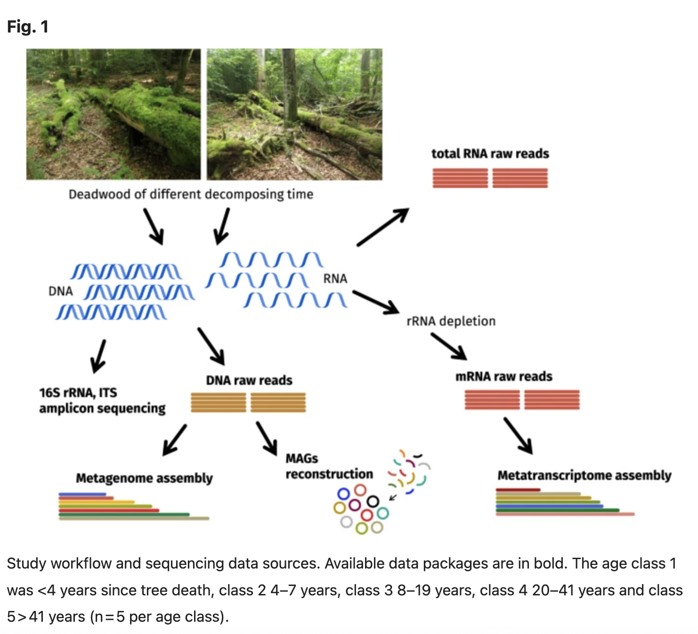

# Additional data

If you would like additional practice, this article describes sequencing data for microbes found on European beech (Fagus sylvatica L.) deadwood in order to better understand decomposition. The samples have been classified by their age since tree death (<4, 4-7, 8-19, 20-41, and >41 years).

Tláskal, V., Brabcová, V., Větrovský, T. et al. Metagenomes, metatranscriptomes and microbiomes of naturally decomposing deadwood. Sci Data 8, 198 (2021). https://doi.org/10.1038/s41597-021-00987-8

{width=75%}

Data includes amplicon-based metagenomes (16S for bacteria and ITS2 for fungi), Illumina and PacBio shotgun metagenomes, and metatranscriptomes (both total RNA and mRNA). There are 25 samples, though not all samples have all sequencing datatypes. Table 1 in the figure has more information about the samples. All sequencing data can be found in Bioproject: PRJNA603240. Disclaimer: We have not tested all of these data with the workflows in the workshop but you should have enough training to be able to run several of the workflows with these data.
