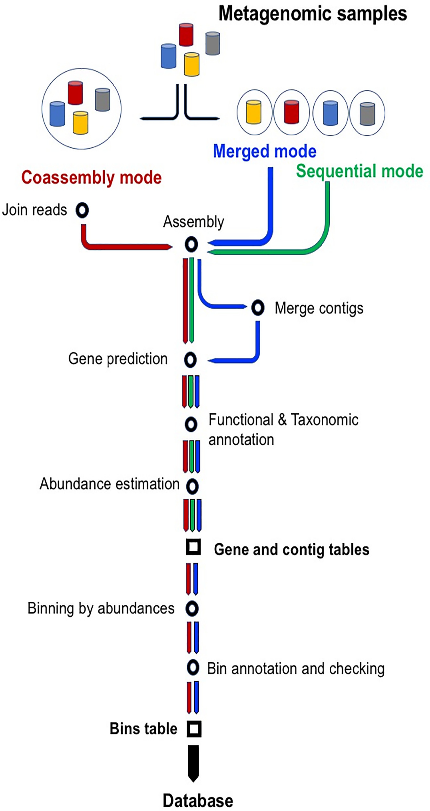
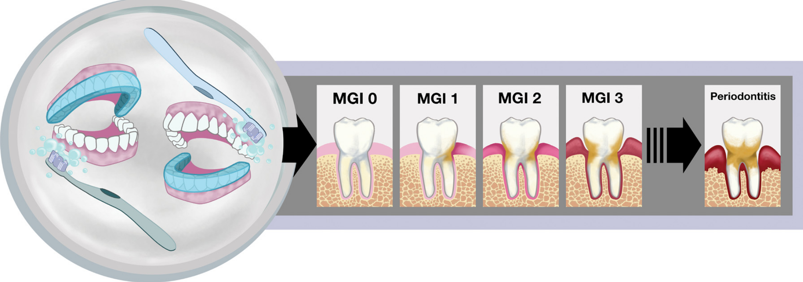

# Metatranscriptomics Analysis with SqueezeMeta

## What is SqueezeMeta?

SqueezeMeta is a fully automatic pipeline for metagenomics/metatranscriptomics. It includes multi-metagenome support that enables co-assembly of related metagenomes and retrieval of individual genomes[1].

## SqueezeMeta Workflow
{width=100%}
Figure 1: Workflow of the three modes of operation of SqueezeMeta: sequential, co-assembly and merged. Starting from metagenomic samples, green, blue and red arrows indicate main steps in sequential, merged and co-assembly modes. All modes create two of the three main results tables: open reading frame (ORF) and contig tables. Co-assembly and merged modes also apply binning and, therefore, they also create the bin table.

## Tutorial Introduction
Over half of adults experience gingivitis, a mild yet treatable form of periodontal disease caused by the overgrowth
of oral microbes. Left untreated, gingivitis can progress to a more severe and irreversible disease, most
commonly chronic periodontitis. While periodontal diseases are associated with a shift in the oral microbiota
composition, it remains unclear how this shift impacts microbiota function early in disease progression. Metatranscriptome
sequencing analysis indicates that during the early stages of transition to gingivitis, a number of
virulence-related transcripts were significantly differentially expressed in individual and across pooled patient
samples[2].

In this tutorial we will analyze metatranscriptomic data from this study to identify gene function that may be associated
with disease progressions. The publication for this data is located here https://www.ncbi.nlm.nih.gov/pmc/articles/18.pdf

{width=100%}
Figure 2: Study design and visualization of the progression from health to periodontal disease. On the left, the covered or uncovered teeth depict the study design utilized, in which an acrylic stent (shown in blue) was worn to cover either the entire top or bottom set of teeth during brushing throughout the course of the experiment, 2 weeks. The images on the right illustrate the clinical symptoms associated with gingivitis that were scored by trained dental professionals in this study. An modified gingival index (MGI) score of 0 represents a healthy tooth with no indication of inflammation (shown by increasing redness at the gum) or plaque (tan color on tooth). Healthy periodontia progress through various degrees of gingivitis as depicted by the MGI 1, MGI 2, and MGI 3 panels and can eventually progress to the destructive gum disease, chronic periodontitis, shown on the far right.

Many of the steps have been completed beforehand. However, instructions and code are provided so that you
can build the database and format the metadata that we will use with SqueezeMeta.

## Conda Environment

```{bash, eval=FALSE}
# Do not do for this tutorial

conda create -n squeezemeta -c bioconda -c fpusan squeezemeta sra-tools
```

## Retrieve Databases

SqueezeMeta provides a couple scripts that will allow you to download the NCBI taxonomy tree and RefSeq
reference genomes.

```{bash, eval=FALSE}
# Make a new directory and enter it.

mkdir squeezemeta
cd squeezemeta

# Download from source and format the latest version of the annotation databases for use with SqueezeMeta. Do not do this step for this tutorial (It took ~14 hours).

make_databases.pl /home/$USER/squeezemeta/database
```

## Data Download

• This was done already but we will practice downloading data from SRA. Download the metadata from SRA

• Copy the following link into a web browser https://www.ncbi.nlm.nih.gov/bioproject/PRJNA387475

• Select the RNA Seq data with the following SRA IDs and send to the Run selector.

– SRR5787581
– SRR5787582
– SRR5787583
– SRR5787584
– SRR5787585
– SRR5787586

• Export the metadata to your computer and copy to logrus.

```{bash, eval=FALSE}

# Download from source and format the latest version of the annotation databases for use with SqueezeMeta. Do not do this step for this tutorial (It took ~14 hours).

# Parse the metadata to extract the SRR IDs and sample names. This will be need to create sample_file.txt
awk -F',' '{if ($0 !~"^Run") print $1,$27}' SraRunTable.txt | sort -t_ -k2 -k1 > sample_groups.txt

# Create the sample_file.txt file from the sample_groups.txt file
awk -F' ' '{print $2"\t"$1"_pass.fastq.gz""\t""pair1"}' \
sample_groups.txt > sample_file.txt

# Create a file with just the SRR accession IDs
awk '{print $1}' sample_groups.txt > sra_ids.txt
```
• Use the SRA ids for this study to download the raw fastq files from SRA using perfetch and fastq-dump from sra-tools.

```{bash, eval=FALSE}
# Make a directory to store the fastq files
mkdir -p /home/$USER/squeezemeta/fastq

# Move into fastq directory
cd /home/$USER/squeezemeta/fastq

# Download SRA data with prefetch
prefetch -O . -p SRR5787581

# Convert SRA data to fastq format using fastq-dump from sra-tools
fastq-dump --outdir . --gzip --skip-technical --readids \
--read-filter pass --dumpbase --split-e \
--clip /home/$USER/squeezemeta/fastq/SRR5787581

# Use a for loop to download many fastq from SRA.
# Create a variable called ids to store the SRA ids that contained
# in the sra_ids.txt file that we created previously
ids=$(<sra_ids.txt)

# Download SRA data with prefetch using a for loop
for j in $ids; do prefetch -O . -p $j; done

# Convert SRA data to fastq format using a for loop
for j in $ids; do fastq-dump --outdir . --gzip --skip-technical \
--readids --read-filter pass --dumpbase --split-e --clip \
/home/$USER/squeezemeta/fastq/$j; done

# Deactivate fastqdump environment
conda deactivate
```

• Run SqueezeMeta. The top command runs SqueezeMeta using an assembly based method for metatranscriptomics. Unfortunately,
the assembly based method my not be appropriate for this dataset. After assembly, less than 50% of the
reads aligned to the assembly. The bottom command uses the sqm_read.pl script to perform a read based method for
metatranscriptomics and may be more suited for this dataset.

```{bash, eval=FALSE}
# Activate squeezemeta environment
source activate squeezemeta

# Create a symbolic link to fastq files
cd /home/$USER/squeezemeta/fastq
ln -s /home/condasw/data/Metagenomics/SqueezeMeta/fastq/*gz ./

# This is an assembly based method of metatranscriptomics (Finished running in ~4.25 hours)
cd /home/$USER/squeezemeta
SqueezeMeta.pl -m coassembly -p gingivitis_assembly_based -s sample_file.txt \
-f /home/$USER/squeezemeta/fastq -a megahit -map minimap2-sr

# This is read based method of metatranscriptomics (Finished running in ~48 hours)
sqm_reads.pl -p gingivitis_read_based -s sample_file.txt \
-f /home/$USER/squeezemeta/fastq \
--memory 0.1 --num-cpu-threads 12 --euk

# Softlink to pre-run output directory
ln -s /home/elavelle/squeezemeta/gingivitis_2 /home/$USER/squeezemeta/

# Launch R
R
```

## Analysis of SqueezeMeta

• Load SQMtools library and analyze SqueezeMeta data.
• SQMtools manuals https://github.com/jtamames/SqueezeMeta/blob/master/SQMtools_0.5.0.pdf
• SQMtools and R tutorial https://github.com/jtamames/SqueezeMeta/wiki/Using-R-to-analyze-your-SQM-results

```{R, eval=FALSE}
# Load SQMtools library
library('SQMtools')
# set working directory to directory containing gingivitis_2 folder
# replace <username> with your username
setwd('/home/$USER/squeezemeta/')
# Load SqueezeMeta data into R
gingivitis = loadSQM('gingivitis_2')
```
{width=100%}
```{R, eval=FALSE}
# Access Matrix of genera and their abundances
genus_tax = gingivitis$taxa$genus$abund

# Look at the first 6 genera for all 6 samples
genus_tax[1:6, 1:6]

# Access Matrix of KEGG ids and their abundances
KEGG_table = gingivitis$functions$KEGG$abund

# Look at the first 6 KEGG ids for all 6 samples
KEGG_table[1:6, 1:6]

# What Genera are there?
# Plot the top 15 (N) taxonomies at the genus level
# Replace percent with abund to see raw abundance instead of percentages
# Save plots to file with ggplot2
library('ggplot2')
pdf('genus_abund.pdf', width=10, height=8)
plotTaxonomy(gingivitis, rank='genus', count='percent', N = 15)
dev.off()

# Now, we know something about the microbial diversity in the samples,
# but what are they doing? We should check the functional
# profile(KEGG, COG and PFAM annotations) of the samples:
pdf('KEGG_tpm.pdf', width=14, height=12)
plotFunctions(gingivitis, fun_level ="KEGG", count ="tpm", N = 20)
dev.off()

# Which functions are more abundant in the project? We use the DESeq2 package to
# analyze which functions are significantly more abundant in
# Load DESeq2 package
library('DESeq2')

# Create the required matrix with the raw abundances, colData (metadata file)
metadata = as.data.frame(c(rep('MGI0',3), rep('MGI2',3)))
rownames(metadata) = colnames(gingivitis$functions$KEGG$abund)
colnames(metadata)='condition'

# Verify sample order
all(rownames(metadata)==colnames(gingivitis$functions$KEGG$abund))

# Convert your data to the format required by DESeq2
dds = DESeqDataSetFromMatrix(countData = gingivitis$functions$KEGG$abund, colData = metadata,
design = ~ condition)

# Remove low abundant KEGGs:
keep = rowSums(counts(dds)) >= 10
dds = dds[keep,]

# Choose factor levels
dds$condition=factor(dds$condition, levels=c('MGI2','MGI0'))

# Run DESeq2
dds2=DESeq(dds)
results=results(dds2, name='condition_MGI0_vs_MGI2')

# Make and save MA plot
6
pdf("MA_plot.pdf")
plotMA(results, ylim=c(-2,2))
dev.off()

# Transform data
rld <- rlogTransformation(dds2)

# Create Heatmap based on KEGG expression
sampleDists <- as.matrix(dist(t(assay(rld))))
library(gplots)
pdf("KEGG-heatmap-samples.pdf", w=50, h=50, pointsize=50)
heatmap.2(as.matrix(sampleDists), key=F, trace="none",
col=colorpanel(100, "blue", "white"),
margin=c(30, 30), main="Sample Distance Matrix")
dev.off()

# Principal components analysis
# Can do with built-in DESeq2 function:
pdf("KEGG_pca.pdf")
plotPCA(rld, intgroup=c("condition"))
dev.off()

# Get differential expression results for MGI0 vs MGI2
MGI2_from_MGI0 <- results(dds2, contrast=c("condition", "MGI0", "MGI2"))

# Order by adjusted p-value
MGI2_from_MGI0 <- MGI2_from_MGI0[order(MGI2_from_MGI0$padj), ]

# Merge with normalized count data
resdata <- merge(as.data.frame(MGI2_from_MGI0), as.data.frame(counts(dds2, normalized=TRUE)),
by="row.names", sort=FALSE)
names(resdata)[1] <- "KEGG"
head(resdata, n = 15)

# Write results
write.csv(resdata, file="MGI2_from_MGI0_DE.csv")

# Now we can subset the SqueezeMeta results and create heatmaps for the most significant KEGGs
top15_sigs = subsetFun(gingivitis, fun = 'K09942|K01775|K11607|K15022|K02647|K05524|K00176|K01267| \
|K03469|K07095|K08987|K11604|K17472|K11645|K16950', fixed = F)
pdf("top_15_sig.pdf")
plotFunctions(top15_sigs, fun_level = "KEGG", count = 'tpm')
dev.off()

# Now subset data for all significant pathways with padj <= 0.05
# First we will look at the DE results spreadsheet MGI0_VS_MGI2_DE.CSV and select KEGGs with padj
all_sigs = subsetFun(gingivitis, fun = 'K09942|K01775|K11607|K15022|K02647|K05524|K00176|K01267|\
|K03469|K07095|K08987|K11604|K17472|K11645|K16950|K16191|K06889|K15539|K19002|K00876|K02119|\
|K02120|K16327|K06079|K08999|K04758|K11066|K08279|K09946|K02392|K11910|K03409|K07658|K01761|\
|K02794|K01364|K01923|K00278|K01284|K01489|K09797|K21556|K15582|K12410|K13789|K14982|K15125|\
|K06298|K03856|K00266|K03551|K09607|K04026|K03558|K20777|K02389|K01443|K03152|K11748|K02388|\
|K03426|K03584|K05515|K12527|K00226|K01783|K07444|K11995|K11720|K11617|K01006|K02039|K16066|\
|K00552|K16149|K03555|K17722|K01486|K07775|K07305|K03413|K03548|K09762|K03324|K07636|K00830|\
|K02666|K03273|K02970|K03817|K12994|K12264|K07106|K22431|K00412|K06948|K00812|K01961|K07729|\
|K00978|K03332|K03151|K06861|K13098|K02406|K06890|K01791|K13888|K00848|K02919|K00030|K01919|\
|K02409|K22212|K22432|K02656|K08364|K01182|K09775|K15789|K18987|K22293|K07346|K11708|K00265|\
|K05807|K04756|K03655|K03648|K01807|K16511|K00337|K13677|K00549|K02837|K02784|K07035|K07078|\
|K07258|K02824|K02556|K01627|K06188|K02836|K03831|K10119|K09474|K02518|K03292|K03308|K00826|\
|K06209|K02897|K02668|K21472|K12132|K06485|K07665|K03594|K00013|K03191|K01950|K01739|K01926|\
|K03718|K07343|K02395|K19286|K19354|K03205|K00570|K07137|K02393|K03585|K16301|K03589|K01887|\
|K03569|K00788|K05837|K19157|K02124|K02217|K07473|K06020|K16012|K02952|K03270|K03694|K20884|\
|K19304|K00748|K06178|K03828|K07791|K01092|K01609|K00794|K01507|K02028|K03086|K07037|K03339|\
|K06950|K07031|K09153|K13012|K00558|K02431|K03595|K02340|K08218|K07098|K01819|K18133|K06131|\
|K07216|K07273|K01420|K07816|K00602|K00158|K19158|K01924|K04082|K05601|K11145|K02123|K02529|\
|K01095|K11068|K06871|K02025|K02117|K11473|K03969|K14059|K01243|K01358|K20114|K07016|K09794|\
|K12960|K03289|K01653|K03790|K04764|K03841|K03089|K10530|K02563|K01754|K02343|K02110|K09791|\
|K06042|K03110|K13634|K01858|K04486|K00101|K01682|K03601', fixed = F)

# To calculate the log-fold change of a KEGG, you can provide a list of vectors.
# Create vectors with sample names by condition (cond):
MGI0.samples = gingivitis$misc$samples[grep('MGI0', gingivitis$misc$samples)]
7
MGI2.samples = gingivitis$misc$samples[grep('MGI2', gingivitis$misc$samples)]
cond = list(MGI0.samples, MGI2.samples)

# Choose colors, one per condition
colors = c('#006682', '#c26e00') ##006682 = blue , #c26e00 = orange

# Plot log2 fold changes using copy number abundances in the selected KEGG pathway:
# beta-Lactam resistance Ko01501
# The hue of the color depends on the value of the log-fold-change calculated using
# copy numbers: the darkest orange implies a log-fold-change value >= 1.5
#(more abundant in MGI2) and the darkest blue a log-fold-change <= -1.5
#(more abundant in MGI0 samples). See Figure 3 below:
exportPathway(all_sigs, '01501', output_suffix = 'beta_lactam_resis.log2FC',
fold_change_colors = colors, fold_change_groups = cond, count ='copy_number',
max_scale_value = 10)

# Periodontal Pathogens Produce Quorum Sensing Signal Molecules
exportPathway(all_sigs, '02024', output_suffix = 'Quorum_sensing.log2FC',
fold_change_colors = colors, fold_change_groups = cond, count ='copy_number',
max_scale_value = 10)
```

## References
[1] Tamames J, Puente-Sánchez F. SqueezeMeta, A Highly Portable, Fully Automatic Metagenomic Analysis Pipeline. Front
Microbiol. 2019;9:3349. Published 2019 Jan 24. doi:10.3389/fmicb.2018.03349 Format:
[2] Microbiota and Metatranscriptome Changes Accompanying the Onset of Gingivitis Emily M. Nowicki, Raghav Shroff, Jacqueline
A. Singleton, Diane E. Renaud, Debra Wallace, Julie Drury, Jolene Zirnheld, Brock Colleti, Andrew D. Ellington,
Richard J. Lamont, David A. Scott, Marvin Whiteley mBio. 2018 Mar-Apr; 9(2): e00575-18. Published online 2018 Apr 17.
doi: 10.1128/mBio.00575-18 PMCID: PMC5904416.
