---
title: "Metagenomics Workshop NCGR"
site: bookdown::bookdown_site
documentclass: book
bibliography: [book.bib, packages.bib]
# url: your book url like https://bookdown.org/yihui/bookdown
# cover-image: path to the social sharing image like images/cover.jpg
description: |
  This is a minimal example of using the bookdown package to write a book.
  The HTML output format for this example is bookdown::gitbook,
  set in the _output.yml file.
link-citations: yes
github-repo: rstudio/bookdown-demo
---

# Community Profiling and Metagenomics

## Microbes were the first life forms on this planet

1. Earth declares its independence about 4600 MYA

<<<<<<< HEAD
{width=80%}
=======


{width=100%}
{width=100%}
>>>>>>> 148c40f8fe67fc7f9433a9beb868929d9cf76845

2. First photosynthetic bacteria 3.4 billion years ago (BYA)
+ Used sunlight for energy to create biomass
+ Anaerobic (anoxic photosynthesis)

<<<<<<< HEAD
{width=80%}
=======
{width=100%}

{width=100%}
>>>>>>> 148c40f8fe67fc7f9433a9beb868929d9cf76845

3. 2.7 BYA first oxygen producers emerge
+ Oxygen as waste product during respiration
+ Most of the oxygen was sequestered and not readily available
<<<<<<< HEAD

{width=80%}

=======
>>>>>>> 148c40f8fe67fc7f9433a9beb868929d9cf76845
4. 2.3 BYA atmosphere has oxygen
5. 500 million year ago (MYA) first terrestrial plants
6. 200 MYA mammals emerged
7. 13 MYA one of us makes all of us proud by learning how to fly
8. 10 MYA the branch of life currently called homo emerges
9. 400 years ago humans observe the first microbe under
a simple scope

<<<<<<< HEAD
{width=80%}
=======
{width=80%}

https://education.nationalgeographic.org/resource/age-earth/#undefined

>>>>>>> 148c40f8fe67fc7f9433a9beb868929d9cf76845

#### THERE WOULD BE NO LIFE WITHOUT MICROBES{-}

### Microbes enable habitability on Earth by catalyzing reactions of biogeochemical cycles

1. The amount or % of elements on Earth remains constant
2. Recycling of these elements, flux, and bio-availability is
largely taken care of by microbes
3. Best example to illustrate – nitrogen

+ 78% of Earths atm is N2
+ Required for important biological processes
+ In gaseous form it is unavailable
+ In fact many processes are N2 limited
+ Making N2 bioavailable in a form that can be
by eukaryotes is completely on the shoulders of microbes

#### Nitrogen Cycle
 
<<<<<<< HEAD
{width=80%}

#### Carbon Cycle

{width=80%}
=======
{width=80%}

https://cdn.britannica.com/37/6537-050-CF14602B/ammonia-Nitrogen-fixation-nitrogen-form-means-nitrates-1909.jpg

#### Carbon Cycle

{width=80%}

{width=80%}

https://www.pmel.noaa.gov/co2/story/Carbon+Cycle
>>>>>>> 148c40f8fe67fc7f9433a9beb868929d9cf76845

How many microbes??

1. 40 million microbes in a gram of soil
2. One million microbes in a ml of fresh water
3. One trillion in a human body

#### MICROBES ARE ABUNDANT......AND EXTREMELY DIVERSE!{-}

## How many kinds of living beings are there?

<<<<<<< HEAD
1. Aristotle’s Scala naturae – 350 BC

{width=80%}

2. 2000 yrs later

+ Edward Hitchcoc
    + 1840

{width=80%}
=======
1. Aristotle’s Scala naturae
= **350 BC**

{width=55%}
{width=40%}

https://sites.google.com/site/aristotlethebiologist/aristotle-s-biology/great-chain-of-being

{width=60%}

https://upload.wikimedia.org/wikipedia/commons/e/e9/Die_Leiter_des_Auf-_und_Abstiegs.jpg

2. 2000 yrs later

+ Edward Hitchcock
    + 1840
+ 

{width=80%}

https://upload.wikimedia.org/wikipedia/commons/8/8f/Edward_Hitchcock_Paleontological_Chart.jpg
>>>>>>> 148c40f8fe67fc7f9433a9beb868929d9cf76845

+ Ernst Haeckel
    + 1879

<<<<<<< HEAD
{width=80%}
=======
{width=80%}

https://upload.wikimedia.org/wikipedia/commons/d/de/Tree_of_life_by_Haeckel.jpg
>>>>>>> 148c40f8fe67fc7f9433a9beb868929d9cf76845

+ Charles Darwin 
    + 1837
    + The idea that species could have evolved from an ancestor
    + This could have happened through transmutations
    + Premise for trees today
    + ALL METHODS DEPEND ON **OBSERVABLE MORPHOLOGICAL TRAITS** FOR CATEGORIZATION

<<<<<<< HEAD
## What happened when we found out about microbes?

{width=80%}
=======
{width=80%}


## What happened when we found out about microbes?

{width=80%}

https://hms.harvard.edu/news/diet-gut-microbes-immunity
>>>>>>> 148c40f8fe67fc7f9433a9beb868929d9cf76845

### Roadmap to where we are now with determining microbial diversity{-}

1. Leeuwenhoek
+ Father of microbiology
+ Late 1600’s
+ Microscope

<<<<<<< HEAD
{width=80%}
=======
```{bash}
ln -s /home/pangenomics/data/yprp/ .
```


{width=80%}

{width=80%}
>>>>>>> 148c40f8fe67fc7f9433a9beb868929d9cf76845

2. Robert Koch
+ 1890
+ First time bringing microbes to the lab
+ Cultivation of microbes

{width=80%}

3. Discovery of DNA structure
+ Rosiland Franklin
    + 1951

{width=80%}

+ Frederick Sanger
    + 1975
    
{width=80%}

+ Carl Woese
    + 1977

{width=80%}

#### DNA Structure{-}

{width=80%}


## Tree of Life

{width=80%}

“Visible organisms represent the smallest sliver of life’s diversity. Bacteria are the true lords of the world. They have been on this planet for billions of years and have irrevocably changed it, while diversifying into endless forms most wonderful and most beautiful.” (The Atlantic)

Life just got weird!

{width=80%}

## What Makes Microbes so Special?

1. -15oC/4oF to 130oC/266oF temperatures
2. 0 to 12.8 pH acidity
3. More than 200 atm pressure
4. 4 miles deep into Earth’s crust
5. Up to 5kGy radiation

###  Grand Prismatic Spring – YNP – 183oC{-}

1. Validates the importance of microbes and sums up life on Earth with boundaries.

{width=80%}

2. Microbes are constantly trying to evolve and get deeper and deeper into the hot springs

3. Eukaryotes only surround this spring – cannot survive close to the hot spring

### The great “plate count” anomaly

1. Cultivation based cell counts are orders of magnitude lower than direct microscopic observation

{width=80%}

2. As microbiologists, we are able to cultivate only a small minority of naturally occurring microbes

3. Our nucleic acid derived understanding of microbial diversity has rapidly outpaced our ability to culture new microbes

### Total number of genomes at NCBI

1. Haploid genome
2. Single circular chromosome, plasmids
3. Metabolic diversity
4. Genetic malleability
5. No nucleus
6. Easy interspecies gene transfer

{width=80%}

https://www.ncbi.nlm.nih.gov/genome/browse/#!/overview/

## Roadmap to Culture Independent Techniques

1. rRNA as an evolutionary marker 
+ 1977 
+ (Woese and Fox, PNAS)
2. Polymerase Chain Reaction
+ 1985
+ (K. Mullis, Science)
3. “Universal Primers” for rRNA sequencing
+ 1985
+ (N. Pace, PNAS)
4. PCR amplification of 16S rRNA gene
+ 1989
+ (Bottger, FEMS Microbiol)
5. Curation and hosting of RDP
+ Early 1990’s
+ (rRNA database) FTP
6. Term ‘microbiome’
+ 2001
+ coined by Lederberg and McCray

## Microbiomes and their significance
+ Microbes do not work or function as a single entity
+ Most microbial activities are performed by complex communities of microorganisms
    + **Microbiome**

### What is a microbiome

1. Totality of microbes in a defined environment, and their intricate interactions with each other and the surrounding environment
+ A population of a single species is a culture(monoculture), extremely rare outside of lab and in some infections
+ A microbiome is a mixed population of different microbial species
+ MIXED COMMUNITY IS THE NORM!
 
### Why Study Microbiomes
 
1. Microbes modulate and maintain the atmosphere
+ Critical elemental cycles (carbon, nitrogen, sulfur, iron,...)
+ Pollution control, clean up fuel leaks
2. Microbes keep us healthy
+ Protection from pathogens
+ Absorption/production of nutrients in the gut
+ Role in chronic diseases (obesity, Crohn’s/IBD, arthritis...)
3. Microbes support plant growth and suppress plant disease
+ Most complex communities reside in soil
+ Crop productivity

### Why is Microbiome Research New?

1. Bias for microbes (especially pathogens) that are
cultivable
+ Culture-based methods do not detect majority of microbes
+ Only pathogens are easily detected
+ And most microbes are not pathogens
2. Availability of tools
+ Discovery of culture independent techniques
+ Amplicon sequencing and DNA sequencing


{width=80%}

{width=80%}

{width=80%}

1. Recovered over 150,000 microbial genomes from ~10,000 metagenomes

2. 70,178 genomes assembled with higher than 90% completeness

3. 3,796 SGBs (species-level genome bins) identified -77% of the total representing species without any publicly available genomes
 
### Microbiome Projects and Databases

1. American Gut Project
2. Earth microbiome Project
3. Human Oral Microbiome Database
4. CardioBiome
5. Human Microbiome Studies – JCVI
6. MetaSub – Metagenomics and metadesign of Subways and Urban Biomes
7. Gut microbiota for Health
8. NASA: Study of the impact of long term space travel in the Astronaut’s
microbiome
9. Michigan microbiome project
10. Coral microbiome project 
11. Seagrass microbiome project

## Structural and Functional Approaches to study microbiomes

{width=80%}

### 16S rRNA as an evolutionary chronometer

{width=80%}

1. Ubiquitous – present in all known life (excluding viruses)
2. Functionally constant wrt translation and secondary structure
3. Evolves very slowly – mutations are extremely rare
4. Large enough to extract information for evolutionary inference
5. Limited exchange – limited examples of rRNA gene sharing between organisms

### 16S rRNA vs rpoB (RNA polymerase β subunit gene)

{width=80%}

#### 16S rRNA hypervariable regions

{width=80%}

{width=80%}

Illustration of different hypervariable regions of 16S rRNA

## Basic Workflow for 16S Gene Based Sequencing

{width=80%}

## Addressing the ‘fine print’ while generating 16S rRNA gene amplicon libraries

1. Sample Collection
+ Sample collection significantly influences the microbiome profiler 
after sequencing
+ Sample storage
2. DNA isolation
+ Template concentration
+ Template extraction protocol
3. PCR amplification
+ PCR bias and inhibitors
+ Amplification of contaminants

J. Microbiol Methods (2018), App. Environ. Microbiol. (2014), Microbiome (2015)

## Steps Involved

1. Experimental Design: How many samples can be included in the sequencing run?
+ By using barcoded primers, numerous samples can be sequenced simultaneously (multiplexing)

{width=80%}

### Samples

1. More the number of samples, more cost effective the run (sequencing depth will be compromised)

Comparison of multiplexing capacity by sequencing system

{width=80%}

2. It is critical to have a ‘library prep manifest’ to document the position of each sample with its associated barcode along with additional metadata information

### Include Controls

1. Between run repeat (process any sample in duplicate per run to measure reproducibility across runs)
2. Within run repeat (process any sample in duplicate per plate to measure reproducibility)
3. Water used during PCR (water blank- to determine if any contaminant was introduced during PCR reaction)
4. Water spiked with known bacterial DNA (mock bacterial communities- enables quantification of sequencing errors, minimizes bias during sampling and library preparation )

### DNA extraction protocol

1. Effect of mechanical lysis methods for extraction
2. Presence of inhibitors such as organic matter, humic acid, bile salts, polysaccharides
3. DNA yield post extraction and reproducibility

Effect of bead beating was larger than sampling time over 5 months

{width=80%}

A. Percentage read abundance of the 11 most abundant phyla as a result of bead beating intensity 
B. PCA of samples with different bead beating intensities vs. samples taken at different dates

### Selection of primers and region of 16S gene influence microbial profile

V2, V4, V6-V7 regions produced consistent results

{width=80%}

1. V2, V3 and V6 contain maximum nucleotide heterogeneity
2. V6 is the shortest hypervariable region
with the maximum sequence
heterogeneity
3. V1 is best target for distinguishing
pathogenic S aureus
4. V2 and V3 are excellent targets for
speciation among Staph and Strep pathogens as well as Clostridium and Neisseria species
5. V2 especially useful for speciation of Mycobacterium sp. and detection of E coli O157:H7
6. V3 useful for speciation of
Haemophilus sp
7. V6 best target for probe based PCR assays to identify CDC select agents (bio-terrorism agents)

{width=80%}

### Purification of Amplicons

After one –step or two-step PCR, products are cleaned up using AMpure beads

{width=80%}

1. Gel Electrophoresis and quantification of cleaned amplicon products
+ Qubit
2. Sample pooling – equimolar concentrations (how many samples do you want to pool? How many reads per sample?
3. Gel extraction of pooled product
4. Final clean up (Qiagen kit) and QC

{width=80%}

[Amplicon Sequencing Library Prep - PacBio](https://www.pacb.com/wp-content/uploads/Multiplexed-Amplicon-Library-Preparation-Using-SMRTbell-Express-Template-Prep-Kit-2.0-–-Customer-Training.pdf)


#### Overview of generic amplicon workflow

{width=80%}

## Data Processing{-}

### FastQC

{width=80%}

1. Many tools/options to filter and trim data
2. Trimming does not always improve things as valuable information
can be lost!
3. Removal of adapters is critical for downstream analysis

### Dereplication

1. In this process all the quality-filtered sequences are collapsed into a set of unique reads, which are then clustered into OTUs
2. Dereplication step significantly reduces computation time by eliminating redundant sequences

### Chimera detection and removal of non-bacterial sequences

Chimeras as artifact sequences formed by two or more biological sequences incorrectly joined together
 
{width=80%}

Incomplete extensions during PCR allow subsequent PCR cycles to use a partially extended strand to bind to the template of a different, but similar, sequence. This partially extended strand then acts as a primer to extend and form a chimeric sequence.

### Clustering

1. Analysis of 16S rRNA relies on clustering of related sequences at a particular level of identity and counting the representatives of each cluster

{width=80%}

Some level of sequence divergence should be allowed – 95% (genus-level, partial 16S gene), 97% (species-level) or 99% typical similarity cutoffs used in
practice and the resulting cluster of nearly identical tags (assumedly identical genomes) is referred to as an OTU (Operational Taxonomic Unit)

### Create OTU tables

OTU table is a matrix that gives the number of reads per sample per OTU

{width=80%}

### Bin OTUs into Taxonomy (assign taxonomy)

1. Accuracy of assigning taxonomy depends on the
reference database chosen
+ Ribosomal Database Project
+ GreenGenes
+ SILVA
2. Accuracy depends on the completeness of databases

{width=80%}

### Assess Population Diversity: **alpha diversity**

1. Assessment of diversity involves two aspects
+ Species richness (# of species present in a sample)
+ Species evenness (distribution of relative abundance of species)

2. Total community diversity of a single sample/environment is given by alpha-diversity and represented using rarefaction curves

3. Quantitative methods such as Shannon or Simpson indices measure evenness of the alpha- diversity
 
{width=80%}

### Assess Beta Diversity

1. Beta-diversity measures community structure differences (taxon composition and relative abundance) between two or more samples
+ For example, beta-diversity indices can compare similarities and differences in microbial communities in healthy and diseases states
2. Many qualitative (presence/absence taxa) and
quantitative(taxon abundance) measures of community
distance are available using several tools
+ LIBHUFF, TreeClimber, DPCoA, UniFrac (QIIME)
 
### Measuring Population Diversity: **alpha and beta diversity**

{width=80%}

## Diversity Measurements with 16s rRNA sequencing

1. Overall Benefits
+ Cost effective
+ Data analysis can be performed by established pipelines
+ Large body of archived data is available for reference

2. Overall Limitations
+ Sequences only a single region of the genome
+ Classifications often lack accuracy at the
species level
+ Copy number per genome can vary. While they
tend to be taxon specific, variation among
strains is possible
+ Relative abundance measurements are
unreliable because of amplification biases
+ Diversity of the gene tends to overinflate
diversity estimates

3. FastQC for 16S rRNA dataset
+ Extremely biased per base sequence content
+ Extremely narrow distribution of GC content
+ Very high sequence duplication levels
+ Abundance of overrepresented sequences
+ In cases where the PCR target is shorter than the read length, the sequence will read through into adapters
 

## QIIME 2

Importing data
Demultiplexing
Running Quality Control
Creating a feature table
Building a phylogenetic tree
Calculating core diversity metrics
Testing alpha diversity group significance and correlation
Performing beta diversity ordination
Testing beta diversity group significance
Assigning taxonomies
Performing differential abundance analysis with ANCOM and/or  gneiss

## Taxonomy: Expectation vs Reality

{width=80%}

## Beta Diversity - UniFrac

1. Measures how different two samples’ component  sequences are

{width=80%}

2. Weighted Unifrac: takes abundance of each sequence  into account

## Results from Paper

1. Main phyla: Firmicutes, Bacteroidetes, Proteobacteria,  Actinobacteria, Fusobacteria with differences bw samples
2. Sputum (patient) samples had highest diversity followed  by oropharynx samples followed by nasal
3. Healthy controls (N and O) more diverse than samples  from TB patients
4. Between-group comparisons?
5. Phyla differences?


```{r include=FALSE}
# automatically create a bib database for R packages
knitr::write_bib(c(
  .packages(), 'bookdown', 'knitr', 'rmarkdown'
), 'packages.bib')
```

<!--chapter:end:index.Rmd-->

<<<<<<< HEAD
# Visualizing Genomes

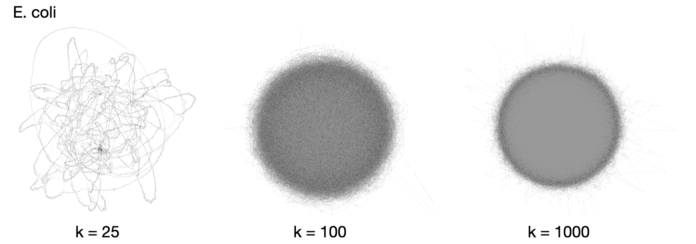{width=100%}

## Set up Directories

1. Make sure you're working in a **screen**

2. Make directory

```
mkdir viz
```
3. Navigate to the directory

```
cd viz
```
4. Link to data

```
ln -s /home/pangenomics/data/yprp/ .
```

## Graphical Fragment Assembly (GFA) format

+ Originally developed for representing genomes during assembly
+ Now used for pangenomics 
+ More on this later...

## Bandage

{width=100%}

+ BLAST integration
  + Can build a local BLAST database of the graph
  + Can do a web BLAST search with sequences from nodes
2. More details on making CSV labels: https://github.com/rrwick/Bandage/wiki/CSV-labels

### **Group exercise:**{-}

1. Copy the following example graph from logrus to your computer:
```
logrus:/home/<username>/yprp/example/S288C.SK1.minigraph.gfa
```
2. Open Bandage and load the graph
3. Spend some time exploring the graph
4. If your have BLAST, find [CUP1](https://www.yeastgenome.org/locus/S000001095) and [YHR054C](https://www.yeastgenome.org/locus/S000001096) via BLAST
  + How many copies are in the graph?
  + What does the structure it’s in look like?
  + Take a screenshot of the region that CUP1 is in with the gene colored

## General Feature Format (GFF)

https://genome.ucsc.edu/FAQ/FAQformat.html#format3


+ Plain text file
+ 3 different versions
+ Each line represents a feature
+ 9 Columns
  + Tab separated
  + First 7 are the same for all feature types
    + seqname, source, feature, start, end, score, strand
  + 8th column is phase of CDS (coding DNA sequence) features
    + 0, 1, or 2 for CDS features, . otherwise
  + 9th column is for additional attributes related to feature

## Browser Extensible Data (BED) Format

https://genome.ucsc.edu/FAQ/FAQformat.html#format1

+ Plain text file
+ Designed for drawing features in genome browsers
+ Each line represents a genomic region and associated annotations
  + Features aren’t necessary biological
+ 12 Columns
  + Tab or white-space separated
  + First 3 are required
    + chrom, chromStart, chromEnd
  + The next 9 are optional
    + name, score, strand, thickStart, thickEnd, itemRgb, blockCount, blockSizes, blockStart

## Integrative Genomics Viewer (IGV)

https://software.broadinstitute.org/software/igv/

+ View GFF/BED files relative to FASTA and multiple sequence alignments
+ Doesn’t work with with names that contain dots “.”
  + This conflicts with our naming convention, but we’ll work around it...

### **Group exercise:**{-}

1. Open IGV with S288C and GFF from [YPRP](https://yjx1217.github.io/Yeast_PacBio_2016/data/)
2. Find [CUP1](https://www.yeastgenome.org/locus/S000001095) and [YHR054C](https://www.yeastgenome.org/locus/S000001096)
    + How many copies does it have?

## Linking IGV with Bandage

1. Convert graph from gfa to bed

```
gfatools gfa2bed yprp/example/S288C.SK1.minigraph.gfa > S288C.SK1.minigraph.bed

```

### **Group Exercise**{-}

1. Find an interesting structure in Bandage
2. Get its node ID(s)
3. `grep` the BED file for the ID(s)

Why isn’t this BED file going to work in IGV?
+ How should we solve this issue?

4. Implement *your* solution
5. Are there any other nuances you notice in the BED file?
=======
# Filter out Red Alder Sequencing Reads

In order to focus on sequencing reads from the microbes in the nodule, we will filter out reads that align to the red alder genome as follows:

1 Align the fastq-formatted reads to the red alder genome using minimap2.
2 Extract reads that do not align to red alder and sort them using samtools.
3 Create a fastq file with only the unaligned reads using samtools bam2fastq.
4 Compress the fastq file using gzip.

+ Activate the environment that contains minimap2 and samtools

```
conda activate seqtools
```

+ Make a directory and go into it

```
mkdir ~/microbe_fastq
cd ~/microbe_fastq
```

+ Link to the merged minion reads

```
ln -s /home/cjb/minion/2022/data/minit4/data/AlderNodule3469-3/3469-3/20220701_2144_MC-113445_FAS21661_134c02ac/fastq_pass/all.fastq 3469-3.all.fastq
```

+ Run Minimap2 to align the MinION reads to the red alder genome
    + he -x map-ont parameter (allows ~10% error + divergence)

```
minimap2 -x map-ont -L -t 8 -a \
/home/cjb/minion/2019/indexes/red_alder_genome/consensus.fasta \
3469-3.all.fastq > 3469-3-minionxredalder.mm2.sam
```

+ Convert the unmapped reads in the alignment file (sam) to a fastq file
    + The -f4 includes only reads with the 4 flag (unmapped)

```
samtools fastq -f4 3469-3-minionxredalder.mm2.sam > 3469-3.microbe.fq
```

+ Compress the new fastq file 
    + (note that it will automatically add the extension .gz)

```
gzip 3469-3.microbe.fq
```

### Now run these steps with 4956-3 (minit3){-}

Reads are here: 

/home/cjb/minion/2022/data/minit3/data/aldernodule4956-3/4956-3/20220701_2154_MC-113286_FAS37509_f3119554/fastq_pass/all.fastq

>>>>>>> 148c40f8fe67fc7f9433a9beb868929d9cf76845


<!--chapter:end:01-visualizing-genomes.Rmd-->

# Reference Graphs with VG

## Variation Graph Toolkit (VG)

+ Constructs graphs
+ Manipulates graphs
+ Indexes graphs
+ Maps sequences to graphs
+ Calls variants on mapped sequences
+ Visualizes graphs

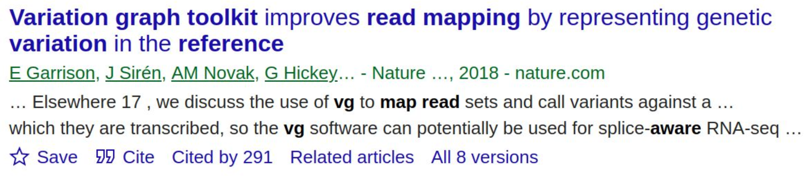{width=65%}

{width=100%}

Also does:

+ [Transcriptomic analysis](https://github.com/vgteam/vg#transcriptomic-analysis)
+ Assembly-based pipelines
+ So much more

Graphs are cyclic, but otherwise general, i.e. reference, iterative, reference-free, etc.

## Reference Graphs

A reference genome "decorated" with variants:

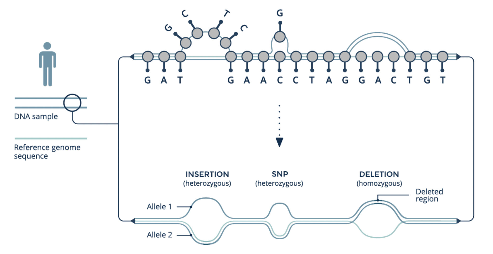{width=100%}
 
## Pipeline

1. Prepare input
2. Construct graph
3. View with Bandage

## Preparing the Input

Already **done** for you:

+ Reference FASTA
  + Description lines should only contain chromosome names
  + Remove extraneous sequences, e.g. mitochondrial DNA
+ VCF
  + Ideally chromosome names exactly match chromosome names in reference

## Set up directories

1. Make sure you're working in a **screen**
2. Make directory

```
mkdir vg
```
3. Navigate to the directory

```
cd vg
```
4. Link to data

```
ln -s /home/pangenomics/data/yprp/ .
```

## Variant Call (VCF) Format

https://en.wikipedia.org/wiki/Variant_Call_Format 

+ Plain text file
+ Header:
  + Header lines start with #
  + Header lines with special keywords start with ##
+ Columns
  + Tab separated
  + 8 mandatory columns
    + CHROM, POS, ID, REF, ALT, QUAL , FILTER, INFO
  + 9th column is optional
    + FORMAT
  + Each additional column represents a sample and has the format described in the FORMAT column
 
## Variation Graph (VG) Format

https://github.com/vgteam/vg/wiki/File-Formats

+ [Protocol Buffer](https://protobuf.dev) messages (protobufs) describing a graph that can store sequence in its nodes and paths
+ Encoded as binary
+ Code for reading/writing protobufs can be generated for
many languages
+ [vg.proto](https://github.com/vgteam/libvgio/blob/master/deps/vg.proto)

## Yeast Data

Reference: **S288C**

VCF: [3 SV calling pipelines on the 11 non-reference strains](https://link.springer.com/article/10.1186/s13059-020-1941-7)

+ [Minimap2](https://github.com/lh3/minimap2) and paftools call
+ [LAST](https://last.cbrc.jp) and [AsmVar](https://github.com/bioinformatics-centre/AsmVar)
+ [nucmer](https://github.com/mummer4/mummer) and [Assemblytics](https://github.com/marianattestad/assemblytics)

This workshop used an updated version of the Phase 1 pipeline available [here](https://github.com/alancleary/sv-genotyping-paper/tree/master/yeast#1-prepare-yeast-assemblies-and-call-svs-relative-to-the-reference-strain-s288c)

## Construct Graph

Construct a graph from the reference and VCF:
```
vg construct -r yprp/assemblies/S288C.genome.fa -v yprp/variants/S288C.vcf -S -a -f -p -t 20 > S288C.vg
```

+ **-r yprp/assemblies/S288C.fa**
    + the reference genome
+ **-v yprp/variants/S288C.sv.vcf**
    + the VCF file containing variants (indels, structures, etc)
+ **-S**
    + include structural variants in construction of graph
+ **-a**
    + save paths for alts of variants by variant ID
+ **-f**
    + don't chop up alternate alleles from input VCF
+ **-p**
    + show progress
+ **-t 20** 
    + use 20 threads
+ **> S288C.vg**
    + write the standard out (the computed graph) into S288C.vg

Compact chains of nodes:
```
vg mod -u S288C.vg -t 20 > S288C.unchop.vg
```

+ **-u**
    + unchop nodes, i.e. compact chains

## Viewing with Bandage

Convert the graph from vg to gfa:
```
vg view S288C.unchop.vg -g > S288C.unchop.gfa
```

+ **-g**
    + output GFA format

### Exercise

1. Open with Bandage
2. Where’s CUP1?
3. Does the graph capture any CNV?
4. What does it look like?
5. Take a screenshot of the CUP1 region
 
## VG Index Formats

https://github.com/vgteam/vg/wiki/File-Formats

XG (lightweight graph / path representation)

+ Binary file containing graph structure (nodes, edges, paths) but no sequences
+ Complex data structure that answers graph queries efficiently

GCSA (Generalized Compressed Suffix Array)

+ Equivalent to .sa file created by bwa index
+ Binary file containing a suffix array that efficiently looks up where sequences occur in the graph

## Indexing

Generate .xg and .gcsa files (5min):
```
vg index -x S288C.xg -g S288C.gcsa S288C.vg -t 20
```

+ **-x S288C.xg**
    + the output .xg file
+ **-g S288C.gcsa** 
    + the output GCSA file
+ **-t 20** 
    + use 20 threads
    
NOTE: **Don’t** index the **unchopped** file!

NOTE: You can index a GFA file but this may have implications for mapping.
There’s also an [autoindex](https://github.com/vgteam/vg/wiki/Automatic-indexing-for-read-mapping-and-downstream-inference) command.

## Graph Alignment/Map (GAM) Format
 
https://github.com/vgteam/vg/wiki/File-Formats

+ Analogous to BAM, but for graphs
+ Binary file describing where reads mapped to in the graph
structure
+ Uncompressed has one read per line
+ Can be converted to JSON for manual parsing (very inefficient!)

## Read Mapping

Map reads (13min):
```
vg map -d S288C -f yprp/reads/SK1.illumina.fastq.gz -t 20 > S288C.SK1.illumina.gam
```

+ **-d S288C**
    + use the S288C.xg and S288C.gcsa files
+ **-f yprp/reads/SK1.illumina.fastq.gz**
    + the reads file
+ **-t 20**
    + use 20 threads
+ **S288C.SK1.illumina.gam**
    + the output GAM file

Computing mapping stats (1min):

```
vg stats -a S288C.SK1.illumina.gam
```

+ **-a**
    + input is an alignment (GAM) file


##  Bringing Alignments Back to Single Genomes

Map reads (2min):

```
vg surject -x S288C.xg -b S288C.SK1.illumina.gam -t 20 > S288C.SK1.illumina.BAM
```
+ **-x S288C.xg**
    + graph or xg to use
+ **-b**
    + BAM output
+ **-t 20**
    + use 20 threads

### **Exercise:**{-}

1. Rename chromosomes in BED for us with IGV
2. Copy BED to personal computer
3. Spend some time looking at BED in IGV and share any interesting observations
you may have? 
+ What’s up with CUP1?
 

##  Preparing the BAM IGV (or other genome viewer)

Only necessary if genome viewer can’t match UCSC style names names in BAM to chromosomes in reference 
===>

1. Convert BAM to SAM:

```
samtools view -h -o S288C.SK1.illumina.sorted.sam S288C.SK1.illumina.sorted.bam
```

2. Remove assembly name:

```
sed 's/S288C.//' S288C.SK1.illumina.sorted.sam > S288C.SK1.illumina.sorted.renamed.sam
```
 
3. Convert SAM to BAM

```
samtools view -bS S288C.SK1.illumina.sorted.renamed.sam > S288C.SK1.illumina.sorted.renamed.bam
```
<===
 
4. Sort the bam file:

```
samtools sort -o S288C.SK1.illumina.sorted.bam S288C.SK1.illumina.bam
```

5. Index BAM:

```
samtools index S288C.SK1.illumina.sorted.renamed.bam
```

## Pack (pileup support) Format

https://github.com/vgteam/vg/wiki/File-Formats

+ Binary file
+ Computes pileup support for each read in a mapping
+ The format isn’t actually documented...

## Calling Graph Supported Variants

Compute read support for variation already in the graph (1min):

```
vg pack -x S288C.xg -g S288C.SK1.illumina.gam -Q 5 -s 5 -o S288C.SK1.illumina.pack -t 20
```

+ **-Q 5**
    + ignore mapping and base quality < 5
+ **-s 5**
    + ignore the first and last 5pb of each read
+ **-o S288C.SK1.illumina.pack**
    + the output pack file
+ **-t 20**
    + use 20 threads
    
Generate a VCF from the support (1min):

```
vg call S288C.xg -k S288C.SK1.illumina.pack -t 20 > S288C.SK1.illumina.graph_calls.vcf
```

## Calling Novel Variants

Augment the graph with the mapped reads (52min):

```
vg augment S288C.vg S288C.SK1.illumina.gam -A S288C.SK1.illumina.aug.gam -t 20 > S288C.SK1.illumina.aug.vg
```

+ *NOTE: Only supports VG files and indexes used for mapping must be built from the same VG file being augmented, i.e. indexes build from GFA files that were then converted to VG won’t work.*

Index the augmented graph (2min):

``` 
vg index -x S288C.SK1.illumina.aug.xg S288C.SK1.illumina.aug.vg -t 20
```

Compute read support for novel variation (3min):

```
vg pack -x S288C.SK1.illumina.aug.xg -g S288C.SK1.illumina.aug.gam -Q 5 -s 5 -o S288C.SK1.illumina.aug.pack -t 20
```

Generate a VCF from the support (5min)

```
vg call S288C.SK1.illumina.aug.xg -k S288C.SK1.illumina.aug.pack -t 20 > S288C.SK1.illumina.aug_calls.vcf
 ```
 
## Calling Variants Already in the Graph

Output variants used to construct graph (<1min):

```
vg deconstruct S288C.xg -P S288C -t 20 > S288C.deconstruct.vcf
 ```
 
+ **-P S288C**
    + report variants relative to paths with names that start with S288C

**`S288C.deconstruct.vcf` might not be identical to S288C.vcf because VG takes liberties with variants when constructing the graph.**

##  Pros and Cons Reference Graphs

**Pros:**

+ Graphs are relatively small
  + Easy to inspect visually
  + Good for low-quality / fragmented assemblies
  + Shorter run-times

**Cons:**

+ Variation represented is determined by VCF pipeline
  + Only describes variation relative to the reference
  + Suboptimal mappings
  + Suboptimal population structure
 
##  Additional vg Commands that are Useful

### vg combine

Combines two or more graphs into one.

+ Use to construct graph in parts (e.g. individual chromosomes) and then combine
+ Use to combine graphs of related species

### Modifying and Simplifying Graphs

**vg chunk** - Splits graphs or alignments into smaller chunks. 

**vg mod** - Used to modify graphs.

  + We’ve already used vg mod -u to “unchop” nodes. 

**vg simplifying** - Simplifies a graph.

**vg find** - Used to identify subgraphs based on various metrics and parameters.

  + e.g. anchored by a region on a specific chromosome. 

Use **--help** with any command to learn how to use it.

## Drawing Graphs 

**vg view** - Outputs graphs and other structures for drawing.

  + We’ve already used vg *view -g* to convert from vg to gfa for viewing in Bandage.
  + Can also output dot (among other files types) which is a more general graph drawing format (compatible with [Graphviz](https://graphviz.org)).

**vg viz** - Basic graph drawing ([documentation](https://github.com/vgteam/vg/wiki/Visualization)).
  + Recommend only using on **small (sub)graphs**.
  + Use in conjunction with *chunk*, *mod*, and/or *find* to draw an interesting subgraph.
  + You can include mapped reads in the visualization!
 


<!--chapter:end:02-reference-graphs-vg.Rmd-->

# Incremental Graphs with *minigraph*

## Minigraph Functions

Constructs graphs

Maps sequences to graphs

https://github.com/lh3/minigraph


## Minigraph Overview

Finds approximate positions of diverged sequences and adds them into the graph

1-to-1 orthogonal regions

<center>
{width=50%}
</center>

## Minimizers and Minimap2
Minigraph is built off of ideas and code from Minimap2.

### Minimizers {-}
From the minimap2 usage:
"A minimizer is the smallest k-mer in a window of w consecutive k-mers."

Essentially a minimizer tags a sequence window with the kmer that is first alphabetically.


A nice tutorial:  
+ https://homolog.us/blogs/bioinfo/2017/10/25/intro-minimizer/

### Minimap2 {-}
Minimap2 is a fast sequence aligner.
It can align short or long reads or assemblies against a reference using the seed-chain-align approach that many aligners employ. It finds exact matches (anchors) between query minimizers (seeds) and indexed reference minimizers. It links colinear anchors together (chains). For nt-level alignment it fills in regions between anchors within chains and between chains (align).

https://github.com/lh3/minimap2  
https://academic.oup.com/bioinformatics/article/34/18/3094/4994778

## Pipeline

1. Prepare the input
2. Build graphs
+ Build a single genome graph and incrementally add more sequences
+ Or build a graph for all sequences at once
3. View with Bandage

## Yeast Assemblies

*12 Mb*  
*16 chromosomes*

<br>
Yeast Population Reference Panel (YPRP)  https://yjx1217.github.io/Yeast_PacBio_2016/data/

12 Yeast PacBio Assemblies (Chromosome level)

>1. ~100-200x PacBio sequencing reads 
>2. HGAP + Quiver polishing  
>3. ~200-500x Illumina (Pilon correction)  
>4. Manual curation  
>5. Annotation

<br>


{width=100%}


<br>

>Make sure your chromosome names are unique across all samples and that they contain the sample name. We’re using \<strain name>.\<chromosome> (>S288C.chrVIII)

<br>

## Prepare the Input

1. Make sure you're working in a **screen**

2. Make Directory

```{bash, eval=FALSE}
mkdir --parents ~/pangenomics/minigraph
```
3. Navigate to the Directory

```{bash, eval=FALSE}
cd ~/pangenomics/minigraph
```
4. Link to data

```{bash, eval=FALSE}
ln -s /home/pangenomics/data/yprp/assemblies/*.fa .
```

## Graphical Fragment Assembly (GFA) format


Tab-delimited text

Lines start with one of the following types:


| Type | Description | Explanation |
|:--|:-----|:---------|
| **H**  |  Header  |       |
| **S**  |  Segment  |  A continuous sequence or subsequence   |
| **L** |  Link |  Segment overlaps (basepairs & orientations)  |
| **J** | Jump | Jumps link sequences across gaps |
| **C** | Containment | Segment contained in another segment |
| **P** | Path | An ordered & oriented list of linked segments |
| **W** | Walk | An ordered & oriented list of segments w/o overlaps |
| **#** | Comment | |

Optional Fields TAG:TYPE:VALUE  
http://gfa-spec.github.io/GFA-spec/GFA1.html

Let's go to the specification to look at optional fields and an example:  
http://gfa-spec.github.io/GFA-spec/GFA1.html


## *reference* Graphical Fragment Assembly (rGFA)

https://github.com/lh3/gfatools/blob/master/doc/rGFA.md

+ Strict subset of GFA
+ Tags that trace origin
+ Stable coordinates

<center>
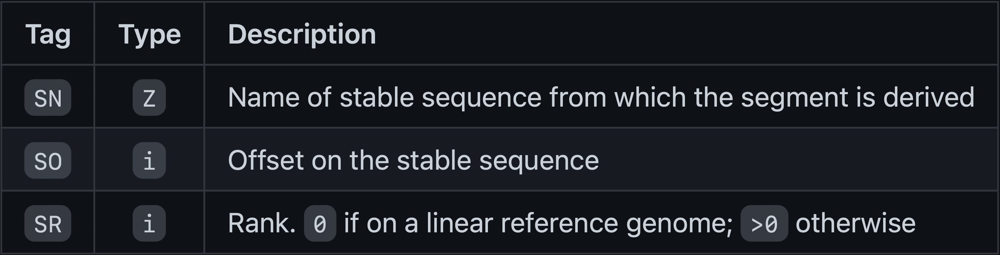{width=80%}

{width=70%}
</center>

## Build Graphs


1. The first sequence in the graph is used as a “reference”:

```{bash, eval=FALSE}
minigraph -xggs reference.fa -t 20 > ref.minigraph.gfa
```

+ **-xggs** 
    + build a graph using a simple (ggs) algorithm
+ **-t 20**
    + use 20 threads

2. Incrementally add strains to graph:

```{bash, eval=FALSE}
minigraph -xggs ref.minigraph.gfa strain_1.fa > strain_1.minigraph.gfa

minigraph -xggs strain_1.gfa strain_2.fa > strain_2.minigrpah.gfa
...

minigraph -xggs string_N-1.gfa strain_N.fa > yprp.minigraph.gfa
```

3. Or build a graph for all strains at once:

```{bash, eval=FALSE}
minigraph -xggs ref.minigraph.gfa strain_*.fa > yprp.minigraph.gfa
```

## Reference Graph

Activate the environment
```{bash, eval=FALSE}
source activate pangenomics
```

Now that you know how to build a minigraph, try to create a graph for the reference (S288C) and answer the following questions.

1. Make the reference graph
```{bash, eval=FALSE}

```

2. How many lines in the gfa file?
```{bash, eval=FALSE}

```

3. What type of lines are they?
```{bash, eval=FALSE}

```

### Reference Graph Commands {-}

1. Make the reference graph

```{bash, eval=FALSE}
minigraph -xggs S288C.genome.fa > ref.minigraph.gfa
```

2. How many lines in the gfa file?

```{bash, eval=FALSE}
wc -l ref.minigraph.gfa
```

3. What type of lines are they?

```{bash, eval=FALSE}
cut -f 1 ref.minigraph.gfa | sort | uniq -c
```

### Reference Graph Bandage Visualization {-}

Download your gfa file onto your computer and upload it into Bandage.

{width=70%}

## YPRP Graphs


1. Add in the rest of the lines
+ we’ll do this alphabetically
+ capture the stderr

```{bash, eval=FALSE}
minigraph -xggs ref.minigraph.gfa $(ls yprp/assemblies/*fa | grep -v S288C) > yprp.minigraph.gfa 2>yprp.minigraph.err
```

*Note:* We can simply use the reference fasta instead of a gfa

```{bash, eval=FALSE}
minigraph -xggs /home/pangenomics/data/yprp/assemblies/S288C.genome.fa $(ls yprp/assemblies/*fa | grep -v S288C) > yprp.minigraph.gfa 2>yprp.minigraph.err
```

Try to answer the following questions:

1. How many lines are in the gfa file?

```{bash, eval=FALSE}

```

2. What type of lines are they?

```{bash, eval=FALSE}

```

3. How many yeast assemblies have inversions compared to S288C (hint: look in the stderr)?

```{bash, eval=FALSE}

```

### YPRP Commands {-}

1. How many lines are in the gfa file?

```{bash, eval=FALSE}
wc -l yprp.minigraph.gfa
```

2. What type of lines are they?

```{bash, eval=FALSE}
cut -f 1 yprp.minigraph.gfa | sort | uniq -c
```

3. How many yeast assemblies have inversions compared to S288C (hint: look in the stderr)?

```{bash, eval=FALSE}
grep inv yprp.minigraph.err
```

### YPRP Graph Statistics {-}

```{bash, eval=FALSE}
export PATH=$PATH:/home/vesw/gfatools/
gfatools stat yprp.minigraph.gfa
```

Number of segments: 2729

Number of links: 3864

Number of arcs: 7728

Max rank: 11

Total segment length: 13243550

Average segment length: 4852.895

Sum of rank-0 segment lengths: 12157149

Max degree: 7

Average degree: 1.416


### YPRP Graph in Bandage {-}

Take a look at the YPRP graph in Bandage. Your might be rendered differently.

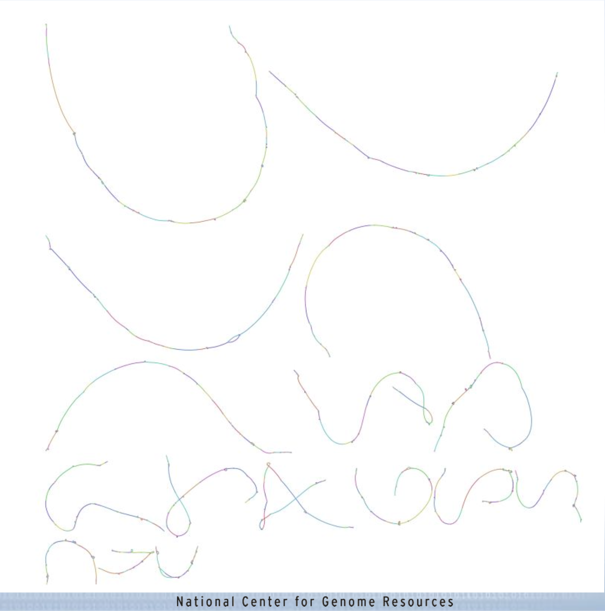{width=100%} 
<br>
<br>

## Structures in the graph

### Insertions and Diverged Regions {-}

Zoom in on segment s1054.

Trace the S288C path (hint: the S288C segments are numbered sequentially).

Identify insertions and regions that have diverged.

 
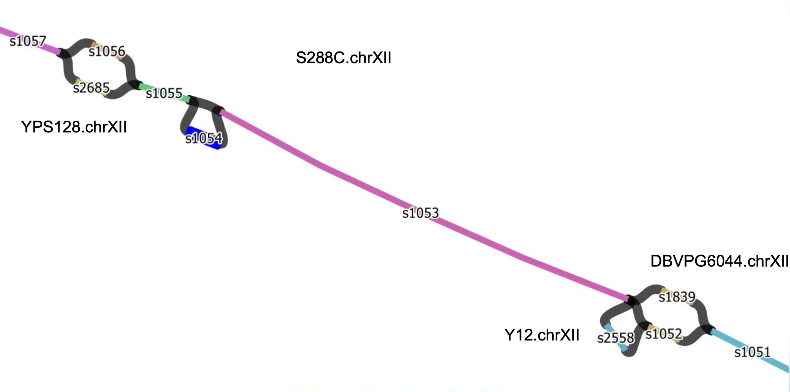{width=100%} 

### Group Exercise{-}

1. Find a simple and a complex region
2. Discuss it in your group
3. Share it with everyone
4. Keep track of the segments

### Inversions {-}

Here are some examples of inversions.

{width=75%} 

Let's find them in bandage.

s1289 LN:i:24089 SN:Z:S288C.chrXIV SO:i:567595

s1672 LN:i:257 SN:Z:DBVPG6044.chrV SO:i:446168


Click on the links (black) to see the direction that paths can travel.

Do a web-blast in Bandage to see what they might code for.


### Inversions in the GFA {-}

I found the inversions by searching the graph GFA file for pairs of segments that have two links between them.

```{bash, eval=FALSE}
 grep '^L' yprp.minigraph.gfa | awk '{print $2 "\t" $4}'|sort|uniq -c|awk '$1>=2{print}'
```


2 s1288 s1289  
2 s1289 s1290  
2 s1671 s1672  
2 s1672 s1673


1. Pull out s1289, its adjacent segments and the links connecting them

```{bash, eval=FALSE}
gfatools view -l s1289 -r 1 yprp.minigraph.gfa
```

>**-l STR/@FILE**.       segment list to subset [ ]   
>**-r INT**.       subset radius (effective with -l) [0]
    
Showing just the links here:  
L       s1288   +       s1289   +       0M      SR:i:0  L1:i:4105       L2:i:24089  
L       s1288   +       s1289   -       0M      SR:i:5  L1:i:4105       L2:i:24089  
L       s1289   +       s1290   +       0M      SR:i:0  L1:i:24089      L2:i:1511  
L       s1289   -       s1290   +       0M      SR:i:5  L1:i:24089      L2:i:1511

2. Now do the same for s1672

3. Try extending the surrounding region by increasing the -r parameter

## Minigraph Blog

Heng Li
http://lh3.github.io/2021/01/11/minigraph-as-a-multi-assembly-sv-caller

## Bonus Questions

1. What is the longest segment in the graph?
[Hint: Parse out the number from the 4th field of the segment line]
2. What is the shortest segment in the graph?
3. What cigar strings exist for the overlaps in the links? [Hint:
Field 6 of the link line]
4. How many segments are attributed to each genome? [Hint: Parse out field 5 of the segment line]
 
### Commands for Bonus Questions {-}

1. What is the longest segment in the graph?

```{bash, eval=FALSE}
grep "^S" yprp.minigraph.gfa |cut -f 4|sed 's/.\+://'|sort -n | tail -1
```

2. What is the shortest segment in the graph?

```{bash, eval=FALSE}
grep "^S" yprp.minigraph.gfa |cut -f 4|sed 's/.\+://'|sort -n | head -1
```

3. What cigar strings exist for the overlaps in the links? [Hint: Field 6 of the link line]

```{bash, eval=FALSE}
grep "^L" yprp.minigraph.gfa |cut -f 6|sort -u
```

4. How many segments are attributed to each genome?

```{bash, eval=FALSE}
grep "^S" yprp.minigraph.gfa |cut -f 5|sed 's/SN:Z://'|sed 's/\..\+//'|sort|uniq -c
```

*Note:* There are lots of ways to do this.

## Graph to Fasta

We can convert the gfa graph file to a fasta file the represents the sequence of the pangenome.

>Fasta format:  
>>header  
>ACGCGCTAGCGCGAC  
>ACGGCGTAGGGGCAG  
>ACGGCT

```{bash, eval=FALSE}
gfatools gfa2fa -s yprp.minigraph.gfa > minigraph.stable.fa
```

### FASTA questions {-}

Answer the following questions:

1. How many sequences?

```{bash, eval=FALSE}

```

2. Take a look at the headers

```{bash, eval=FALSE}

```

### FASTA Commands {-}

1. How many sequences?

```{bash, eval=FALSE}
grep -c '>' minigraph.stable.fa
```

2. Take a look at the headers

```{bash, eval=FALSE}
grep '>' minigraph.stable.fa|less
```

## GAF format

“The only visual difference between GAF and PAF is that the 6th column in GAF may encode a graph path like >MT_human:0-4001<MT_orang:3426-3927 instead of a contig/chromosome name.”

https://github.com/lh3/minigraph


Let's look at PAF format
https://lh3.github.io/minimap2/minimap2.html


## Read Mapping

Align reads from SK1 to the minigraph

21,906,518 paired Illumina reads  
Read length = 151 nts

```{bash, eval=FALSE}
minigraph -x sr yprp.minigraph.gfa /home/pangenomics/data/yprp/reads/SK1.illumina.fastq.gz -t 20 > SK1.mapped.gaf
```

>**-x sr**        map short reads (sr)


## Read Mapping Stats

Ideally we would convert from GAF to GAM using vg convert the calculate stats with vg stats but it doesn't work.

Count the number of primary alignments

```{bash, eval=FALSE}
grep -c "tp:A:P" SK1.mapped.gaf
```

18092858 primary alignments  

Calculate the percent of reads that had alignments

18092858/21906518 = 82.59% of reads aligned


## Structural Variant Calling

Call structural variants with gfatools (doesn’t work with VG graphs):

```{bash, eval=FALSE}
gfatools bubble yprp.minigraph.gfa > yprp.minigraph.structural.bed
```
 

{width=100%}
https://github.com/lh3/minigraph
 
### Structural Variant Stats {-}

1. Total number of variants:

```{bash, eval=FALSE}
wc -l yprp.minigraph.structural.bed
```

2. Indels (the shortest path is 0)

```{bash, eval=FALSE}
awk '$7==0{print}'
yprp.minigraph.structural.bed|wc -l
```

3. Inversions

```{bash, eval=FALSE}
awk '$6==1{print}' yprp.minigraph.structural.bed | cut -f 1-12
```

{width=100%}


## CUP1

### Visualize the CUP1 region {-}

10 working copies + 1 pseudogene in S288C

{width=100%}
 
1. Find the region in the graph based on its S288C coordinates  
S288C.chrVIII:213045-233214

```{bash, eval=FALSE}
gfatools view -R S288C.chrVIII:213045-233214 yprp.minigraph.gfa > cup1.gfa
```


2. Create a .csv to bring in the segment names  
Note that you need a header

```{bash, eval=FALSE}
 cat <(echo "Segment,Name") <(grep "^S" cup1.gfa | awk '{print $2 "," $5}') > cup1.csv
```

3. Load the graph and the .csv file into Bandage

<center>
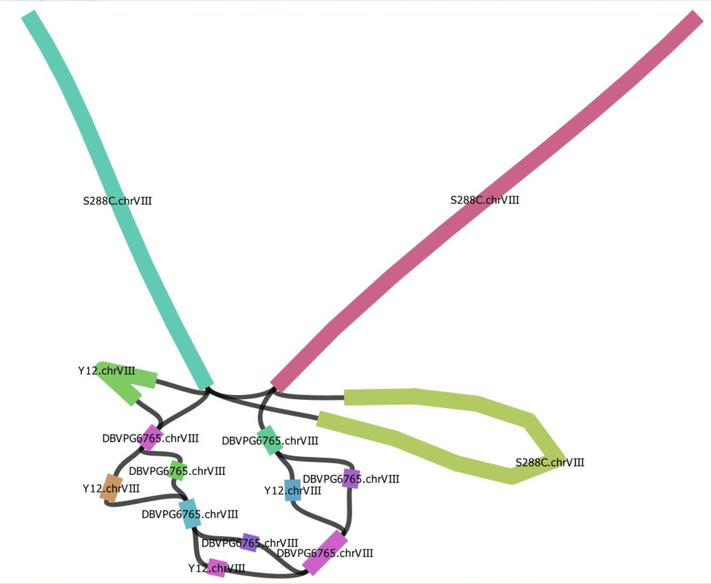{width=60%}
</center>


This compares S288C and SK1.

<center>
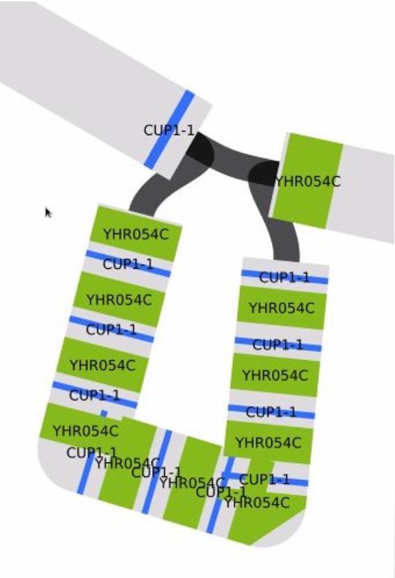{width=35%}

{width=100%}
</center>

If you have blast installed on your computer, you can blast the two gene sequences to their positions. CUP1 is the smaller one. Gene sequences are in: /home/pangenomics/data/yprp/genes/

<center>
{width=70%}
</center>

### CUP1 Paths in Y12 {-}

Let's find the Y12 paths through the graph for all bubbles in the CUP1 graph file.

```{bash, eval=FALSE}
minigraph -xasm -l100 --call cup1.gfa /home/pangenomics/data/yprp/assemblies/Y12.genome.fa > Y12.call.bed
```

Output
S288C.chrVIII   213609  233593  >s720   >s722 >s2512>s2052>s2513>s2054>s2514>s2056>s2515>s2058:11410:+:Y12.chrVIII:206778:21819

alignment path through the bubble:path length:mapping strand:the contig name:approximate contig start:approximate contig end


### CUP1 Paths in all yeast genomes {-}

Let’s do all the samples:

```{bash, eval=FALSE}
for i in /home/pangenomics/data/yprp/assemblies/*.fa; do
   bn=`basename $i .fa`
   minigraph -xasm -l100 --call cup1.gfa $i > $bn.call.bed
done
```

Compare to the Bandage Graph

## Minigraph Pros and Cons

**Pros**

Captures length variation   
Efficient   
Easy to add new genomes

**Cons**

Lack of base level alignment + sample input order dependency =  
    + suboptimal mappings  
    + suboptimal local graphs  
Needs collinear chains so it doesn’t work well with many short segments such as rare SNPs.

https://github.com/lh3/minigraph#limitations

“Please do not overinterpret complex subgraphs. If you are interested in a particular subgraph, it is recommended to extract the input contig subsequences involved in the subgraph with the --call option and manually curated the results.”

## Blog Battle

**Heng Li (Minigraph)**

https://lh3.github.io/2019/07/08/on-a-refere nce-pan-genome-model

**Erik Garrison (VG)**

https://ekg.github.io/2019/07/09/Untangling -graphical-pangenomics

**Heng Li (Minigraph)**

+ https://lh3.github.io/2019/07/12/on-a-refere nce-pan-genome-model-part-ii
 
## Exercises

### Start with another reference {-}

1. What reference did you choose? 
2. What order are the other samples in?
3. How does the graph compare?
4. How does read mapping compare?
5. How do structural variant calls compare? 
6. How does the cup1 region compare? 
7. Any other interesting differences?

### Another Yeast Dataset {-}

A subset of yeast genomes from: https://www.nature.com/articles/s41586-018-0030-5.pdf

Data are in: /home/pangenomics/data/1011yeast/assemblies/*fa.gz

1. How many sequences in each assembly? Min? Max?
2. Make and characterize a minigraph
+ Choose 13 lines to match the number of genomes we ran earlier   
+ Try all 127 assemblies  
3. How do these graphs compare to our previous yeast graph? 
4. Pick a region from one of the graphs and make and characterize a subgraph.

### Human GFA {-}

**lipoprotein(a) - LPA** 

See if you can pull out and visualize the LPA region pictured below from two human GFA files from different versions of the human reference (GRCh38.p13 and CHM13). BLAST the LPA gene against the graphs in Bandage.

GFA files are in /home/pangenomics/data/1011yeast/assemblies/. The LPA gene sequence is in /home/pangenomics/data/human/genes/

Approximate Positions:

+ GRCh38.p13 chr6 160000000-161000000 complement

+ CHM13 chr6 161200000-162200000


<center>
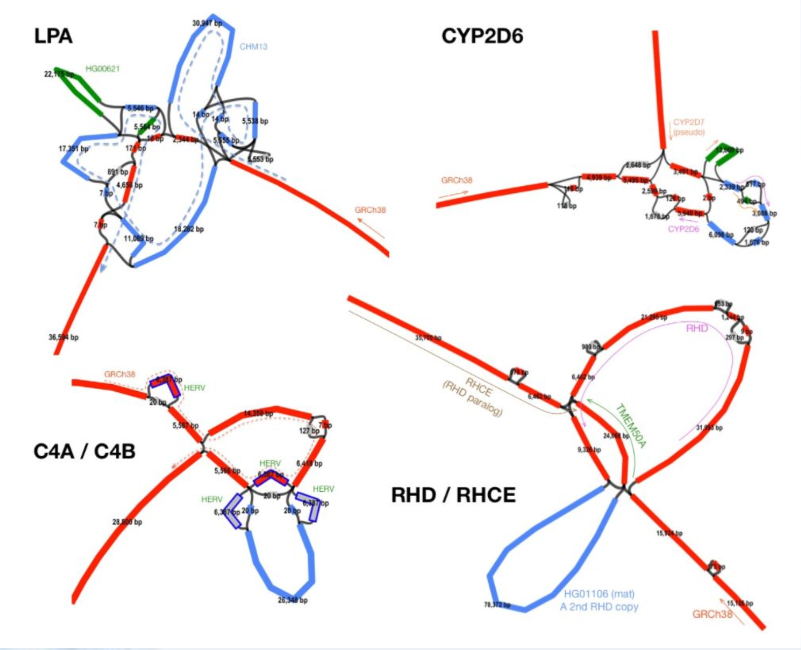{width=60%}
http://lh3.github.io/2021/01/11/minigraph-as-a-multi-assembly-sv-caller
</center>

Your results should look something like this.

{width=100%}

### Convert to VG and call variants {-}

Convert minigraph to vg (<1min):

```{bash, eval=FALSE}
vg convert -g yprp.minigraph.gfa -v -t 20 > yprp.minigraph.vg
```

>**-g**        input GFA graph
>**-v**        output VG graph
>**-t 20**       use 20 threads
    
Make vertices small enough (<=1024bp) for indexing (<1min):

```{bash, eval=FALSE}
vg mod -X 256 yprp.minigraph.vg -t 20 > yprp.minigraph.mod.vg
```

>**-X**       max node size
>**-t 20**       use 20 threads
    
*NOTE:* Converting to VG isn’t required if not calling variants, i.e. you can index and map directly on GFA.

1. Use vg to index the VG graph (2min)
2. Use vg to map SK1 reads to minigraph GFA (17min)
3. Use vg to call variants on read mapping GAM
    a. pack (20min)
    b. call (<1min)
    c. don’t do augment; run-time too long!


<!--chapter:end:03-incremental-graphs-minigraph.Rmd-->

# Reference-Free Graphs with Cactus

## Cactus

https://github.com/ComparativeGenomicsToolkit/cactus

+ Reference-free whole genome MSA 
+ Constructs graph based on MSA
 
## Cactus Graphs

Cactus Graphs “naturally decompose the common substructures in a set of related genomes into a hierarchy of chains that can be visualized as two-dimensional multiple alignments and nets that can be visualized in circular genome plots”

https://www.liebertpub.com/ doi/abs/10.1089/cmb.2010.02 52

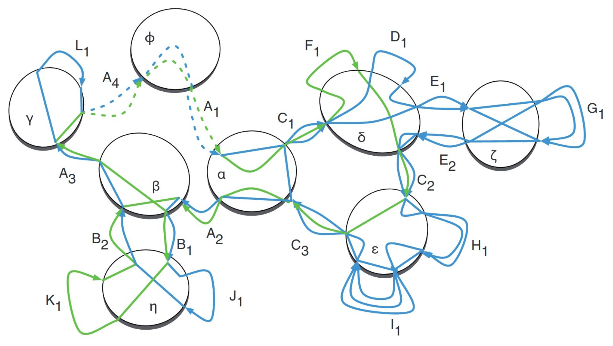{width=100%} 

##  Cactus Algorithm

1. Multiple sequence aligner
2. Originally developed for multi-species alignments
3. Fast because it uses a guide tree (Newick format)
+ https://evolution.genetics.washington.edu/phylip/newicktree.html
4. Now supports minigraph GFA in place of guide tree for pangenome
alignments
+ https://github.com/lh3/minigraph

{width=100%}

## Reference-Free Graphs

https://academic.oup.com/bioinformatics/article/30/24/3476/2422268

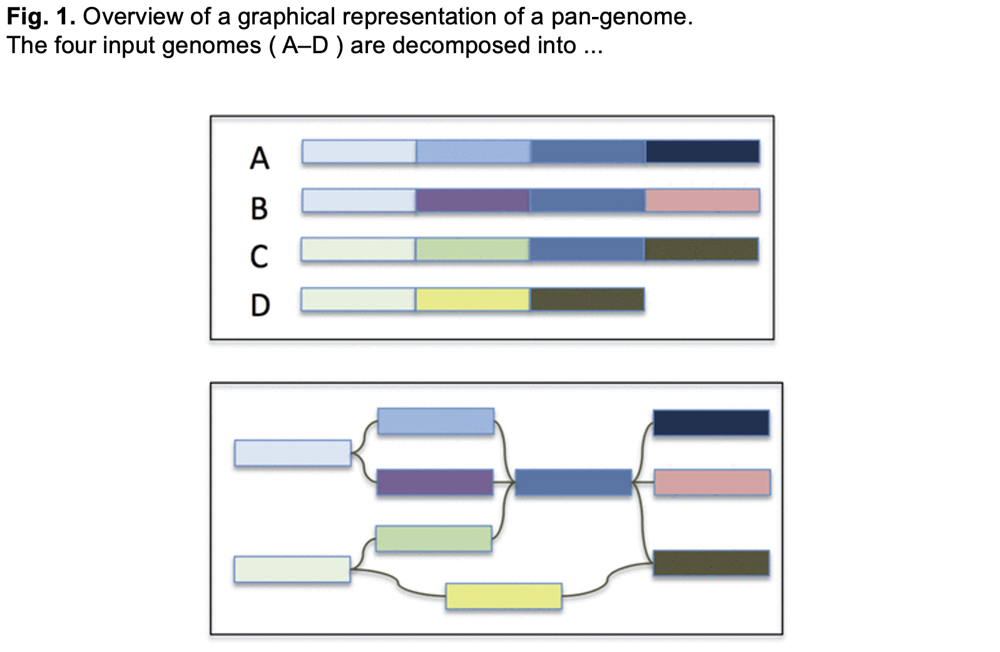{width=100%}

## Pipeline

1. minigraph
2. Prepare the input
3. cactus
4. vg
5. View with Bandage

### Set up Directories

1. Make sure you're working in a **screen**

2. Make Directory

```
mkdir cactus
```
3. Navigate to the Directory

```
cd cactus
```
4. Link to data

```
cp -r /home/pangenomics/data/yprp/assemblies .
```

*Note:* Don't use "ln -s /home/pangenomics/data/yprp/ ."

## Yeast Data

Reference:
+ S288C

Using all 12 YPRP assemblies

## Preparing the Input

**(already done for you)**

1. FASTA files
+ Chromosome names should be unique across files
    + We’re using: 
    
    ```
    <strain name>.<chromosome>*
    ```
    
E.G.

>S288C.chrI

## minigraph

Use the graph we previously built: yprp.minigraph.gfa

## Preparing the Input (exercise)

1. Cactus seqFile tells Cactus where to load sequences from
+ Maps sequence names to file paths
    + We’re using: 
    
    ```
    “strain name>\t<path to sequence>”
    ```

    + Must include “_MINIGRAPH_” entry for path to minigraph GFA 

E.G.

seqFile:
S288C ./S288C.genome.fa _MINIGRAPH_ yprp.minigraph.gfa

+ It’s recommended the minigraph contains all the sequences in the seqFile

2. Call it **yprp.seqFile.txt**

## Cactus

1. Align each input FASTA to the minigraph (2min):

```
 cactus-graphmap jobStore yprp.seqFile.txt yprp.minigraph.gfa
 yprp.cactus.paf --outputFasta yprp.minigraph.gfa.fa
 --maxCores 20
 ```

+ **jobstore**
    + a directory where intermediate files should be stored (shouldn’t exist)
+ **yprp.seqfile.txt**
    + text file mapping sequence names to file paths
+ **yprp.minigraph.gfa**
    + the graph constructed by minigraph
+ **yprp.cactus.paf**
    + what to name the output pairwise mapping file
+ **yprp.minigraph.gfa.fa**
    + a FASTA to output the GFA’s sequence to 
*NOTE:* This command modifiers the seqFile. Make a copy before running!

2. Generate multiple alignment and VG graph (19min):

*NOTE*: Don’t run this command if you intend to use

```
 cactus-graphmap-split
 cactus-align jobStore yprp.seqFile.txt yprp.cactus.paf
 yprp.cactus.hal --pangenome --pafInput --outVG
 --reference S288C --maxCores 20
 ```

+ **yprp.cactus.hal**
    + what to name the output multiple sequence alignment file
+ **reference S288C**
    + the name of the reference in the seqFile (should be the same as
the reference in the minigraph GFA)

## Preparing the Input (exercise)

1. Cactus contigs files tells Cactus to contigs to split the graph on
+ A list of all the S288C contigs
+ Call it S288C.contigs.txt

### Preparing the Input (solution)

Make a reference contigs file:

```
grep -Po "^>\K.*" ~/cactus/yprp/assemblies/S288C.genome.fa >
S288C.contigs.txt
```

## Cactus Split

1. Align each input FASTA to the minigraph and split by reference chromosome (4min):

```
 cactus-graphmap-split jobStore yprp.seqFile.txt
 yprp.minigraph.gfa yprp.cactus.paf
 --refContigsFile S288C.contigs.txt --reference S288C
 --outDir chroms --maxCores 20
 ```
 
+ **yprp.seqFile.txt**
    + modified version from previous *cactus-graphmap* command
+ **yprp.cactus.paf**
    + output from previous *cactus-graphmap* command
+ **-refContigsFile**
    + the names of the chromosomes in the reference FASTA
+ **–reference**
    + the name of the reference in the seqFile
+ **-outDir**
    + where the split outputs should be placed

2. Generate multiple alignment and graph for a chromosome (35min total):

```
cactus-align jobStore chroms/seqfiles/S288C.chrI.seqFile
chroms/S288C.chrI/S288C.chrI.paf
yprp.S288C.chrI.cactus.hal --pangenome --pafInput --outVG
--reference S288C --maxCores 20
```

+ Recommend automating with a bash script; 
    + see: /home/pangenomics/scripts/cactus-align-chromosomes.sh

*NOTE*: Other options are:

+ cactus-align --batch
+ cactus-align-batch

## Viewing with Bandage

View **one chromosome at a time** with Bandage


<!--chapter:end:04-reference-free-graphs-cactus.Rmd-->

# Reference-Free Graphs with *pggb*

## pggb

https://github.com/pangenome/pggb

+ All-pairs whole genome alignment 
+ Induces a graph from the alignments
 
## PanGenome Graph Builder

pggb is built on the idea that a pangenome graph represents an alignment of the genomes in the graph (this is literally what Cactus does), but infers the graph from all pairwise alignments instead of a multiple alignment.

pggb computes all pairwise alignments efficiently by focusing on long, colinear homologies, instead of using the more traditional k-mer matching alignment approach.

Critically, pggb performs graph *normalization* to ensure that paths through the graph (e.g. chromosomes) have a linear structure while allowing for cyclic graph structures that capture structural variation.

## Reference-Free Graphs

https://academic.oup.com/bioinformatics/article/30/24/3476/2422268

{width=100%}

##  Cactus Algorithm

1. All-pairs align genomes with [wfmash](https://github.com/waveygang/wfmash)
2. Convert alignments into a graph using [seqwish](https://github.com/ekg/seqwish)
3. Progressively normalize graph with [smoothxg](https://github.com/pangenome/smoothxg) and [gfaffix](https://github.com/marschall-lab/GFAffix)

## Pipeline

1. Prepare the input
3. pggb
4. View with Bandage

### Set up Directories

1. Make sure you're working in a **screen**

2. Make Directory

```
mkdir pggb
```
3. Navigate to the Directory

```
cd pggb
```
4. Link to data

```
cp -r /home/pangenomics/data/yprp/assemblies .
```

*Note:* Don't use `ln -s /home/pangenomics/data/yprp/ .`

## Yeast Data

Reference:

+ S288C

Using all 12 YPRP assemblies

## Preparing the Input (exercise)

1. Create a FASTA file containing all the yprp assemblies. Call it `yprp.all.fa`.
2. Create a FASTA file containing chromosome VIIII from every assembly. Call it `yprp.chrVIII.fa`.
3. How can you confirm that the contens of these files is correct?

### Preparing the Input (solution)

1. `cat yprp/assemblies/*.fa > yprp.all.fa`
2.
3. `grep -c ‘>’ yprp.all.fa`

## Preparing the Input

[bgzip](https://www.htslib.org/doc/bgzip.html) the FASTA files (~1min):
```
bgzip -c yprp.all.fa > yprp.all.fa.gz
bgzip -c yprp.chrVIII.fa > yprp.chrVIII.fa.gz
```

+ **-c**
    + output the bgzipped file to standard output
+ **>**
    + redirect the standard output into a file
    
Index the bgzip files with [samtools](http://www.htslib.org/doc/samtools.html) [faidx](http://www.htslib.org/doc/samtools-faidx.html):
```
samtools faidx yprp.all.fa.gz
samtools faidz yprp.chrVIII.fa.gz
```

## Singularity

Note that we’re using [Singularity](https://sylabs.io/guides/main/user-guide) to run pggb.
```
singularity [options] run <image file> [image arguments]
 ```
**Singularity sets the working directory inside the container to your `$PWD` directory by default.** If you want to use a different directory you’ll have to mount it manually with **-B**.

*Singularity* is a program for running containers. A *container* contains the program you want to run AND everything you need to run it, e.g. other software it depends on, config files, etc. The inside of a container is usually another Linux operating system! An *image* is a file that describes a container. Multiple containers of the same image can be run simultaneously.

## Running pggb on Chromosome VIII

Build a graph containing all the yprp assemblies (~5min):
```
singularity run /home/pangenomics/singularity_images/pggb_latest.sif
    pggb build -i yprp.chrVIII.fa.gz -o output_chrVIII -n 12 -t 20 -p 95
```

+ **-i yprp.chrVIII.fa**
    + an input FASTA containing all sequences
+ **-o output_chrVIIII**
    + the directory where all output files should be placed
+ **-n 12>**
    + the number of haplotypes (assemblies) in the input file
+ **-t 20**
    + the number of threads to use
+ **-p 95**
    + minimum sequence identity of alignment segments
+ **-2 5000**
    + nucleotide segment length when scaffolding the graph
    
NOTE: These arguments were taken from the [pggb paper](https://github.com/pangenome/pggb-paper/blob/main/workflows/AllSpecies.md). Refer to the paper for other species.

## Viewing with Bandage

View your Chromsome VIII graph with Bandage (exercise):
1. Find CUP1 and YHR054C
2. Take a screenshot

## Exercises

1. Use vg to index the chromosome VIII graph
2. Use vg to map SK1 reads to the chromosome VIII graph
3. Use vg to call variants on chromosome VIII read mapping GAMS

## Running pggb on all Chromosomes

Partition the sequences before building the graph (<1min):
```
singularity run /home/pangenomics/singularity_images/pggb_latest.sif
    partition-before-pggb -i yprp.all.fa.gz -o output_all -n 12 -t 20 -p 95 -s 5000
 ```
This partitions the input FASTA into smaller FASTAs containing sequences that should be in the same subgraph:

+ Will likely correspond to chromosomes if you have complete assemblies
+ May improve run-time of normalization step and make downstream analysis easier
+ Consider skipping if your assemblies/organism has complex structure you want represented in the graph, e.g. ploidy, translocations, etc.

This will print a `pggb` command for every partition to the command line.

+ Commands are also written to a log file: `output_all/yprp.all.fa.gz.<gibberish>.log`

### Exercise

1. Make a bash script to run all of the generated commands with singularity
  + Run the command **NOT DURING THE WORKSHOP** to build the graphs (~1hr40min)

## How do you handle larger graphs? Nextflow

[Nextflow](https://www.nextflow.io/docs/latest/index.html) - Software for running workflows in parallel / distributed computing environments

+ Supports Singularity and Docker containers
+ Nextflow pipelines are open-source
  + You can use other people’s pipelines
  + You can build and share your own pipelines
+ [nf-core/pangenome](https://nf-co.re/pangenome) contains pggb along with other pangenome software

## Pros and Cons

Pros:

+ Graphs are truly reference-free
+ Includes normalization step
  + Especially good for species with complex structural variation, such as plants
  
Cons:

+ Normalization step is currently a bottleneck
+ Partitioning removes inter-chromosome structural variation


<!--chapter:end:05-reference-free-graphs-pggb.Rmd-->

# Other Tools and Methods


## Workshop Tools Review

+ **vg**
    + https://github.com/vgteam/vg
    + https://www.nature.com/articles/nbt.4227
+ **minigraph**
    + https://github.com/lh3/minigraph
    + https://link.springer.com/article/10.1186/s13059-020-02168-z
+ **cactus**
    + https://github.com/ComparativeGenomicsToolkit/cactus
    + https://www.nature.com/articles/s41586-020-2871-y
+ **gfatools**
    + https://github.com/lh3/gfatools
+ **Bandage**
    + https://rrwick.github.io/Bandage/
    + https://academic.oup.com/bioinformatics/article/31/20/3350/196114
+ **IGV**
    + https://software.broadinstitute.org/software/igv/
    + https://www.nature.com/articles/nbt.1754

## Other Visualizations 

+ Bandage with paths
+ GfaViz
+ Panache
+ Anvi’o
+ Visualizing Alignment of Microbial Genomes
+ PanX
+ Genome Context Viewer
+ Sequence Tube Maps
+ MoMI-G
+ PGV (Pangenome Graph Viewer)

## Bandage with Paths

https://github.com/asl/Bandage

A fork of Bandage that supports embedded paths

+ graphs constructed with minigraph **don’t have paths**!
    
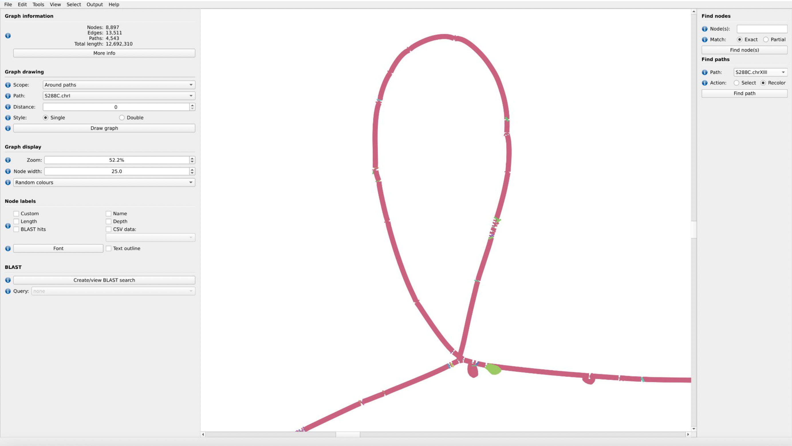{width=100%}

## GfaViz

https://github.com/ggonnella/gfaviz 

+ Manuscript:
    + https://academic.oup.com/bioinformatics/article/35/16/2853/5267826?login=false

A GFA viewer that explicitly supports variation graphs (Fig c).

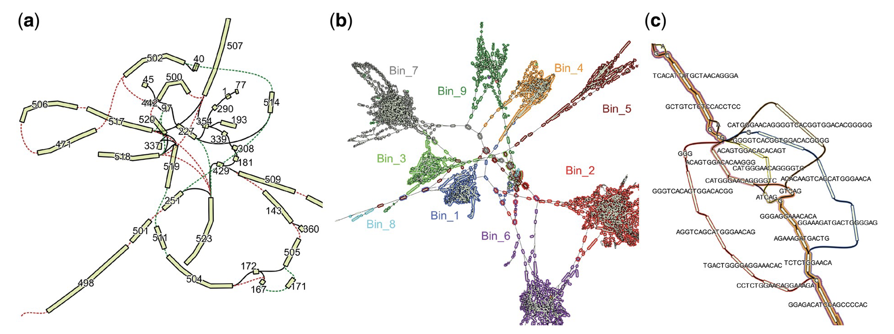{width=100%}

## Panache 

https://github.com/SouthGreenPlatform/panache

+ Manuscript:
    + https://academic.oup.com/bioinformatics/article/37/23/4556/6380547

Web browser-based visualization of linearized pangenomes

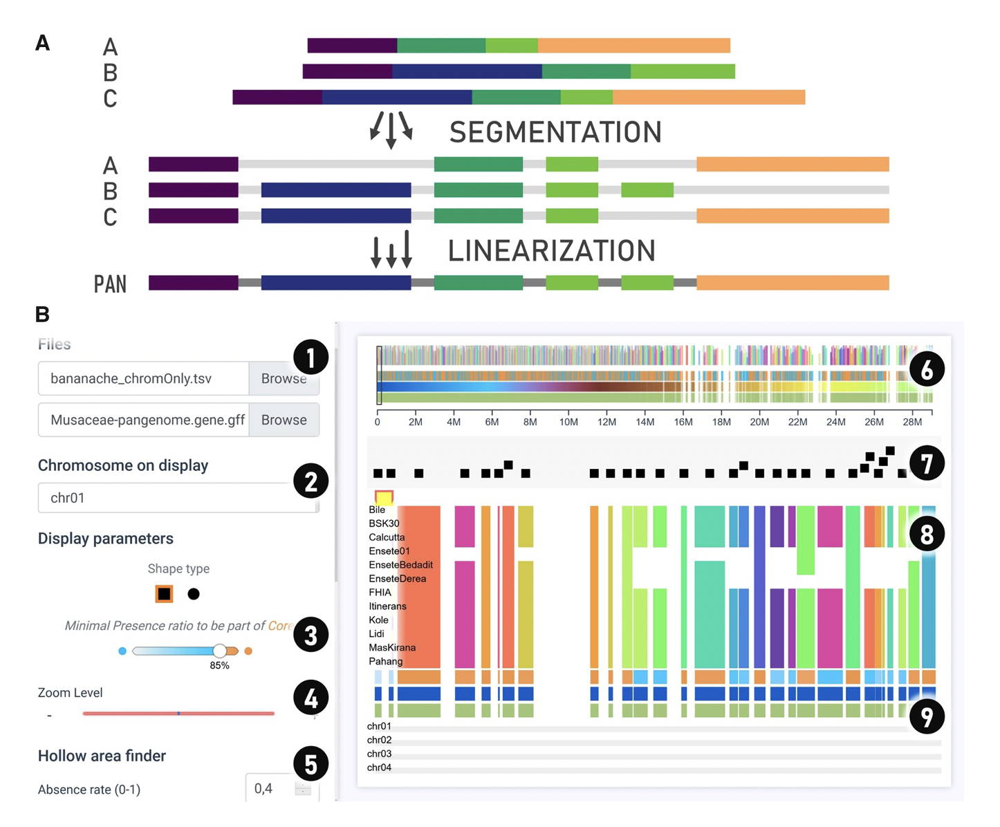{width=100%}

## Anvi'o

https://anvio.org

+ Manuscript:
    + https://peerj.com/articles/1319/
+ Pangenomics Workflow:
    + https://merenlab.org/2016/11/08/pangenomics-v2/

An analysis and visualization platform that can run pipelines on microbial pangenomic data.

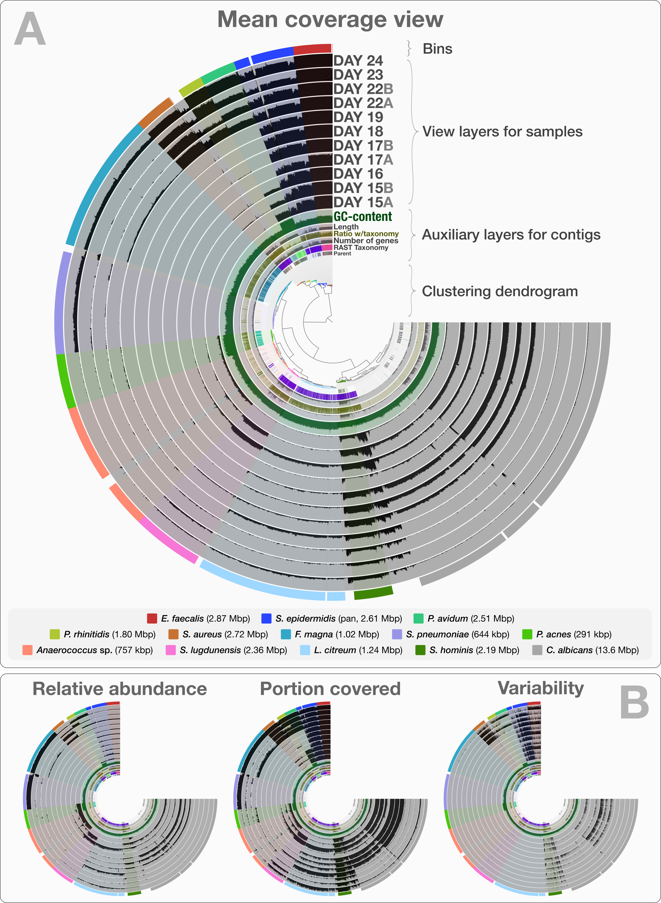{width=100%}

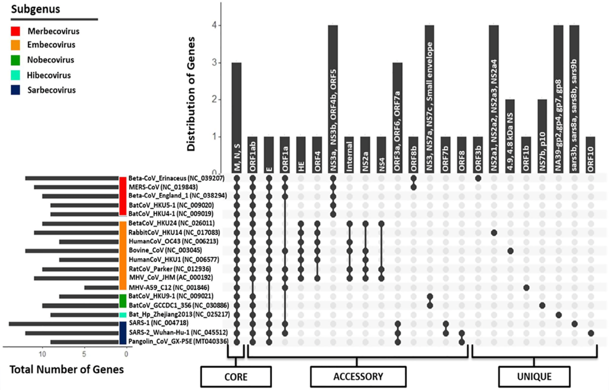{width=100%}


## Visualizing Alignment of Microbial Genomes

+ Manuscript:
    + https://peerj.com/articles/9576/
    
Sequence-level alignment showing common and rare variations at sequence level.

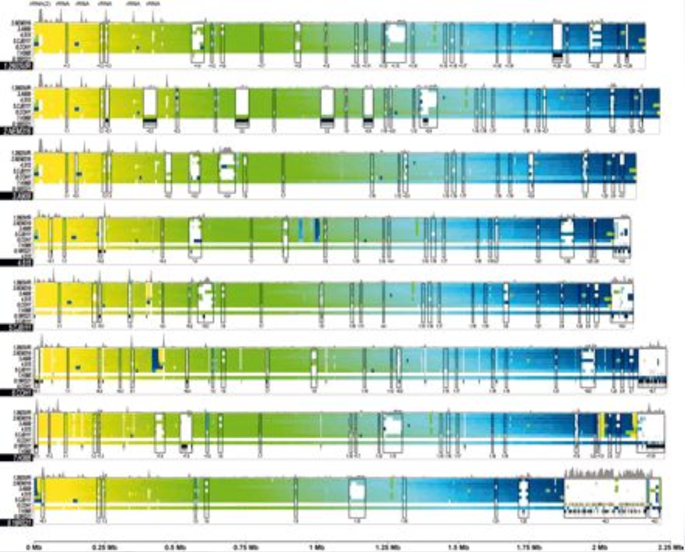{width=80%}

## PanX

https://github.com/neherlab/pan-genome-analysis

+ Manuscript:
    + https://academic.oup.com/nar/article/46/1/e5/4564799
+ Demo:
    + https://pangenome.org
    
Pangenome analysis pipeline and visualizations.

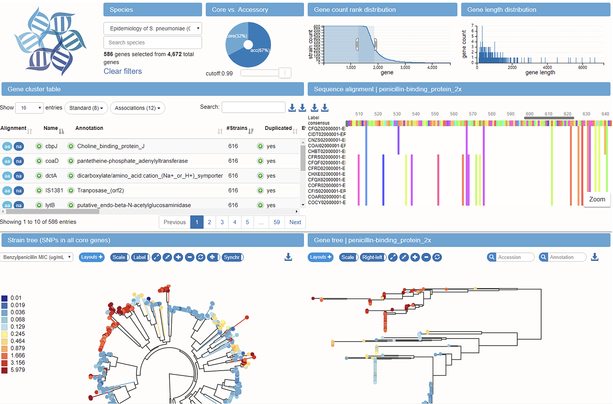{width=100%}

## Genome Context Viewer

https://github.com/legumeinfo/gcv

+ Manuscript:
    + https://academic.oup.com/nar/article/46/1/e5/4564799
+ Demo:
  + https://www.legumeinfo.org/gcv2/instructions
  
Visual exploration of population using synteny derived from gene homology relationships (e.g. gene families).


{width=100%}

## Sequence Tube Maps

https://github.com/vgteam/sequenceTubeMap

+ Manuscript:
    + https://academic.oup.com/bioinformatics/article/35/24/5318/5542397
+ Demo:
    + https://vgteam.github.io/sequenceTubeMap/

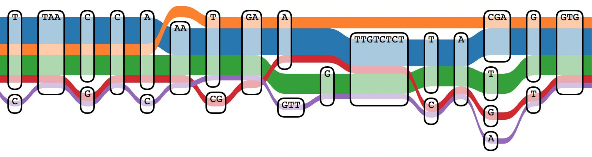{width=100%}

## MoMI-G

https://github.com/MoMI-G/MoMI-G

+ Manuscript
    + https://bmcbioinformatics.biomedcentral.com/articles/10.1186/s12859-019-3145-2
+ Demo:
    + http://demo.momig.tokyo

Web-based multi-scale genome graph browser.

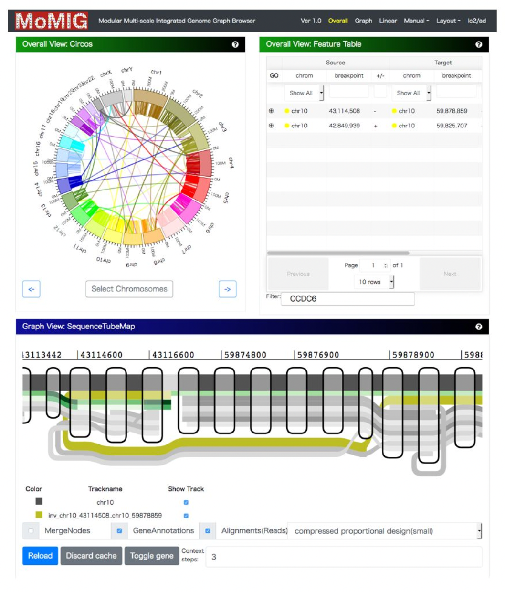{width=100%}

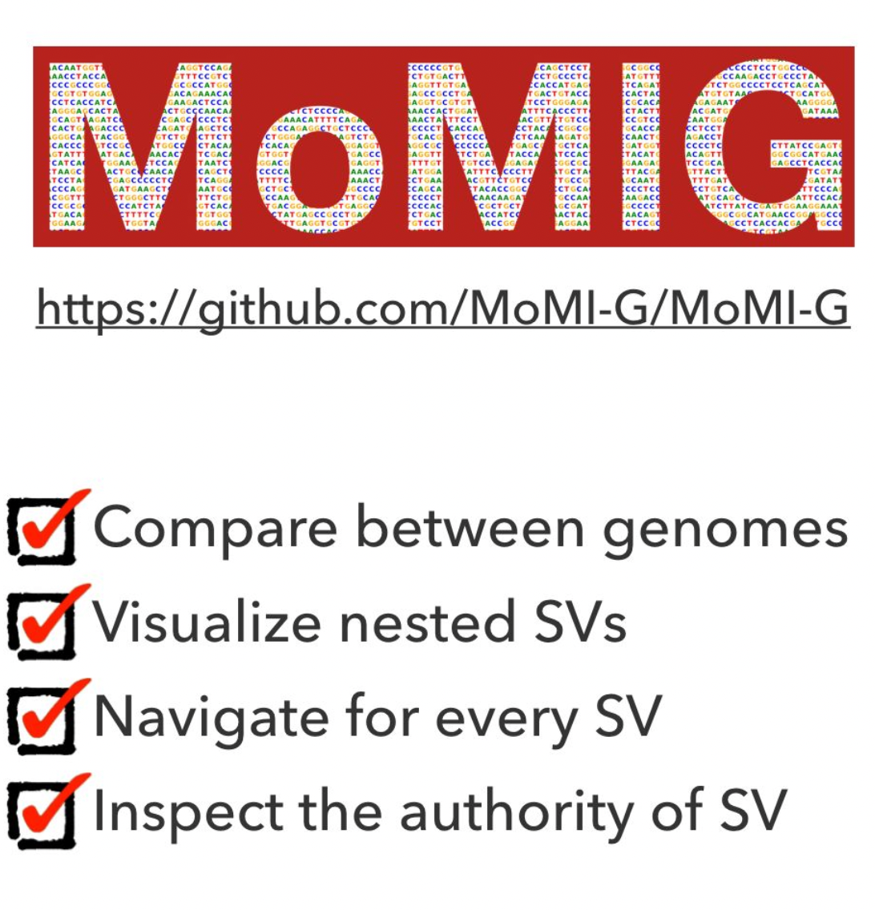{width=50%}

## PGV (Pangenome Graph Viewer)

https://github.com/ucrbioinfo/PGV

+ Manuscript:
    + https://bmcbioinformatics.biomedcentral.com/articles/10.1186/s12859-021-04424-w
+ Demo:
    + https://panviz-22b36.firebaseapp.com 

Web-based reference-agnostic representation and visualization of pan-genomes constructed using a **progressiveMauve** pipeline.

+ https://darlinglab.org/mauve/user-guide/progressivemauve.html

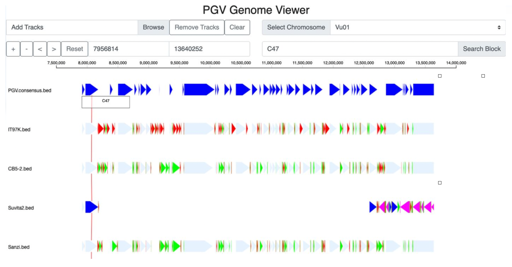{width=100%}

{width=100%}

## Other Graph Construction / Manipulation Tools / Pipelines

+ odgi
+ seqwish
+ smoothxg
+ pggb

## odgi (optimized dynamic genome/graph implementation)

https://github.com/pangenome/odgi

+ Manuscript:
    + https://www.biorxiv.org/content/10.1101/2021.11.10.467921v1
+ Documentation:
    + https://odgi.readthedocs.io/en/latest/
    
“A toolkit for understanding pangenome graphs.”

Functionality:

1. Explore graphs via 1D and 2D visualization
2. Detect complex regions in the graph
3. Extract selected loci
4. Sorting and laying out, e.g. in preparation for visualization
5. Navigating and annotating graphs, e.g. bringing annotations in
to Bandage
6. Remove artifacts and complex regions
7. MultiQC report for graph statistics

## seqwish

https://github.com/ekg/seqwish

+ Dissertation
    + https://github.com/ekg/seqwish
    
“The sequences wish they were squished into a graph.” 

+ Converts pairwise alignments between sequences into a variation graph, i.e. pangenome.

+ Takes one or more PAF files as input (e.g. output of minimap2)
+ Infers graph nodes and node orderings from alignment blocks
and how they overlap between sequences.

##  smoothxg

https://github.com/pangenome/smoothxg

“Linearize and simplify variation graphs using blocked partial order alignment.”

+ “Smooths” graph by consolidating structures that are artifacts of graph assembly / data.

## pggb (pangenome graph build)

https://github.com/pangenome/pggb

A pipeline under development for efficiently building reference-free pangenome graphs.

Basic pipeline:

1. Align sequences with **wfmash**
+ https://github.com/waveygang/wfmash
2. Construct graph from alignments using **seqwish**
+ https://github.com/ekg/seqwish
3. Use **smoothxg** to remove artifacts and make graph acyclic for
compatibility with tools like vg
+ https://github.com/pangenome/smoothxg

## Other Mapping, Variant Calling, and Genotyping Tools

+ GraphAligner
+ GraphTyper / GraphTyper2
+ BayesTyper
+ Paragraph
+ Practical Haplotype Graph

## GraphAligner

https://github.com/maickrau/GraphAligner

+ Manuscript
    + https://genomebiology.biomedcentral.com/articles/10.1186/s13059-020-02157-2
    
“Aligns long reads to genome graphs. Compared to the state-of-the-art tools, GraphAligner is 13x faster and uses 3x less memory. When employing GraphAligner for error correction, we find it to be more than twice as accurate and over 12x faster than extant tools.”

## GraphTyper / GraphTyper2

https://github.com/DecodeGenetics/graphtyper

+ Manuscripts
    + https://www.nature.com/articles/ng.3964
    + https://www.nature.com/articles/s41467-019-13341-9

“A graph-based variant caller capable of genotyping population-scale short read data sets. It represents a reference genome and known variants of a genomic region using an acyclic graph structure (a "pangenome reference"), which high-throughput sequence reads are re-aligned to for the purpose of discovering and genotyping SNPs, small indels, and structural variants.”

+ GraphTyper2 is the v2 release of GraphTyper, i.e. the same GitHub repository

## BayesTyper

https://github.com/bioinformatics-centre/BayesTyper

+ Manuscript:
    + https://www.nature.com/articles/s41588-018-0145-5

Performs genotyping of all types of variation by exactly aligning sequence k-mers to a reference graph and then using Bayesian inference built on a “variation-prior” database to do genotyping.

BayesTyper enables “sensitive and accurate genotyping across classes and varying lengths of structural variants” as compared to other methods

## Paragraph

https://github.com/Illumina/paragraph

+ Manuscript
    + https://genomebiology.biomedcentral.com/articles/10.1186/s13059-019-1909-7

A suite of graph-based genotyping tools to support accurate genotyping of short-read data.

Developed by Illumina.

“Paragraph has better accuracy than other existing genotypers and can be applied to population-scale studies.”

## Practical Haplotype Graph (PHG)

https://bitbucket.org/bucklerlab/practicalhaplotypegraph/wiki/Home

+ Manuscript
    + https://academic.oup.com/g3journal/article/12/2/jkab390/6423995
    
A graphical genotyping data storage and genotype imputation platform designed to be used on skim sequencing methods to infer high-density genotypes directly from low-coverage sequence.

+ Developed by the Buckler Lab
+ Has been used extensively with wheat and maize    
    
## So Much More...

### The Pangenome book, edited by Tettlin!

https://library.oapen.org/handle/20.500.12657/37707

<!--chapter:end:06-other-tools.Rmd-->

# Graph-specific Analyses

{width=50%} 

## Frequented Region (FR) Algorithm

Identify regions in a graph that are co-visited by a set of supporting
paths from individual sequences in the pangenome.

{width=80%} 


1. Similar evolutionary histories
2. Similar selection pressures

3. Heuristic but scalable
4. Node merging with noise tolerance
    + Error
    + Divergence
5. Nucleotide level

### A few of the parameters

1. penetrance (𝛼)
minimum fraction of nodes
2. the maximum insertion parameter (κ)
maximum number of inserted nodes

## Yeast Insertion for Alcohol Tolerance

### 17kb insertion on chromosome XIV

{width=100%} 

### 17kb insertion across all 55 strains

+ 9 of 20 additional alcohol related strains share EC1118’s inserted FRs. 
+ Strains sharing four or more FRs are highlighted.
+ 5 genes inserted


{width=100%} 

## SARS-CoV-2

+ Identify conserved genomic regions
    + Vaccine and treatment targets

+ Identify genomic shifts over time and geographic space
    + Mutations affecting spread and virulence

+ Identify genomic regions that differentiate strains
    + Implications in modelling and treatment
 
{width=20%}

## Genomic shifts across time and space

733 SARS-CoV-2 genomes from the beginning of the pandemic through April

Highlight

+ Early strains:
    + (Wuhan, 12/30/2019)
    + (Italy, 4/27/2020)
    
+ **Spike protein**
    + Engages the human ACE2 cell receptor to gain entry into the host cell. Target for vaccines, template for antibody production, and candidate for generating entry inhibitors.
    
### Wuhan & Italy compared to 733 strain support

Spike protein conserved, especially end Genomic shift

{width=100%}

{width=100%}

### D614G mutation

A mutation seen in Europe in February that spread across the globe to become the dominant strain. Preliminary analyses suggest it might increase contagion and/or virulence and that strains people with immunity to the original strain might not be immune to the mutated strain. The figure shows the region has undergone genomic shift and isn’t conserved in all the genomes.

{width=100%}

### Conserved haplotype blocks and selection coefficients

##### Soft and incomplete selective sweeps{-}

{width=80%}


{width=100%}

## Medicago truncatula

{width=50%}

+ Model legume
+ 450 Mb genome
+ Selfing
+ Whole genome duplications
+ High level of rearrangements and gene family expansions

### Medicago Pan-13 genome size curve

{width=100%}

+ Zhou, P., Silverstein, K.A., Ramaraj, T., Guhlin, J., Denny, R., Liu,
J., Farmer, A.D., Steele, K.P., Stupar, R.M. & Miller, J.R. Exploring
structural variation and gene family architecture with De Novo
assemblies of 15 Medicago genomes. BMC genomics 18, 261 (2017).

### Medicago Pan-13 *proteome* size curve

{width=100%}

### Medicago HapMap Summary

1. As much as 22% of the genome is involved in large structural changes;
2. Medicago 13 pangenome expands reference space by 16% (63 Mbp);
3. Pangenome analysis revealed that 42% (180 Mbp) of genomic sequences are missing in one or more assemblies, while pan-proteome analysis identified 67% (50,700) of all ortholog groups as dispensable;
4. Environmentally Sensitive Gene Families found to be enriched in the accession-specific gene pool.

### Medicago: 23 accessions for de novo assembly 

1. 15 genomes from 3 phylogenetic hubs (incl. A17)
2. 6 genomes from RIL parents
3. 3 “random” genomes

{width=60%}

### Medicago: LEED..PEED (LP) family

1. Short secreted peptides
2. Transcribed in nitrogen-fixing nodules but absent from other plant tissues
3. Not found in other sequenced legumes
4. M. truncatula A17 (reference)
    + 12 LP genes on chromosome 7
    + 1 LP gene on chromosome 4
    
+ leucine:glutamic acid:glutamic acid:aspartic acid
+ proline:glutamic acid:glutamic acid:aspartic acid

Genomic Characterization of the LEED..PEEDs, a Gene Family Unique to the Medicago Lineage
Diana I. Trujillo, Kevin A. T. Silverstein and Nevin D. Young 
G3: GENES, GENOMES, GENETICS October 1, 2014 vol. 4 no. 10 2003-2012; https://doi.org/10.1534/g3.114.011874

#### LEED..PEED{-}

{width=100%}

### *Medicago truncatula*

1. Horizontal gene transfer among symbionts and between symbionts and plants

2. Nodule specific gene families

3. Expansion of plant gene families

## Using Machine Learning to Connect Genotype to Phenotype

{width=100%}

### Yeast

1. FR matrix as features
2. Random Forest
3. Predict Phenotypes

### Yeast Root Mean Square Error (RMSE)

{width=100%}

{width=100%}

{width=100%}

## VG and Machine Learning

### vg vectorize (xg graph or gcsa)

{width=100%}

{width=100%}


<!--chapter:end:08-graph-specific-analyses.Rmd-->

<<<<<<< HEAD
---
title: "QIIME2"
subtitle: "Hands On Command Line Tutorial"
output: html_document
---

```{r setup, include=FALSE}
knitr::opts_chunk$set(echo = TRUE)
```

## Logging on to the server

Make it a practice to start a screen before you begin analysis.

```{bash, eval=FALSE}
ssh -p 44111 <USERNAME>@gateway.training.ncgr.org

screen -S QIIME2
```
## Setting up a working directory for QIIME2 analysis
```{bash, eval=FALSE}
cd /home/$USER/

mkdir QIIME2_Analysis

cd QIIME2_Analysis
```

## Dataset for analysis

For this tutorial, we will use data from the following published manuscript:
https://microbiomejournal.biomedcentral.com/articles/10.1186/2049-2618-2-29

Respiratory tract clinical sample selection for microbiota analysis in patients with pulmonary tuberculosis

Pulmonary Tuberculosis (The Human Microbiome in the Fight Against Tuberculosis, 2017)

{width=100%}
Why study microbiome in relation to TB?
1. Microbiome composition is a potential risk factors for TB infection and disease susceptibility, disease progression,
and treatment outcomes
2. TB infection and disease can affect microbiome, subsequently impacting health via alteration of immune responses

This pilot study was carried out using sputum, oropharynx, and nasal respiratory tract samples collected from patients
with pulmonary tuberculosis and healthy control individuals, in order to compare sample types and their usefulness in
assessing changes in bacterial and fungal communities.

## Data download

Data was downloaded from the National Center for Biotechnology Information (NCBI) based on the SRA accession
numbers reported in the manuscript - PRJNA242354.
A program called fastq-dump version 2.10.0 was used to download the data directly from NCBI SRA database. Tbe
following exercise will help you use fastq-dump for your own projects too.

```{bash, eval=FALSE}
source activate fastqdump
# MAKE SURE YOU ARE IN THE FOLLOWING FOLDER
/home/$USER/QIIME2_Analysis
# CREATE A FOLDER FOR DOWNLOADING FASTQ FILES TO ANALYZE

mkdir input_data
cd input_data
fastq-dump --gzip --outdir ./ \
SRR1204628 SRR1204630 SRR1204627 SRR1204629 SRR1204626 SRR1204623 \
SRR1204625 SRR1204624 SRR1204622 SRR1204631 SRR1204638 SRR1204642 \
SRR1204633 SRR1204632 SRR1204634 SRR1204639 SRR1204646 SRR1204647 \
SRR1204641 SRR1204640 SRR1204636 SRR1204637 SRR1369696 SRR1369694 \
SRR1204635 SRR1204643 SRR1204644 SRR1204645 SRR1369709 SRR1369707 \
SRR1369690 SRR1369691 SRR1369692 SRR1369693 SRR1369710 SRR1369713 \
SRR1204650 SRR1204651 SRR1369688 SRR1369689 SRR1369695 SRR1204649 \
SRR1204648 SRR1369697 SRR1369704 SRR1369703 SRR1369706 SRR1369705 \
SRR1369708 SRR1369698 SRR1369699 SRR1369701 SRR1369700 SRR1369702 \
SRR1369714 SRR1369717 SRR1369716 SRR1369715 SRR1369711 SRR1369712
# --outdir -> Path to Output directory
# --gzip -> Compress output files using gzip

# After running this step, you will have 60 files in your input_data folder
# To check, cd into folder that has fastq files, type this command
ls -l | wc -l
# Optional exercise:
# Count the number of sequences in the two fastq files pertaining to one sample and sum them.
conda deactivate
```

## Quality Control
```{bash, eval=FALSE}
# Filter poor quality reads
source activate fastp

for file in *.fastq; do fastp -i ${file} -o ${file}.filtered; done
conda deactivate
```
{width=100%}
Data was collected from 30 Individuals.

• 6 TB Patients - Nasal

• 6 TB Patients - oropharynx

• 6 TB Patients - Sputum

• 6 Healthy Controls - Nasal

• 6 Healthy Controls - oropharynx

DATA TABLE:

```
SAMPLE FASTA FILE 	                TOTAL NUMBER OF READS 
Control_1_Nasal_L001_R1_001.fasta 	41056
Control_1_Pharynx_L001_R1_001.fasta 119972
Control_2_Nasal_L001_R1_001.fasta 	32142
Control_2_Pharynx_L001_R1_001.fasta 42973
Control_3_Nasal_L001_R1_001.fasta 	32953
Control_3_Pharynx_L001_R1_001.fasta 39148
Control_4_Nasal_L001_R1_001.fasta 	83174
Control_4_Pharynx_L001_R1_001.fasta 17475
Control_5_Nasal_L001_R1_001.fasta 	29146
Control_5_Pharynx_L001_R1_001.fasta 32728
Control_6_Nasal_L001_R1_001.fasta 	32738
Control_6_Pharynx_L001_R1_001.fasta 15320
Patient_1_Nasal_L001_R1_001.fasta 	69995
Patient_1_Pharynx_L001_R1_001.fasta 59646
Patient_1_Sputum_L001_R1_001.fasta 	66725
Patient_2_Nasal_L001_R1_001.fasta 	61070
Patient_2_Pharynx_L001_R1_001.fasta 27106
Patient_2_Sputum_L001_R1_001.fasta 	71434
Patient_3_Nasal_L001_R1_001.fasta 	91920
Patient_3_Pharynx_L001_R1_001.fasta 36224
Patient_3_Sputum_L001_R1_001.fasta 	27533
Patient_4_Nasal_L001_R1_001.fasta 	28996
Patient_4_Pharynx_L001_R1_001.fasta 30713
Patient_4_Sputum_L001_R1_001.fasta 	59433
Patient_5_Nasal_L001_R1_001.fasta 	70843
Patient_5_Pharynx_L001_R1_001.fasta 39674
Patient_5_Sputum_L001_R1_001.fasta 	29576
Patient_6_Nasal_L001_R1_001.fasta 	106178
Patient_6_Pharynx_L001_R1_001.fasta 58956
Patient_6_Sputum_L001_R1_001.fasta 	35703
```

## What is QIIME2?
https://docs.qiime2.org/2020.11/about/

QIIME 2 is a powerful microbiome analysis package with a focus on data and analysis transparency. QIIME2 enables researchers to start an analysis with raw DNA sequence data and finish with publication-quality figures and statistical results.

Key features:

• Integrated and automatic tracking of data provenance

• Plugin system for extending microbiome analysis functionality

• Support for multiple types of user interfaces (e.g. API, command line, graphical)

Plugin availability - https://docs.qiime2.org/2020.11/plugins/available/

## Metadata setup

Metadata file that we will be using for our data set: (mappingFile.txt on logrus)

Here is how you will make a metadata file on your own: https://docs.qiime2.org/2017.6/tutorials/metadata/

```
#SampleID 	Treatment 	TreatmentSite 	TreatmentNumber 	Sex 	BodySite 	Description 
C_1_N 	C 	CN 	1	F 	Nasal 	    Control 1 Nasal 
C_1_P 	C 	CP 	2	F 	Oropharynx 	Control 1 Pharynx 
C_2_N 	C 	CN 	1	M 	Nasal 	    Control 2 Nasal 
C_2_P 	C 	CP 	2	M 	Oropharynx 	Control 2 Pharynx 
C_3_N 	C 	CN 	1	M 	Nasal 	    Control 3 Nasal 
C_3_P 	C 	CP 	2	M 	Oropharynx 	Control 3 Pharynx 
C_4_N 	C 	CN 	1	M 	Nasal 	    Control 4 Nasal 
C_4_P 	C 	CP 	2	M 	Oropharynx 	Control 4 Pharynx 
C_5_N 	C 	CN 	1	M 	Nasal 	    Control 5 Nasal 
C_5_P 	C 	CP 	2	M 	Oropharynx 	Control 5 Pharynx 
C_6_N 	C 	CN 	1	M 	Nasal 	    Control 6 Nasal 
C_6_P 	C 	CP 	2	M 	Oropharynx 	Control 6 Pharynx 
P_1_N 	P 	PN 	3	F 	Nasal 	    Patient 1 Nasal 
P_1_P 	P 	PP 	4	F 	Oropharynx 	Patient 1 Pharynx 
P_1_S 	P 	PS 	5	F 	Sputum 	    Patient 1 Sputum 
P_2_N 	P 	PN 	3	M 	Nasal 	    Patient 2 Nasal 
P_2_P 	P 	PP 	4	M 	Oropharynx 	Patient 2 Pharynx 
P_2_S 	P 	PS 	5	M 	Sputum 	    Patient 2 Sputum 
P_3_N 	P 	PN 	3	M 	Nasal 	    Patient 3 Nasal 
P_3_P 	P 	PP 	4	M 	Oropharynx 	Patient 3 Pharynx 
P_3_S 	P 	PS 	5	M 	Sputum 	    Patient 3 Sputum 
P_4_N 	P 	PN 	3	M 	Nasal 	    Patient 4 Nasal 
P_4_P 	P 	PP 	4	M 	Oropharynx 	Patient 4 Pharynx 
P_4_S 	P 	PS 	5	M 	Sputum 	    Patient 4 Sputum 
P_5_N 	P 	PN 	3	M 	Nasal 	    Patient 5 Nasal 
P_5_P 	P 	PP 	4	M 	Oropharynx 	Patient 5 Pharynx 
P_5_S 	P 	PS 	5	M 	Sputum 	    Patient 5 Sputum 
P_6_N 	P 	PN 	3	M 	Nasal 	    Patient 6 Nasal 
P_6_P 	P 	PP 	4	M 	Oropharynx 	Patient 6 Pharynx 
P_6_S 	P 	PS 	5	M 	Sputum 	    Patient 6 Sputum 
```

```{bash, eval=FALSE}
# Move out of the input_data directory

cd ../

# Copy metadata file from my workspace to your workspace,

cd /home/$USER/QIIME2_Analysis

cp /home/elavelle/QIIME2_Analysis/mappingFile.txt ./

less mappingFile.txt 
```

## Data import
We will be beginning our analysis with demultiplexed, quality controlled sequences.

For the purpose of this workshop we will not use the entire dataset per sample. We have created 1000 sequences per sample as subset. This will be your input dataset.

```{bash, eval=FALSE}
cd /home/$USER/QIIME2_Analysis

# Copy the subset file of sequences:

cp /home/metag/data/seqs.1000.fna ./

conda deactivate

source activate qiime2

# This command will vary depending input data type and format
# Here, we are importing .fasta reads (no quality scores)

qiime tools import \
--input-path seqs.1000.fna \
--output-path seqs.1000.qza \
--type 'SampleData[Sequences]'
```

## Dereplicate

From https://docs.qiime2.org/2021.2/tutorials/overview/#derep-denoise

• We dereplicate our sequences to reduce repetition and file size/memory requirements in downstream steps (Don’t worry, we keep count of each replicate). 

• We denoise to correct for stochastic sequencing effects and PCR error.

• We cluster sequences to collapse similar sequences (e.g., those that are ≥ 97% similar to each other) into single replicate sequences. This process, also known as OTU picking, was once a common procedure, used to simultaneously dereplicate but also perform a quick-and-dirty denoising procedure. Use denoising methods instead if you can. 

```{bash, eval=FALSE}

qiime vsearch dereplicate-sequences \
--i-sequences seqs.1000.qza \
--o-dereplicated-table table.qza \
--o-dereplicated-sequences rep-seqs.qza 
```


## Generating a feature table
The final products of all denoising and clustering methods/workflows are a FeatureTable[Frequency] (feature table) artifact and a FeatureData[Sequence] (representative sequences) artifact. These are two of the most important artifacts in an amplicon sequencing workflow, and are used for many downstream analyses, as discussed below. Indeed, feature tables are crucial to any QIIME 2 analysis, as the central record of all observations per sample. 

{width=100%}
The feature-table summarize command will give you information on how many sequences are associated with each sample and with each feature, histograms of those distributions, and some related summary statistics. The feature-table and tabulate-seqs commands will provide a mapping of feature IDs to sequences, and provide links to easily BLAST each sequence against the NCBI nt database.

## Visualization

```{bash, eval=FALSE}

qiime feature-table summarize \
--i-table table.qza \
--o-visualization table.qzv


qiime feature-table tabulate-seqs \
--i-data rep-seqs.qza \
--o-visualization rep-seqs.qzv
```

Look at the format of a feature table from a mock dataset as well as other tutorials:
https://view.qiime2.org/visualization/?type=html&src=https%3A%2F%2Fdocs.qiime2.org%2F2020.11%2Fdata%2Ftutorials%2Fmoving-pictures%2Ftable.qzv

## Setting up a reference

Greengenes (16S rRNA) and Silva (16S/18S rRNA) databases have to be imported as QIIME2 artifacts before using them.

```{bash, eval=FALSE}

qiime tools import \
--input-path /home/metag/QIIME2_greengenes/Greengenes_16S_rRNA/\
gg_13_8_otus/rep_set/99_otus.fasta \
--output-path 99_otus.qza \
--type FeatureData[Sequence]
```

## Clustering

{width=100%}
There are three types of clustering,

I. De novo Operational Taxonomic Unit (OTU) clustering

De novo OTU picking is used when we dont have a reference sequence collection to cluster against, for example, working with an infrequently used marker gene.

De novo OTU picking cannot be used in the following two scenarios,

1. Comparing non-overlapping amplicons, such as V2 and V4 regions of 16S rRNA

2. Working with very large data sets, e.g., HiSeq

Advantage: No reference is required.

Disadvantage: Run time can be very expensive depending on the volume of data (parallel processing not possible)

```{bash, eval=FALSE}
# EXAMPLE- DO NOT RUN THE ABOVE COMMAND TO COMPLETION.

qiime vsearch cluster-features-de-novo \
--i-table table.qza \
--i-sequences rep-seqs.qza \
--p-perc-identity 0.99 \
--o-clustered-table table-dn-99.qza \
--o-clustered-sequences rep-seqs-dn-99.qza
```

II. Closed-reference OTU clustering

Reads are clustered against a reference sequence collection. Any reads which do not hit a sequence in the reference sequence collection are excluded from downstream analyses.

Closed-reference OTU picking is used:

1. When comparing non-overlapping amplicons, such as V2 and V4 regions of the 16S rRNA.

2. When reference sequences span the sequenced regions.

Closed-reference OTU picking is not used when reference sequence collection is not available

Advantage: Fast, useful for extremely large data sets. Better trees and taxonomy. OTUs are defined in the reference and have a reliable tree/taxonomy.

Disadvantage: Inability to detect novel diversity with respect to your reference sequence collection

```{bash, eval=FALSE}

# EXAMPLE- DO NOT RUN THE ABOVE COMMAND TO COMPLETION

qiime vsearch cluster-features-closed-reference \
--i-table table.qza \
--i-sequences rep-seqs.qza \
--i-reference-sequences 99_otus.qza \
--p-perc-identity 0.99 \
--o-clustered-table table-cr-99.qza \
--o-clustered-sequences rep-seqs-cr-99.qza \
--o-unmatched-sequences unmatched-cr-99.qza
```

III. Open-reference OTU clustering

In open-reference OTU clustering, sequence reads are clustered against a reference sequence collection and any reads which do not hit the reference sequence collection are subsequently clustered de novo.

```{bash, eval=FALSE}

# EXAMPLE- DO NOT RUN THE ABOVE COMMAND TO COMPLETION

qiime vsearch cluster-features-open-reference \
--i-table table.qza \
--i-sequences rep-seqs.qza \
--i-reference-sequences 99_otus.qza \
--p-perc-identity 0.99 \
--o-clustered-table table-or-99.qza \
--o-clustered-sequences rep-seqs-or-99.qza \
--o-new-reference-sequences new-ref-seqs-or-99.qza
```
STEP 7: Building a phylogenetic tree

Evolution is the core concept of biology. There is only so much you can learn from microbes while ignoring evolution. Evolution-aware analyses of a dataset needs a phylogenetic tree of its sequences. These trees can be built de-novo or they can be reference based. Phylogeny-based analyses in QIIME2 generally need a rooted tree. 

{width=100%}

```{bash, eval=FALSE}

# Carry out a multiple sequence alignment using Mafft

qiime alignment mafft \
--i-sequences rep-seqs-or-99.qza \
--o-alignment aligned-rep-seqs.qza

# THE ABOVE STEP SHOULD APPROXIMATELY TAKE 4 MINUTES TO RUN TO COMPLETION

# Mask (or filter) the alignment to remove positions that are highly variable. 
# These positions are generally considered to add noise to a
# resulting phylogenetic tree.

qiime alignment mask \
--i-alignment aligned-rep-seqs.qza \
--o-masked-alignment masked-aligned-rep-seqs.qza

# THE ABOVE STEP SHOULD APPROXIMATELY TAKE 4 MINUTES TO RUN TO COMPLETION

# Create the tree using the Fasttree program

qiime phylogeny fasttree \
--i-alignment masked-aligned-rep-seqs.qza \
--o-tree unrooted-tree.qza

# THE ABOVE STEP SHOULD APPROXIMATELY TAKE 9 MINUTES TO RUN TO COMPLETION

# root the tree using the longest root

qiime phylogeny midpoint-root \
--i-tree unrooted-tree.qza \
--o-rooted-tree rooted-tree.qza

# THE ABOVE STEP SHOULD APPROXIMATELY TAKE 6 SECONDS TO RUN TO COMPLETION
```
STEP 8: Alpha rarefaction

What is rarefaction?

Species richness is the number of species present in a system. However, the deeper you sequence, the more species you will find. That can be problematic if you gathered 500 reads from one sample and only 100 reads from another sample- you would expect to find more species if you sequenced 5x as many reads! To account for this, we perform an in-silico (i.e., on your computer) experiment called rarefaction. A rarefaction is a random collection of sequences from a sample, with a specified depth (number of sequences). For example, a rarefaction with a depth of 75 reads per sample is a simulation of what your sequencing results would look like if you sequenced exactly 75 reads from each sample. To look at alpha diversity systematically, we can perform many rarefactions: at multiple depths and repeat many times at each depth. In QIIME, this task is performed on your OTU table.

• Concerns:

– Too low: ignore a lot of samples’ information

– Too high: ignore a lot of samples

```{bash, eval=FALSE}

# EXAMPLE- DO NOT RUN THE ABOVE COMMAND TO COMPLETION

cp /home/elavelle/mappingFile.txt ./

qiime diversity alpha-rarefaction \
--i-table table-or-99.qza \
--i-phylogeny rooted-tree.qza \
--p-max-depth 1000 \
--m-metadata-file mappingFile.txt \
--o-visualization alpha-rarefaction.qzv

# Why specify a maximum depth of 1000?
```

Look at the following example and decide what sampling-depth you would use:

https://view.qiime2.org/visualization/?type=html&src=https%3A%2F%2Fdocs.qiime2.org%2F2020.11%2Fdata%2Ftutorials%2Fmoving-pictures%2Falpha-rarefaction.qzv

STEP 9: Calculating and exploring diversity metrics

Species diversity is a valuable tool for describing the ecological complexity of a single sample (alpha diversity) or between samples (beta diversity).

However, diversity is not a physical quantity that can be measured directly, and many different metrics have been proposed to quantify diversity

Species diversity consists of three components: species richness, taxonomic or phylogenetic diversity and species evenness.

1. Species richness = the number of different species in a community.

2. Species evenness = how close the species abundencies in a community are.

3. Phylogenetic diversity = how closely related the species in a community are.

QIIME 2 calculates comprehensive set of metrics for you with one command

Alpha diversity metrics

• Observed Features (a measure of community richness, called “observed OTUs” here for historical reasons) 

• Evenness (or Pielou's Evenness; a measure of community evenness; Pielou, 1966) 

• Shannon Diversity Index (a measure of community diversity; Shannon & Weaver, 1949) 

• Faith's Phylogenetic Diversity (a measure of diversity that incorporates phylogenetic relationships between the features; Faith, 1992); this metric is sometimes referred to as PD_whole_tree, but we discourage the use of that name in favor of Faith's Phylogenetic Diversity or Faith's PD 

Beta diversity metrics

• Jaccard distance (qualitative comparison: # shared OTUs / # union OTUs *100 ; (Jaccard, 1908) 

• Bray‐Curtis distance (a quantitative measure of community dissimilarity- includes abundance; Sørensen, 1948) 

• unweighted UniFrac distance (a qualitative measure of community dissimilarity- analogous to Jaccard- that incorporates phylogenetic relationships between the features; Lozupone & Knight, 2005); implementation based on Striped UniFrac (McDonald et al., 2018) method 

• weighted UniFrac distance (a quantitative measure of community dissimilarity- analogous to Bray-Curtis- that incorporates phylogenetic relationships between the features; Lozupone, Hamady, Kelley, & Knight, 2007); implementation based on Striped UniFrac (McDonald et al., 2018) method.

```{bash, eval=FALSE}

# Generate diversity metrics

qiime diversity core-metrics-phylogenetic \
--i-phylogeny rooted-tree.qza \
--i-table table-or-99.qza \
--p-sampling-depth 1000 \
--m-metadata-file mappingFile.txt \
--output-dir core-metrics-results

# SEVERAL FILES WILL BE GENERATED IN A FOLDER/DIRECTORY TITLED "core-metrics-results"
# THE ABOVE STEP SHOULD APPROXIMATELY TAKE 17 SECONDS TO RUN TO COMPLETION

qiime diversity alpha-group-significance \
--i-alpha-diversity core-metrics-results/faith_pd_vector.qza \
--m-metadata-file mappingFile.txt \
--o-visualization core-metrics-results/faith-pd-group-significance.qzv

# THE ABOVE STEP SHOULD APPROXIMATELY TAKE 5 SECONDS TO RUN TO COMPLETION

qiime diversity alpha-group-significance \
--i-alpha-diversity core-metrics-results/evenness_vector.qza \
--m-metadata-file mappingFile.txt \
--o-visualization core-metrics-results/evenness-group-significance.qzv

# THE ABOVE STEP SHOULD APPROXIMATELY TAKE 5 SECONDS TO RUN TO COMPLETION

qiime diversity alpha-group-significance  \
--i-alpha-diversity core-metrics-results/shannon_vector.qza \
--m-metadata-file mappingFile.txt \
--o-visualization core-metrics-results/shannon_group-significance.qzv

# THE ABOVE STEP SHOULD APPROXIMATELY TAKE 5 SECONDS TO RUN TO COMPLETION

qiime diversity beta-group-significance \
--i-distance-matrix core-metrics-results/unweighted_unifrac_distance_matrix.qza \
--m-metadata-file mappingFile.txt \
--m-metadata-column BodySite \
--o-visualization core-metrics-results/unweighted-unifrac-body-site-significance.qzv \
--p-pairwise

#THE ABOVE STEP SHOULD APPROXIMATELY TAKE 5 SECONDS TO RUN TO COMPLETION

qiime diversity beta-group-significance \
--i-distance-matrix core-metrics-results/unweighted_unifrac_distance_matrix.qza \
--m-metadata-file mappingFile.txt \
--m-metadata-column Sex \
--o-visualization core-metrics-results/unweighted-unifrac-sex-significance.qzv \
--p-pairwise

# THE ABOVE STEP SHOULD APPROXIMATELY TAKE 6 SECONDS TO RUN TO COMPLETION
```

{width=100%}
Significance for a beta diversity metric indicates lesser ingroup distances for one or more groups compared to the inter-group distances.

## PCoA plot
Explore beta diversity metrics. Run any one metric for beta diversity, you do not have to run all the methods. Pick the one that most defines your dataset.

```{bash, eval=FALSE}

qiime emperor plot \
--i-pcoa core-metrics-results/unweighted_unifrac_pcoa_results.qza \
--m-metadata-file mappingFile.txt \
--p-custom-axes TreatmentNumber  \
--o-visualization core-metrics-results/unweighted-unifrac-emperor-TreatmentNumber.qzv

# THE ABOVE STEP SHOULD APPROXIMATELY TAKE 5 SECONDS TO RUN TO COMPLETION

qiime emperor plot \
--i-pcoa core-metrics-results/bray_curtis_pcoa_results.qza \
--m-metadata-file mappingFile.txt \
--p-custom-axes TreatmentNumber \
--o-visualization core-metrics-results/bray-curtis-emperor-TreatmentNumber.qzv

# THE ABOVE STEP SHOULD APPROXIMATELY TAKE 5 SECONDS TO RUN TO COMPLETION

# Download the files to examine in the Qiime viewer

scp -P 44111 -r <username>@gateway.training.ncgr.org:~/QIIME2_Analysis/core-metrics-results Desktop/

```

## Assigning taxonomy

For many experiments, investigators aim to identify the organisms that are present in a sample. E.g., what genera or species are present in my samples? Are there any human pathogens in this patient’s sample? We can do this by comparing our query sequences (i.e., our features, be they ASVs or OTUs) to a reference database of sequences with known taxonomic composition. Simply finding the closest alignment is not really good enough — because other sequences that are equally close matches or nearly as close may have different taxonomic annotations. So we use taxonomy classifiers to determine the closest taxonomic affiliation with some degree of confidence or consensus (which may not be a species name if one cannot be predicted with certainty!), based on alignment, k-mer frequencies, etc.

```{bash, eval=FALSE}

wget "https://data.qiime2.org/2020.6/common/gg-13-8-99-nb-classifier.qza"

qiime feature-classifier classify-sklearn \
--i-classifier gg-13-8-99-nb-classifier.qza \
--i-reads rep-seqs-or-99.qza \
--o-classification taxonomy.qza

#THE ABOVE STEP SHOULD APPROXIMATELY TAKE 6 MINUTES TO RUN TO COMPLETION

qiime metadata tabulate \
--m-input-file taxonomy.qza \
--o-visualization taxonomy.qzv

#THE ABOVE STEP SHOULD APPROXIMATELY TAKE 5 SECONDS TO RUN TO COMPLETION

qiime taxa barplot \
--i-table table-or-99.qza \
--i-taxonomy taxonomy.qza \
--m-metadata-file mappingFile.txt \
--o-visualization taxa-bar-plots.qzv

# THE ABOVE STEP SHOULD APPROXIMATELY TAKE 7 SECONDS TO RUN TO COMPLETION

```

## Visualizing

```{bash, eval=FALSE}
# Copy the visualization files

scp -P 44111 <USERNAME>@gateway.training.ncgr.org:/home/<USERNAME>/QIIME2_1000_Analysis\
/core-metrics-results/*.qzv ./
```

Open your browser and go to the following site:
https://view.qiime2.org/

STEP 12: Differential Abundance - ANCOM - Analysis of Composition of Microbes (Optional)

• Identifies taxa that are present in different abundances across sample groups

• Compares log ratio of the abundance of each taxon to the abundance of all remaining taxa one at a time

• Assumes small percentage (<25%) of features are changing between groups

```{bash, eval=FALSE}
# Limit ANCOM analysis to samples from a single body site (as many features 
# are changing in abundance across body sites)

qiime feature-table filter-samples \
--i-table table.qza \
--m-metadata-file mappingFile.txt \
--p-where "BodySite='Nasal'" \
--o-filtered-table nasal-table.qza

=================================================

# You should run the following command/plugin on your own dataset where you collapse 
# features to a chosen taxonomic level before ANCOM 
# (levels are 1-7, but choose something like 5 or 6)

qiime taxa collapse \
--i-table nasal-table.qza \
--i-taxonomy taxonomy.qza \
--p-level 6 \
--o-collapsed-table nasal-table-level6.qza

==================================================

# In this step, ANCOM takes logs and adds one count 
# to every value (pseudocount)

qiime composition add-pseudocount \
--i-table nasal-table.qza \
--o-composition-table comp-nasal-table.qza

#run ancom 

qiime composition ancom \
--i-table comp-nasal-table.qza \
--m-metadata-file mappingFile.txt \
--m-metadata-column Treatment \
--o-visualization ancom-Treatment-nasal.qzv
```

EXERCISE: Preparing your raw sequence data and importing -[https://docs.qiime2.org/2020.11/tutorials/importing/#]

When using Earth Microbiome Project (EMP) protocol, you should have access to forward reads, reverse reads (if applicable),

and a barcode list, i.e.:

1. forward.fastq.gz
2. reverse.fastq.gz
3. barcodes.fastq.gz

```{bash, eval=FALSE}
source activate qiime2

mkdir emp_example

cd emp_example

qiime tools import \
--type EMPPairedEndSequences \
--input-path ./ \
--output-path emp-paired-end-sequences.qza
```

## Demultiplexing

To demultiplex sequences we need to know which barcode sequence is associated with each sample. This information is contained in the sample metadata file.

Note: Our TB data was is already demultiplexed.

```{bash, eval=FALSE}
wget https://data.qiime2.org/2019.1/tutorials/atacama-soils/sample_metadata.tsv

qiime demux emp-paired \
--i-seqs emp-paired-end-sequences.qza \
--m-barcodes-file sample_metadata.tsv \
--m-barcodes-column BarcodeSequence \
--o-per-sample-sequences demux.qza \
--p-rev-comp-mapping-barcodes \
--o-error-correction-details demux-details.qza

# convert the .qza artifact to a .qzv file for visualization

qiime demux summarize \
--i-data demux.qza \
--o-visualization demux.qzv

# scp the output file to your local machine and view in a web browser.
```

## Denoising

https://docs.qiime2.org/2021.2/tutorials/atacama-soils/

```{bash, eval=FALSE}
qiime dada2 denoise-paired \   
--i-demultiplexed-seqs demux.qza \   
--p-trim-left-f 13 \
--p-trim-left-r 13 \
--p-trunc-len-f 150 \
--p-trunc-len-r 150 \
--o-table table.qza \
--o-representative-sequences rep-seqs.qza \
--o-denoising-stats denoising-stats.qza
```

## Chimeric feature filtering
https://docs.qiime2.org/2021.2/tutorials/chimera/

```{bash, eval=FALSE}
qiime vsearch uchime-denovo \
--i-table table.qza \
--i-sequences rep-seqs.qza \
--output-dir uchime-dn-out

# tabulate for visualization

qiime metadata tabulate \
--m-input-file uchime-dn-out/stats.qza \
--o-visualization uchime-dn-out/stats.qzv

# creates filtered files

qiime feature-table filter-features \
--i-table table.qza \
--m-metadata-file uchime-dn-out/nonchimeras.qza \
--o-filtered-table uchime-dn-out/table-nonchimeric-wo-borderline.qza 

qiime feature-table filter-seqs \
--i-data rep-seqs.qza \
--m-metadata-file uchime-dn-out/nonchimeras.qza \
--o-filtered-data uchime-dn-out/rep-seqs-nonchimeric-wo-borderline.qza 

qiime feature-table summarize \
--i-table uchime-dn-out/table-nonchimeric-wo-borderline.qza \
--o-visualization uchime-dn-out/table-nonchimeric-wo-borderline.qzv
```


<!--chapter:end:QIIME2.Rmd-->

=======
>>>>>>> 148c40f8fe67fc7f9433a9beb868929d9cf76845
