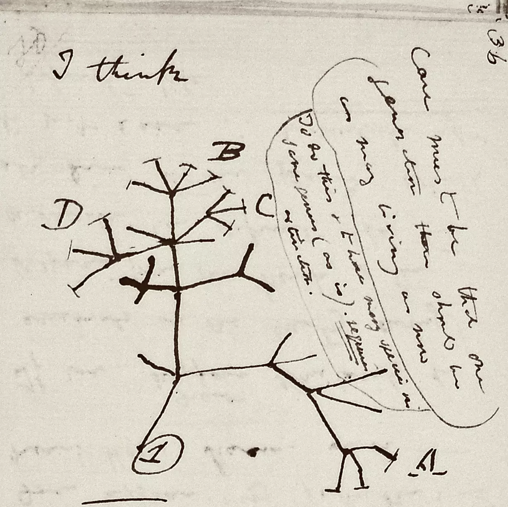
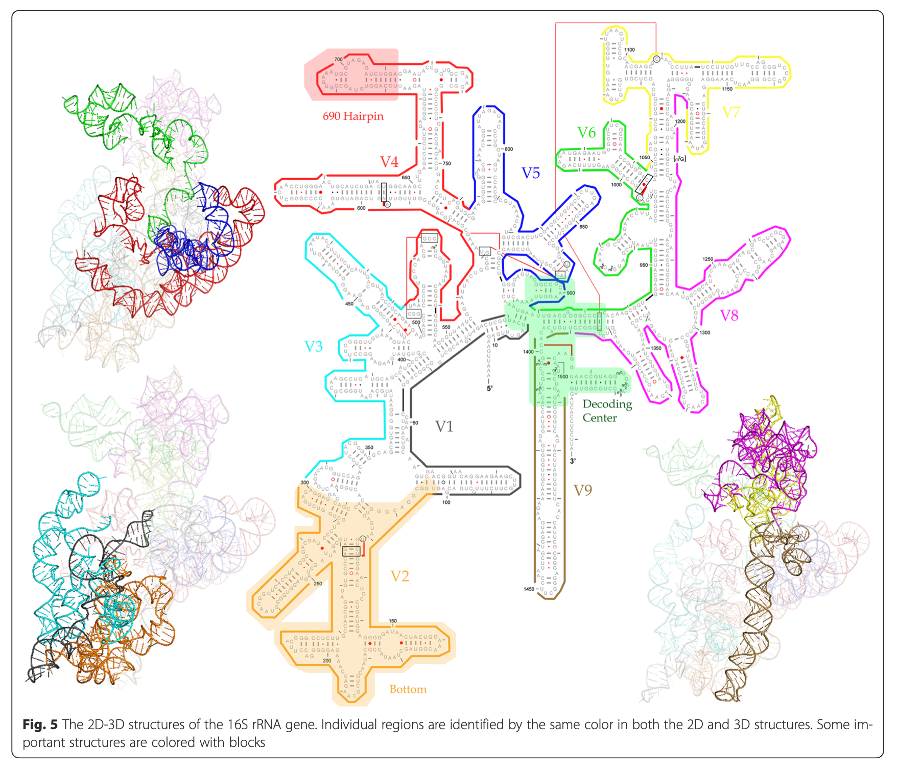
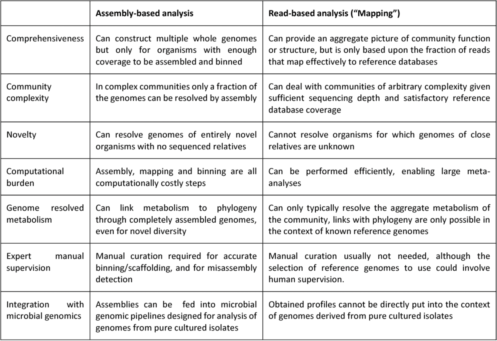
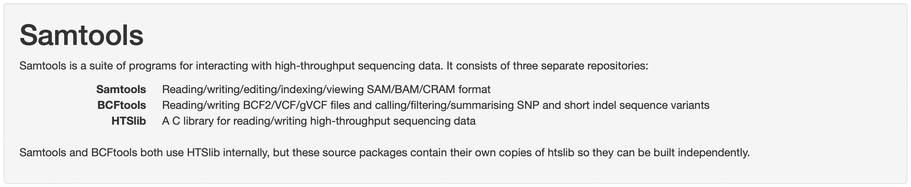
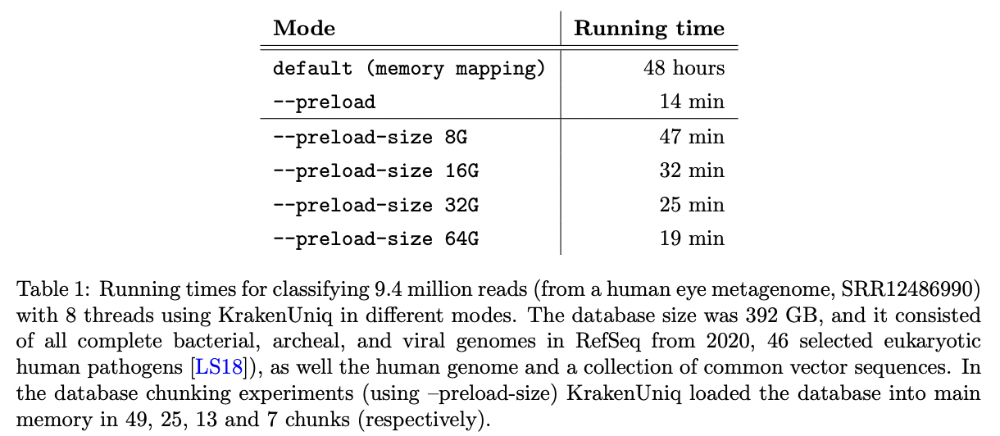
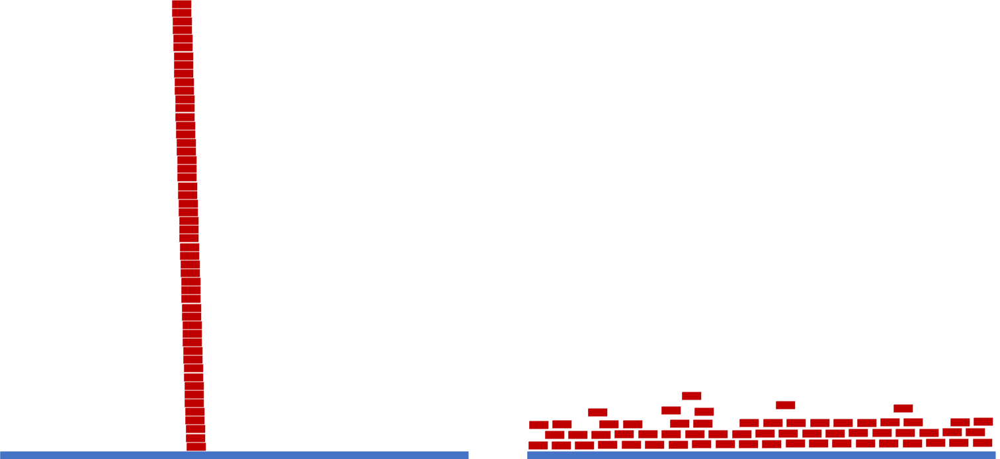

---
title: "Metagenomics Workshop NCGR"
site: bookdown::bookdown_site
documentclass: book
bibliography: [book.bib, packages.bib]
# url: your book url like https://bookdown.org/yihui/bookdown
# cover-image: path to the social sharing image like images/cover.jpg
description: |
  This is a minimal example of using the bookdown package to write a book.
  The HTML output format for this example is bookdown::gitbook,
  set in the _output.yml file.
link-citations: yes
github-repo: rstudio/bookdown-demo
---

# Community Profiling and Metagenomics

## Microbes were the first life forms on this planet

1. Earth declares its independence about 4600 MYA

{width=100%}


2. First photosynthetic bacteria 3.4 billion years ago (BYA)
+ Used sunlight for energy to create biomass
+ Anaerobic (anoxic photosynthesis)

{width=60%}

{width=60%}

3. 2.7 BYA first oxygen producers emerge
+ Oxygen as waste product during respiration
+ Most of the oxygen was sequestered and not readily available
4. 2.3 BYA atmosphere has oxygen
5. 500 million year ago (MYA) first terrestrial plants
6. 200 MYA mammals emerged
7. 13 MYA one of us makes all of us proud by learning how to fly
8. 10 MYA the branch of life currently called homo emerges
9. 400 years ago humans observe the first microbe under
a simple scope


#### THERE WOULD BE NO LIFE WITHOUT MICROBES{-}

### Microbes enable habitability on Earth by catalyzing reactions of biogeochemical cycles

1. The amount or % of elements on Earth remains constant
2. Recycling of these elements, flux, and bio-availability is
largely taken care of by microbes
3. Best example to illustrate – nitrogen

+ 78% of Earths atm is N2
+ Required for important biological processes
+ In gaseous form it is unavailable
+ In fact many processes are N2 limited
+ Making N2 bioavailable in a form that can be
by eukaryotes is completely on the shoulders of microbes

#### Nitrogen Cycle
 
{width=80%}

https://cdn.britannica.com/37/6537-050-CF14602B/ammonia-Nitrogen-fixation-nitrogen-form-means-nitrates-1909.jpg

#### Carbon Cycle

{width=80%}

{width=80%}

https://www.pmel.noaa.gov/co2/story/Carbon+Cycle

How many microbes??

1. 40 million microbes in a gram of soil
2. One million microbes in a ml of fresh water
3. One trillion in a human body

#### MICROBES ARE ABUNDANT......AND EXTREMELY DIVERSE!{-}

## How many kinds of living beings are there?

1. Aristotle’s Scala naturae
= **350 BC**

{width=55%}
{width=40%}

https://sites.google.com/site/aristotlethebiologist/aristotle-s-biology/great-chain-of-being

{width=60%}

https://upload.wikimedia.org/wikipedia/commons/e/e9/Die_Leiter_des_Auf-_und_Abstiegs.jpg

### 2000 yrs later{-}

2. Edward Hitchcock
    + 1840

{width=80%}

https://upload.wikimedia.org/wikipedia/commons/8/8f/Edward_Hitchcock_Paleontological_Chart.jpg

3. Ernst Haeckel
    + 1879

{width=80%}

https://upload.wikimedia.org/wikipedia/commons/d/de/Tree_of_life_by_Haeckel.jpg

4. Charles Darwin 
    + 1837
    + The idea that species could have evolved from an ancestor
    + This could have happened through transmutations
    + Premise for trees today
    + ALL METHODS DEPEND ON **OBSERVABLE MORPHOLOGICAL TRAITS** FOR CATEGORIZATION

{width=80%}


## What happened when we found out about microbes?

{width=40%}

https://hms.harvard.edu/news/diet-gut-microbes-immunity

### Roadmap to where we are now with determining microbial diversity{-}

1. Leeuwenhoek
+ Father of microbiology
+ Late 1600’s
+ Microscope

{width=80%}

{width=80%}

2. Robert Koch
+ 1890
+ First time bringing microbes to the lab
+ Cultivation of microbes

{width=80%}
{width=80%}


3. Discovery of DNA structure
+ Rosiland Franklin
    + 1951

{width=80%}

{width=80%}


+ Frederick Sanger
    + 1975
    
{width=80%}

+ Carl Woese
    + 1977
    + Archaea
    + Phylogenetic tree based on Woese et al. rRNA analysis. The vertical line at bottom represents the last universal common ancestor (LUCA).

{width=80%}

#### DNA Structure{-}

{width=80%}

https://youtu.be/L9NriBoubWE


## Tree of Life

{width=80%}

“Visible organisms represent the smallest sliver of life’s diversity. Bacteria are the true lords of the world. They have been on this planet for billions of years and have irrevocably changed it, while diversifying into endless forms most wonderful and most beautiful.” (The Atlantic)

Life just got weird!

{width=100%}

## What Makes Microbes so Special?

1. -15oC/4oF to 130oC/266oF temperatures
2. 0 to 12.8 pH acidity
3. More than 200 atm pressure
4. 4 miles deep into Earth’s crust
5. Up to 5kGy radiation

###  Grand Prismatic Spring – YNP – 183oC{-}

1. Validates the importance of microbes and sums up life on Earth with boundaries.

{width=80%}

2. Microbes are constantly trying to evolve and get deeper and deeper into the hot springs

3. Eukaryotes only surround this spring – cannot survive close to the hot spring

### The great “plate count” anomaly

1. Cultivation based cell counts are orders of magnitude lower than direct microscopic observation

{width=80%}

2. As microbiologists, we are able to cultivate only a small minority of naturally occurring microbes

3. Our nucleic acid derived understanding of microbial diversity has rapidly outpaced our ability to culture new microbes

### Total number of genomes at NCBI

**Most Prokaryotes:**

1. Haploid genome
2. Single circular chromosome, plasmids
3. Metabolic diversity
4. Genetic malleability
5. No nucleus
6. Easy interspecies gene transfer

{width=80%}

https://www.ncbi.nlm.nih.gov/genome/browse/#!/overview/

## Roadmap to Culture Independent Techniques

1. rRNA as an evolutionary marker 
+ 1977 
+ (Woese and Fox, PNAS)
2. Polymerase Chain Reaction
+ 1985
+ (K. Mullis, Science)
3. “Universal Primers” for rRNA sequencing
+ 1985
+ (N. Pace, PNAS)
4. PCR amplification of 16S rRNA gene
+ 1989
+ (Bottger, FEMS Microbiol)
5. Curation and hosting of RDP
+ Early 1990’s
+ (rRNA database) FTP
6. Term ‘microbiome’
+ 2001
+ coined by Lederberg and McCray

## Microbiomes and their significance
+ Microbes do not work or function as a single entity
+ Most microbial activities are performed by complex communities of microorganisms
    + **Microbiome**

### What is a microbiome

1. Totality of microbes in a defined environment, and their intricate interactions with each other and the surrounding environment
+ A population of a single species is a culture(monoculture), extremely rare outside of lab and in some infections
+ A microbiome is a mixed population of different microbial species
+ MIXED COMMUNITY IS THE NORM!
 
### Why Study Microbiomes
 
1. Microbes modulate and maintain the atmosphere
+ Critical elemental cycles (carbon, nitrogen, sulfur, iron,...)
+ Pollution control, clean up fuel leaks
2. Microbes keep us healthy
+ Protection from pathogens
+ Absorption/production of nutrients in the gut
+ Role in chronic diseases (obesity, Crohn’s/IBD, arthritis...)
3. Microbes support plant growth and suppress plant disease
+ Most complex communities reside in soil
+ Crop productivity

### Why is Microbiome Research New?

1. Bias for microbes (especially pathogens) that are
cultivable
+ Culture-based methods do not detect majority of microbes
+ Only pathogens are easily detected
+ And most microbes are not pathogens
2. Availability of tools
+ Discovery of culture independent techniques
+ Amplicon sequencing and DNA sequencing


{width=100%}

   
### Biodiversity and functional genomics in the human microbiome      
      

{width=80%}
{width=80%}

1. Recovered over 150,000 microbial genomes from ~10,000 metagenomes

2. 70,178 genomes assembled with higher than 90% completeness

3. 3,796 SGBs (species-level genome bins) identified -77% of the total representing species without any publicly available genomes
 
### Microbiome Projects and Databases

1. American Gut Project
2. Earth microbiome Project
3. Human Oral Microbiome Database
4. CardioBiome
5. Human Microbiome Studies – JCVI
6. MetaSub – Metagenomics and metadesign of Subways and Urban Biomes
7. Gut microbiota for Health
8. NASA: Study of the impact of long term space travel in the Astronaut’s
microbiome
9. Michigan microbiome project
10. Coral microbiome project 
11. Seagrass microbiome project

## Structural and Functional Approaches to study microbiomes

{width=80%}

### 16S rRNA as an evolutionary chronometer

{width=80%}

1. Ubiquitous – present in all known life (excluding viruses)
2. Functionally constant wrt translation and secondary structure
3. Evolves very slowly – mutations are extremely rare
4. Large enough to extract information for evolutionary inference
5. Limited exchange – limited examples of rRNA gene sharing between organisms

### 16S rRNA vs rpoB (RNA polymerase β subunit gene)

{width=100%}

#### 16S rRNA hypervariable regions

{width=80%}

{width=80%}

Illustration of different hypervariable regions of 16S rRNA

## Basic Workflow for 16S Gene Based Sequencing

{width=80%}

## Addressing the ‘fine print’ while generating 16S rRNA gene amplicon libraries

1. Sample Collection
+ Sample collection significantly influences the microbiome profiler 
after sequencing
+ Sample storage
2. DNA isolation
+ Template concentration
+ Template extraction protocol
3. PCR amplification
+ PCR bias and inhibitors
+ Amplification of contaminants

J. Microbiol Methods (2018), App. Environ. Microbiol. (2014), Microbiome (2015)

## Steps Involved

1. Experimental Design: How many samples can be included in the sequencing run?
+ By using barcoded primers, numerous samples can be sequenced simultaneously (multiplexing)

{width=80%}

### Samples

1. More the number of samples, more cost effective the run (sequencing depth will be compromised)

Comparison of multiplexing capacity by sequencing system

{width=80%}

2. It is critical to have a ‘library prep manifest’ to document the position of each sample with its associated barcode along with additional metadata information

https://www.youtube.com/watch?v=3SEz-i517Oo&t=5s

### Include Controls

1. Between run repeat (process any sample in duplicate per run to measure reproducibility across runs)
2. Within run repeat (process any sample in duplicate per plate to measure reproducibility)
3. Water used during PCR (water blank- to determine if any contaminant was introduced during PCR reaction)
4. Water spiked with known bacterial DNA (mock bacterial communities- enables quantification of sequencing errors, minimizes bias during sampling and library preparation )

### DNA extraction protocol

1. Effect of mechanical lysis methods for extraction
2. Presence of inhibitors such as organic matter, humic acid, bile salts, polysaccharides
3. DNA yield post extraction and reproducibility

Effect of bead beating was larger than sampling time over 5 months

The effect of bead beating on the observed microbial community composition:

{width=80%}

A. Percentage read abundance of the 11 most abundant phyla as a result of bead beating intensity 

B. PCA of samples with different bead beating intensities vs. samples taken at different dates

### Selection of primers and region of 16S gene influence microbial profile

V2, V4, V6-V7 regions produced consistent results

{width=80%}

1. V2, V3 and V6 contain maximum nucleotide heterogeneity
2. V6 is the shortest hypervariable region
with the maximum sequence
heterogeneity
3. V1 is best target for distinguishing
pathogenic S aureus
4. V2 and V3 are excellent targets for
speciation among Staph and Strep pathogens as well as Clostridium and Neisseria species
5. V2 especially useful for speciation of Mycobacterium sp. and detection of E coli O157:H7
6. V3 useful for speciation of
Haemophilus sp
7. V6 best target for probe based PCR assays to identify CDC select agents (bio-terrorism agents)

{width=80%}

### Purification of Amplicons

After one –step or two-step PCR, products are cleaned up using AMpure beads

{width=80%}

1. Gel Electrophoresis and quantification of cleaned amplicon products
+ Qubit
2. Sample pooling – equimolar concentrations (how many samples do you want to pool? How many reads per sample?
3. Gel extraction of pooled product
4. Final clean up (Qiagen kit) and QC

{width=80%}

[Amplicon Sequencing Library Prep - PacBio](https://www.pacb.com/wp-content/uploads/Multiplexed-Amplicon-Library-Preparation-Using-SMRTbell-Express-Template-Prep-Kit-2.0-–-Customer-Training.pdf)


#### Overview of generic amplicon workflow

{width=80%}

## Oxford Nanopore Sequencing

{width=80%}

### How does it work?

1. Proetin pore
    + nanoscale
    + biosensor
    + motor protein ratchets DNA/RNA through
    
2. Ionic current
    + constant voltage
    + in electrolytic solution
    + disrupted by nucleotide sequence
    + changes in current correspond to sequence

Watch the video below and answer questions:

https://www.youtube.com/watch?v=RcP85JHLmnI

1. How does the DNA bind to the pore?
2. Does something help guide the DNA to the pore?
3. What is the signal produced by the DNA?

https://www.youtube.com/watch?v=E9-Rm5AoZGw

Applications for ONT sequencing:


{width=100%}


## Metagenomics and Metatranscriptomics 

**Metagenomics:** Untargeted sequencing of all microbial genomes present in a sample.

### Shotgun Metagenomics

+ Study design and experimental protocol
+ Computational pre-processing
+ Sequence analysis
+ Post-processing
+ Validation

{width=100%}

### Sample collection and DNA extraction

1. Sample collection and preservation methods can affect quality and accuracy of metagenomic data
    + Collect sufficient biomass
    + Minimize contamination
    + Enrichment methods where applicable
2. DNA extraction methods can affect the composition of downstream sequence data
+ Method must be effective for diverse microbial taxa
    + Mechanical lysis (bead beating) method is considered superior,
however, data will be biased for easy-to-lyse microbes
    + Bead beating will result in short DNA fragments and lead to DNA loss during library prep methods.

### Sources of contamination
1. Kit or lab reagents
2. Low biomass samples are vulnerable to contamination as there is less ‘real’ signal to compete with low levels of contamination
    + Use ultraclean kits
    + Include blank sequencing controls
3. Cross- over from previous sequencing runs
4. PhiX control DNA
5. Human/ host DNA

### Coverage and Sequencing considerations

1. No published guidelines for ‘correct’ amount of coverage for a given environment

+ Choose a system that maximizes output in order to recover sequences from as many low-abundance members of the microbiome as possible

+ HiSeq 2500 or 4000, NextSeq and NovaSeq produce high volume data (120Gb- 1.5 Tb per run) – suited for metagenomics study

+ Multiplexing prudently will enable desired per-sample sequencing depth

### Illumina Sequencers and Yield

https://www.illumina.com/systems/sequencing-platforms.html

{width=100%}


### Generalized workflow of metagenomic next-generation sequencing for diagnostic clinical use


{width=100%}


### Generic Analysis Workflow

{width=100%}

### Strengths and weaknesses of assembly-based and read-based metagenomics analysis

{width=100%}

### Tools and web servers related to gut microbiome studies.

{width=100%}

### Benefits and limitations of whole genome metagenomics

**Benefits**

+ Integrative meta-omics
+ Strain-level profiling
+ Longitudinal study design
+ Capability of sequencing large regions or entire genome
+ Identification of organisms in addition to bacteria, archaea
+ Increased prediction of genes and functional pathways

**Limitations**

+ Expensive
+ Compute intensive 
+ Incomplete databases
+ Biases in functional profiling
+ Unvalidated data in the public space
+ Live or dead dilemma

{width=60%}

“What are they doing?” - Metatranscriptomics

{width=100%}

{width=100%}

### Benefits of Metatranscriptomics


{width=100%}


```
knitr::write_bib(c(
  .packages(), 'bookdown', 'knitr', 'rmarkdown'
), 'packages.bib')
```


<!--chapter:end:index.Rmd-->

# Filter out Red Alder Sequencing Reads

{width=40%}
{width=40%}


In order to focus on sequencing reads from the microbes in the nodule, we will filter out reads that align to the red alder genome as follows:

1 Align the fastq-formatted reads to the red alder genome using minimap2.
2 Extract reads that do not align to red alder and sort them using samtools.
3 Create a fastq file with only the unaligned reads using samtools bam2fastq.
4 Compress the fastq file using gzip.

## Activate the environment that contains minimap2

{width=80%}

```
conda activate minimap2
```

+ Make a directory and go into it

```
mkdir ~/microbe_fastq
cd ~/microbe_fastq
```

+ Link to the merged minion reads

```
ln -s /home/cjb/minion/2022/data/AlderNodule3469-3/3469-3/20220701_2144_MC-113445_FAS21661_134c02ac/fastq_pass/all.fastq 3469-3.all.fastq
```

+ Run Minimap2 to align the MinION reads to the red alder genome
    + he -x map-ont parameter (allows ~10% error + divergence)

```
minimap2 -x map-ont -L -t 8 -a \
/home/cjb/indexes/red_alder_genome/consensus.fasta \
3469-3.all.fastq > 3469-3-minionxredalder.mm2.sam
```

## Activate the environment that contains samtools

{width=80%}

```
conda activate samtools
```

+ Convert the unmapped reads in the alignment file (sam) to a fastq file
    + The -f4 includes only reads with the 4 flag (unmapped)

```
samtools fastq -f4 3469-3-minionxredalder.mm2.sam > 3469-3.microbe.fq
```

+ Compress the new fastq file 
    + (note that it will automatically add the extension .gz)

```
gzip 3469-3.microbe.fq
```

### Now run these steps with 4956-3{-}

Reads are here: 

```
/home/cjb/minion/2022/data/Aldernodule4956-3/4956-3/20220701_2154_MC-113286_FAS37509_f3119554/fastq_pass/all.fastq
```


<!--chapter:end:01-FilteringRedAlder.Rmd-->

# Data Processing

## FastQC

{width=80%}

1. Many tools/options to filter and trim data
2. Trimming does not always improve things as valuable information
can be lost!
3. Removal of adapters is critical for downstream analysis

## Dereplication

1. In this process all the quality-filtered sequences are collapsed into a set of unique reads, which are then clustered into OTUs
2. Dereplication step significantly reduces computation time by eliminating redundant sequences

What's an OTU?

https://www.youtube.com/watch?v=azI9taClDhQ


## Chimera detection and removal of non-bacterial sequences

Chimeras as artifact sequences formed by two or more biological sequences incorrectly joined together
 
{width=80%}

Incomplete extensions during PCR allow subsequent PCR cycles to use a partially extended strand to bind to the template of a different, but similar, sequence. This partially extended strand then acts as a primer to extend and form a chimeric sequence.

## Clustering

1. Analysis of 16S rRNA relies on clustering of related sequences at a particular level of identity and counting the representatives of each cluster

{width=80%}

Some level of sequence divergence should be allowed – 95% (genus-level, partial 16S gene), 97% (species-level) or 99% typical similarity cutoffs used in
practice and the resulting cluster of nearly identical tags (assumedly identical genomes) is referred to as an OTU (Operational Taxonomic Unit)

## Create OTU tables

OTU table is a matrix that gives the number of reads per sample per OTU

{width=80%}

## Bin OTUs into Taxonomy (assign taxonomy)

1. Accuracy of assigning taxonomy depends on the
reference database chosen
+ Ribosomal Database Project
+ GreenGenes
+ SILVA
2. Accuracy depends on the completeness of databases

{width=80%}

## Assess Population Diversity: **alpha diversity**

1. Assessment of diversity involves two aspects
+ Species richness (# of species present in a sample)
+ Species evenness (distribution of relative abundance of species)

2. Total community diversity of a single sample/environment is given by alpha-diversity and represented using rarefaction curves

3. Quantitative methods such as Shannon or Simpson indices measure evenness of the alpha- diversity
 
{width=50%}

## Assess Beta Diversity

1. Beta-diversity measures community structure differences (taxon composition and relative abundance) between two or more samples
+ For example, beta-diversity indices can compare similarities and differences in microbial communities in healthy and diseases states
2. Many qualitative (presence/absence taxa) and
quantitative(taxon abundance) measures of community
distance are available using several tools
+ LIBHUFF, TreeClimber, DPCoA, UniFrac (QIIME)
 
## Measuring Population Diversity: **alpha and beta diversity**

{width=100%}

## Diversity Measurements with 16s rRNA sequencing

1. Overall Benefits
+ Cost effective
+ Data analysis can be performed by established pipelines
+ Large body of archived data is available for reference

2. Overall Limitations
+ Sequences only a single region of the genome
+ Classifications often lack accuracy at the
species level
+ Copy number per genome can vary. While they
tend to be taxon specific, variation among
strains is possible
+ Relative abundance measurements are
unreliable because of amplification biases
+ Diversity of the gene tends to overinflate
diversity estimates

3. FastQC for 16S rRNA dataset
+ Extremely biased per base sequence content
+ Extremely narrow distribution of GC content
+ Very high sequence duplication levels
+ Abundance of overrepresented sequences
+ In cases where the PCR target is shorter than the read length, the sequence will read through into adapters

## Taxonomy: Expectation vs Reality

{width=80%}

## Beta Diversity - UniFrac

1. Measures how different two samples’ component  sequences are

{width=40%}

2. Weighted Unifrac: takes abundance of each sequence  into account

## Results from Paper

1. Main phyla: Firmicutes, Bacteroidetes, Proteobacteria,  Actinobacteria, Fusobacteria with differences bw samples
2. Sputum (patient) samples had highest diversity followed  by oropharynx samples followed by nasal
3. Healthy controls (N and O) more diverse than samples  from TB patients
4. Between-group comparisons?
5. Phyla differences?

<!--chapter:end:02-DataProcessing.Rmd-->


# PycoQC

### Quality Control{-}

+ “PycoQC computes metrics and generates interactive QC plots for Oxford Nanopore technologies sequencing data” (https://a-slide.github.io/pycoQC/ )

{width=25%}

1. What do we need in order to run a Quality Control Check?
+ Sequencing Summary File 
    + Automatically produced by the MinIon basecaller.
+ PycoQC package + dependencies 
    + Already downloaded for you in Logrus.
+ Line of code to produce .html file.
+ Line of code to secure copy file to your computer.

## Sequencing Summary File
 
Where is it?

```
/home/cjb/minion/2022/data/AlderNodule3469-3/3469-3/20220701_2144_MC-113445_FAS21661_134c02ac/sequencing_summary_FAS21661_9ac87089.txt
```

## PycoQC package & code

1. Where is it? How to activate it?
+ Log in to Logrus
+ Stay in your home directory (check with pwd)
+ Type the following: 
		
```
source activate seqtools
pycoQC
pycoQC –f inputfilename.txt –o outputfilename.html
```

## Secure Copy 

1. What terminal to copy from? What is the code?

+ Open new Terminal window (Not Logrus, but keep Logrus terminal window open)	
+ Type:

```
scp username@logrus.training.ncgr.org:/home/username/outputfile.html ~/Desktop/
```

## Open your URL

Find your file on your desktop.

Double-click to open, or right-click to select browser


{width=100%}


### Normalization

With normalization we are trying to get the correct relative gene expression abundances between cells. 

Gene expression between cells is based on count data.

What does a count in a count matrix represent?

-	mRNA Capture
-	Reverse transcription of mRNA
-	sequencing of a molecule of mRNA

The most common normalization protocol is:

-	count depth scaling
-	aka CPM or counts per million
-	it assumes that all cells in the dataset initially contain an equal number of mRNA molecules
-	it assumes that count depth differences arise from sampling

Normalize complete 

-	But wait!
-	We still have unwanted variability in the data.
-	What kind of unwanted variability?
-	What is the solution? Data Correction. 

### Data correction and integration

Biological Covariates

-	Cell-Cycle effects
-	Batch
-	Dropout

Which Covariates to Consider?

-	Depends on downstream analysis
-	Correct for biological and technical to be considered separately
-	Corrections are used for different purposes
-	Each approach to correction presents unique challenges

What are the Correction methods?

-	Regressing out biological effects
-	Regressing out technical effects
-	Batch effects and data integration
-	Expression recovery


<!--chapter:end:03-PycoQC.Rmd-->

# KrakenUniq

"confident and fast metagenomics classification using unique k-mer counts"

Default kmer = 31


{width=60%}

https://genomebiology.biomedcentral.com/articles/10.1186/s13059-018-1568-0

https://github.com/fbreitwieser/krakenuniq

https://gitlab.umiacs.umd.edu/derek/krakenuniq/-/blob/master/MANUAL.md


## Kraken/Centrifuge Family

**Kraken 1** is obsolete.

**Centrifuge** was written to improve Kraken's memory issues. It is completely new code with a different classification index. Its databases are also much smaller. Centrifuge can assign a sequence to multiple taxa. We'll use centrifuge later in the course.

**KrakenUniq** is based on Kraken 1. Adds an efficient algorithm to assess coverage of unique kmers, running at the same speed and with only slightly more memory than Kraken 1. KrakenUniq distinguishes low abundance organisms from false positives.

**Kraken 2** uses "probabilistic data structures" to reduce memory and increase speed at the expense of lower accuracy that leads to false positives during the classifications ("a few dozen out of millions").

**KrakenUniq** was updated in May 2022 (v0.7+) that helped to deal with the large databases on computers without enough RAM to load them into memory. Databases can be read in chunks that fit in RAM.


{width=50%}


KrakenUniq gives you k-mer coverage information, reporting the number and percentage k-mers hit by reads. This helps to differentiate between false positives and good classifications.

{width=50%}


https://www.biorxiv.org/content/10.1101/2022.06.01.494344v1.full.pdf

http://ccb.jhu.edu/software/choosing-a-metagenomics-classifier/#:~:text=However%2C%20while%20Kraken%20provides%20only,1%20databases%2C%20not%20Kraken%202.

https://github.com/fbreitwieser/krakenuniq/blob/master/MANUAL.md


## KrakenUniq databases


KrakenUniq requires Kraken1 not Kraken2 databases

We won't build a database since it can take several days, but let's look at the documentation:  
https://github.com/fbreitwieser/krakenuniq#database-building

You can also get prebuilt databases:  
https://benlangmead.github.io/aws-indexes/k2

We will use a bacterial databases located here:  
/home/cjb/indexes/krakenuniq/db_052422


Link to it.
```{bash, eval=FALSE}
ln -s /home/cjb/indexes/krakenuniq/db_052422/ .
```

The taxa it contains are here:  
/home/cjb/indexes/krakenuniq/db_052422/library/bacteria/library_headers.orig

Take a look at the file.
How many sequences are there?

How many genera?
```{bash, eval=FALSE}
awk '{print $2}' /home/cjb/indexes/krakenuniq/db_052422/library/bacteria/library_headers.orig | sort -u| wc -l
```

And how many of each genera?
```{bash, eval=FALSE}
awk '{print $2}' /home/cjb/indexes/krakenuniq/db_052422/library/bacteria/library_headers.orig | sort | uniq -c | less
```

## Run KrakenUniq

Make a working directory and go into it.
```{bash, eval=FALSE}
mkdir ~/krakenuniq
cd ~/krakenuniq
```

Activate the KrakenUniq environment.
```{bash, eval=FALSE}
source activate krakenuniq
```

Run Kraken on sample 3469-3.
```{bash, eval=FALSE}
time krakenuniq \
	--db /home/cjb/indexes/krakenuniq/db_052422 \
	--threads 32 \
	--report-file 3469-3.report \
	--unclassified-out 3469-3.unclassified.fna \
	--classified-out 3469-3.classified.fna \
	~/microbe_fastq/3469-3.microbe.fq.gz \
	> 3469-3.krakenuniqoutput
```


Make sure you got the following files:
3469-3.classified.fna
3469-3.krakenuniqoutput
3469-3.report
3469-3.unclassified.fna

This command will also bring up the input file as well (3469-3.microbe.fq.gz)
```{bash, eval=FALSE}
ls 3469*
```

Use the less command to look at each of them.

Now run it on the other samples.

## Pavian

Copy the reports to your computer.
Let's open them in Pavian.

Information on installing and some things you can do in Pavian is in the Centrifuge chapter.

<!--chapter:end:04-KrakenUniq.Rmd-->


# QIIME2
Command Line Tutorial

## Logging on to the server

Make it a practice to start a screen before you begin analysis.

```{bash, eval=FALSE}
ssh -p 44111 <USERNAME>@gateway.training.ncgr.org

screen -S QIIME2
```
## Setting up a working directory for QIIME2 analysis
```{bash, eval=FALSE}
cd /home/$USER/

mkdir QIIME2_Analysis

cd QIIME2_Analysis
```

## Dataset for analysis

For this tutorial, we will use data from the following published manuscript:
https://microbiomejournal.biomedcentral.com/articles/10.1186/2049-2618-2-29

Respiratory tract clinical sample selection for microbiota analysis in patients with pulmonary tuberculosis

Pulmonary Tuberculosis (The Human Microbiome in the Fight Against Tuberculosis, 2017)

{width=100%}
Why study microbiome in relation to TB?
1. Microbiome composition is a potential risk factors for TB infection and disease susceptibility, disease progression,
and treatment outcomes
2. TB infection and disease can affect microbiome, subsequently impacting health via alteration of immune responses

This pilot study was carried out using sputum, oropharynx, and nasal respiratory tract samples collected from patients
with pulmonary tuberculosis and healthy control individuals, in order to compare sample types and their usefulness in
assessing changes in bacterial and fungal communities.

## Data download

Data was downloaded from the National Center for Biotechnology Information (NCBI) based on the SRA accession
numbers reported in the manuscript - PRJNA242354.
A program called fastq-dump version 2.10.0 was used to download the data directly from NCBI SRA database. Tbe
following exercise will help you use fastq-dump for your own projects too.

```{bash, eval=FALSE}
source activate fastqdump
# MAKE SURE YOU ARE IN THE FOLLOWING FOLDER
/home/$USER/QIIME2_Analysis
# CREATE A FOLDER FOR DOWNLOADING FASTQ FILES TO ANALYZE

mkdir input_data
cd input_data
fastq-dump --gzip --outdir ./ \
SRR1204628 SRR1204630 SRR1204627 SRR1204629 SRR1204626 SRR1204623 \
SRR1204625 SRR1204624 SRR1204622 SRR1204631 SRR1204638 SRR1204642 \
SRR1204633 SRR1204632 SRR1204634 SRR1204639 SRR1204646 SRR1204647 \
SRR1204641 SRR1204640 SRR1204636 SRR1204637 SRR1369696 SRR1369694 \
SRR1204635 SRR1204643 SRR1204644 SRR1204645 SRR1369709 SRR1369707 \
SRR1369690 SRR1369691 SRR1369692 SRR1369693 SRR1369710 SRR1369713 \
SRR1204650 SRR1204651 SRR1369688 SRR1369689 SRR1369695 SRR1204649 \
SRR1204648 SRR1369697 SRR1369704 SRR1369703 SRR1369706 SRR1369705 \
SRR1369708 SRR1369698 SRR1369699 SRR1369701 SRR1369700 SRR1369702 \
SRR1369714 SRR1369717 SRR1369716 SRR1369715 SRR1369711 SRR1369712
# --outdir -> Path to Output directory
# --gzip -> Compress output files using gzip

# After running this step, you will have 60 files in your input_data folder
# To check, cd into folder that has fastq files, type this command
ls| wc -l
# Optional exercise:
# Count the number of sequences in the two fastq files pertaining to one sample and sum them.
conda deactivate
```

## Quality Control
```{bash, eval=FALSE}
# Filter poor quality reads
source activate fastp

for file in *.gz; do fastp -i ${file} -o ${file}.filtered; done
conda deactivate
```
{width=100%}
Data was collected from 30 Individuals.

• 6 TB Patients - Nasal

• 6 TB Patients - oropharynx

• 6 TB Patients - Sputum

• 6 Healthy Controls - Nasal

• 6 Healthy Controls - oropharynx

DATA TABLE:

```
SAMPLE FASTA FILE 	                TOTAL NUMBER OF READS 
Control_1_Nasal_L001_R1_001.fasta 	41056
Control_1_Pharynx_L001_R1_001.fasta 119972
Control_2_Nasal_L001_R1_001.fasta 	32142
Control_2_Pharynx_L001_R1_001.fasta 42973
Control_3_Nasal_L001_R1_001.fasta 	32953
Control_3_Pharynx_L001_R1_001.fasta 39148
Control_4_Nasal_L001_R1_001.fasta 	83174
Control_4_Pharynx_L001_R1_001.fasta 17475
Control_5_Nasal_L001_R1_001.fasta 	29146
Control_5_Pharynx_L001_R1_001.fasta 32728
Control_6_Nasal_L001_R1_001.fasta 	32738
Control_6_Pharynx_L001_R1_001.fasta 15320
Patient_1_Nasal_L001_R1_001.fasta 	69995
Patient_1_Pharynx_L001_R1_001.fasta 59646
Patient_1_Sputum_L001_R1_001.fasta 	66725
Patient_2_Nasal_L001_R1_001.fasta 	61070
Patient_2_Pharynx_L001_R1_001.fasta 27106
Patient_2_Sputum_L001_R1_001.fasta 	71434
Patient_3_Nasal_L001_R1_001.fasta 	91920
Patient_3_Pharynx_L001_R1_001.fasta 36224
Patient_3_Sputum_L001_R1_001.fasta 	27533
Patient_4_Nasal_L001_R1_001.fasta 	28996
Patient_4_Pharynx_L001_R1_001.fasta 30713
Patient_4_Sputum_L001_R1_001.fasta 	59433
Patient_5_Nasal_L001_R1_001.fasta 	70843
Patient_5_Pharynx_L001_R1_001.fasta 39674
Patient_5_Sputum_L001_R1_001.fasta 	29576
Patient_6_Nasal_L001_R1_001.fasta 	106178
Patient_6_Pharynx_L001_R1_001.fasta 58956
Patient_6_Sputum_L001_R1_001.fasta 	35703
```

## What is QIIME2?
https://docs.qiime2.org/2020.11/about/

QIIME 2 is a powerful microbiome analysis package with a focus on data and analysis transparency. QIIME2 enables researchers to start an analysis with raw DNA sequence data and finish with publication-quality figures and statistical results.

Key features:

• Integrated and automatic tracking of data provenance

• Plugin system for extending microbiome analysis functionality

• Support for multiple types of user interfaces (e.g. API, command line, graphical)

Plugin availability - https://docs.qiime2.org/2020.11/plugins/available/

## Metadata setup

Metadata file that we will be using for our data set: (mappingFile.txt on logrus)

Here is how you will make a metadata file on your own: https://docs.qiime2.org/2017.6/tutorials/metadata/

```
#SampleID 	Treatment 	TreatmentSite 	TreatmentNumber 	Sex 	BodySite 	Description 
C_1_N 	C 	CN 	1	F 	Nasal 	    Control 1 Nasal 
C_1_P 	C 	CP 	2	F 	Oropharynx 	Control 1 Pharynx 
C_2_N 	C 	CN 	1	M 	Nasal 	    Control 2 Nasal 
C_2_P 	C 	CP 	2	M 	Oropharynx 	Control 2 Pharynx 
C_3_N 	C 	CN 	1	M 	Nasal 	    Control 3 Nasal 
C_3_P 	C 	CP 	2	M 	Oropharynx 	Control 3 Pharynx 
C_4_N 	C 	CN 	1	M 	Nasal 	    Control 4 Nasal 
C_4_P 	C 	CP 	2	M 	Oropharynx 	Control 4 Pharynx 
C_5_N 	C 	CN 	1	M 	Nasal 	    Control 5 Nasal 
C_5_P 	C 	CP 	2	M 	Oropharynx 	Control 5 Pharynx 
C_6_N 	C 	CN 	1	M 	Nasal 	    Control 6 Nasal 
C_6_P 	C 	CP 	2	M 	Oropharynx 	Control 6 Pharynx 
P_1_N 	P 	PN 	3	F 	Nasal 	    Patient 1 Nasal 
P_1_P 	P 	PP 	4	F 	Oropharynx 	Patient 1 Pharynx 
P_1_S 	P 	PS 	5	F 	Sputum 	    Patient 1 Sputum 
P_2_N 	P 	PN 	3	M 	Nasal 	    Patient 2 Nasal 
P_2_P 	P 	PP 	4	M 	Oropharynx 	Patient 2 Pharynx 
P_2_S 	P 	PS 	5	M 	Sputum 	    Patient 2 Sputum 
P_3_N 	P 	PN 	3	M 	Nasal 	    Patient 3 Nasal 
P_3_P 	P 	PP 	4	M 	Oropharynx 	Patient 3 Pharynx 
P_3_S 	P 	PS 	5	M 	Sputum 	    Patient 3 Sputum 
P_4_N 	P 	PN 	3	M 	Nasal 	    Patient 4 Nasal 
P_4_P 	P 	PP 	4	M 	Oropharynx 	Patient 4 Pharynx 
P_4_S 	P 	PS 	5	M 	Sputum 	    Patient 4 Sputum 
P_5_N 	P 	PN 	3	M 	Nasal 	    Patient 5 Nasal 
P_5_P 	P 	PP 	4	M 	Oropharynx 	Patient 5 Pharynx 
P_5_S 	P 	PS 	5	M 	Sputum 	    Patient 5 Sputum 
P_6_N 	P 	PN 	3	M 	Nasal 	    Patient 6 Nasal 
P_6_P 	P 	PP 	4	M 	Oropharynx 	Patient 6 Pharynx 
P_6_S 	P 	PS 	5	M 	Sputum 	    Patient 6 Sputum 
```

```{bash, eval=FALSE}
# Move out of the input_data directory

cd ../

# Copy metadata file from my workspace to your workspace,

cd /home/$USER/QIIME2_Analysis

cp /home/elavelle/QIIME2_Analysis/mappingFile.txt ./

less mappingFile.txt 
```

## Data import
We will be beginning our analysis with demultiplexed, quality controlled sequences.

For the purpose of this workshop we will not use the entire dataset per sample. We have created 1000 sequences per sample as subset. This will be your input dataset.

```{bash, eval=FALSE}
cd /home/$USER/QIIME2_Analysis

# Copy the subset file of sequences:

cp /home/metag/data/seqs.1000.fna ./

conda deactivate

source activate qiime2

# This command will vary depending input data type and format
# Here, we are importing .fasta reads (no quality scores)

qiime tools import \
--input-path seqs.1000.fna \
--output-path seqs.1000.qza \
--type 'SampleData[Sequences]'
```

## Dereplicate

From https://docs.qiime2.org/2021.2/tutorials/overview/#derep-denoise

• We dereplicate our sequences to reduce repetition and file size/memory requirements in downstream steps (Don’t worry, we keep count of each replicate). 

• We denoise to correct for stochastic sequencing effects and PCR error.

• We cluster sequences to collapse similar sequences (e.g., those that are ≥ 97% similar to each other) into single replicate sequences. This process, also known as OTU picking, was once a common procedure, used to simultaneously dereplicate but also perform a quick-and-dirty denoising procedure. Use denoising methods instead if you can. 

```{bash, eval=FALSE}

qiime vsearch dereplicate-sequences \
--i-sequences seqs.1000.qza \
--o-dereplicated-table table.qza \
--o-dereplicated-sequences rep-seqs.qza 
```


## Generating a feature table
The final products of all denoising and clustering methods/workflows are a FeatureTable[Frequency] (feature table) artifact and a FeatureData[Sequence] (representative sequences) artifact. These are two of the most important artifacts in an amplicon sequencing workflow, and are used for many downstream analyses, as discussed below. Indeed, feature tables are crucial to any QIIME2 analysis, as the central record of all observations per sample. 

{width=100%}
The feature-table summarize command will give you information on how many sequences are associated with each sample and with each feature, histograms of those distributions, and some related summary statistics. The feature-table and tabulate-seqs commands will provide a mapping of feature IDs to sequences, and provide links to easily BLAST each sequence against the NCBI nt database.

## Visualization

```{bash, eval=FALSE}

qiime feature-table summarize \
--i-table table.qza \
--o-visualization table.qzv


qiime feature-table tabulate-seqs \
--i-data rep-seqs.qza \
--o-visualization rep-seqs.qzv
```

Look at the format of a feature table from a mock dataset as well as other tutorials:
https://view.qiime2.org/visualization/?type=html&src=https%3A%2F%2Fdocs.qiime2.org%2F2020.11%2Fdata%2Ftutorials%2Fmoving-pictures%2Ftable.qzv

## Setting up a reference

Greengenes (16S rRNA) and Silva (16S/18S rRNA) databases have to be imported as QIIME2 artifacts before using them.

```{bash, eval=FALSE}

qiime tools import \
--input-path /home/metag/QIIME2_greengenes/Greengenes_16S_rRNA/\
gg_13_8_otus/rep_set/99_otus.fasta \
--output-path 99_otus.qza \
--type FeatureData[Sequence]
```

## Clustering

{width=100%}
There are three types of clustering,

I. De novo Operational Taxonomic Unit (OTU) clustering

De novo OTU picking is used when we dont have a reference sequence collection to cluster against, for example, working with an infrequently used marker gene.

De novo OTU picking cannot be used in the following two scenarios,

1. Comparing non-overlapping amplicons, such as V2 and V4 regions of 16S rRNA

2. Working with very large data sets, e.g., HiSeq

Advantage: No reference is required.

Disadvantage: Run time can be very expensive depending on the volume of data (parallel processing not possible)

```{bash, eval=FALSE}
# EXAMPLE- DO NOT RUN THE ABOVE COMMAND TO COMPLETION.

qiime vsearch cluster-features-de-novo \
--i-table table.qza \
--i-sequences rep-seqs.qza \
--p-perc-identity 0.99 \
--o-clustered-table table-dn-99.qza \
--o-clustered-sequences rep-seqs-dn-99.qza
```

II. Closed-reference OTU clustering

Reads are clustered against a reference sequence collection. Any reads which do not hit a sequence in the reference sequence collection are excluded from downstream analyses.

Closed-reference OTU picking is used:

1. When comparing non-overlapping amplicons, such as V2 and V4 regions of the 16S rRNA.

2. When reference sequences span the sequenced regions.

Closed-reference OTU picking is not used when reference sequence collection is not available

Advantage: Fast, useful for extremely large data sets. Better trees and taxonomy. OTUs are defined in the reference and have a reliable tree/taxonomy.

Disadvantage: Inability to detect novel diversity with respect to your reference sequence collection

```{bash, eval=FALSE}

# EXAMPLE- DO NOT RUN THE ABOVE COMMAND TO COMPLETION

qiime vsearch cluster-features-closed-reference \
--i-table table.qza \
--i-sequences rep-seqs.qza \
--i-reference-sequences 99_otus.qza \
--p-perc-identity 0.99 \
--o-clustered-table table-cr-99.qza \
--o-clustered-sequences rep-seqs-cr-99.qza \
--o-unmatched-sequences unmatched-cr-99.qza
```

III. Open-reference OTU clustering

In open-reference OTU clustering, sequence reads are clustered against a reference sequence collection and any reads which do not hit the reference sequence collection are subsequently clustered de novo.

```{bash, eval=FALSE}
qiime vsearch cluster-features-open-reference \
--i-table table.qza \
--i-sequences rep-seqs.qza \
--i-reference-sequences 99_otus.qza \
--p-perc-identity 0.99 \
--o-clustered-table table-or-99.qza \
--o-clustered-sequences rep-seqs-or-99.qza \
--o-new-reference-sequences new-ref-seqs-or-99.qza
```

Combine reference-clustered features with de-novo clustered features
```{bash, eval=FALSE}
qiime feature-table merge-seqs --i-data rep-seqs-or-99.qza \
new-ref-seqs-or-99.qza --o-merged-data all-or-seqs-99.qza
```

## Building a phylogenetic tree

Evolution is the core concept of biology. There is only so much you can learn from microbes while ignoring evolution. Evolution-aware analyses of a dataset needs a phylogenetic tree of its sequences. These trees can be built de-novo or they can be reference based. Phylogeny-based analyses in QIIME2 generally need a rooted tree. 

{width=100%}

```{bash, eval=FALSE}

# Carry out a multiple sequence alignment using Mafft

qiime alignment mafft \
--i-sequences all-or-seqs-99.qza \
--o-alignment aligned-rep-seqs.qza

# THE ABOVE STEP SHOULD APPROXIMATELY TAKE 4 MINUTES TO RUN TO COMPLETION

# Mask (or filter) the alignment to remove positions that are highly variable. 
# These positions are generally considered to add noise to a
# resulting phylogenetic tree.

qiime alignment mask \
--i-alignment aligned-rep-seqs.qza \
--o-masked-alignment masked-aligned-rep-seqs.qza

# THE ABOVE STEP SHOULD APPROXIMATELY TAKE 4 MINUTES TO RUN TO COMPLETION

# Create the tree using the Fasttree program

qiime phylogeny fasttree \
--i-alignment masked-aligned-rep-seqs.qza \
--o-tree unrooted-tree.qza

# THE ABOVE STEP SHOULD APPROXIMATELY TAKE 9 MINUTES TO RUN TO COMPLETION

# root the tree using the longest root

qiime phylogeny midpoint-root \
--i-tree unrooted-tree.qza \
--o-rooted-tree rooted-tree.qza

# THE ABOVE STEP SHOULD APPROXIMATELY TAKE 6 SECONDS TO RUN TO COMPLETION
```
## Alpha rarefaction

What is rarefaction?

Species richness is the number of species present in a system. However, the deeper you sequence, the more species you will find. That can be problematic if you gathered 500 reads from one sample and only 100 reads from another sample- you would expect to find more species if you sequenced 5x as many reads! To account for this, we perform an in-silico (i.e., on your computer) experiment called rarefaction. A rarefaction is a random collection of sequences from a sample, with a specified depth (number of sequences). For example, a rarefaction with a depth of 75 reads per sample is a simulation of what your sequencing results would look like if you sequenced exactly 75 reads from each sample. To look at alpha diversity systematically, we can perform many rarefactions: at multiple depths and repeat many times at each depth. In QIIME, this task is performed on your OTU table.

• Concerns:

– Too low: ignore a lot of samples’ information

– Too high: ignore a lot of samples

```{bash, eval=FALSE}

# EXAMPLE- DO NOT RUN THE ABOVE COMMAND TO COMPLETION

cp /home/elavelle/mappingFile.txt ./

qiime diversity alpha-rarefaction \
--i-table table-or-99.qza \
--i-phylogeny rooted-tree.qza \
--p-max-depth 1000 \
--m-metadata-file mappingFile.txt \
--o-visualization alpha-rarefaction.qzv
```
Why specify a maximum depth of 1000?

Look at the following example and decide what sampling-depth you would use:

https://view.qiime2.org/visualization/?type=html&src=https%3A%2F%2Fdocs.qiime2.org%2F2020.11%2Fdata%2Ftutorials%2Fmoving-pictures%2Falpha-rarefaction.qzv

## Calculating and exploring diversity metrics

Species diversity is a valuable tool for describing the ecological complexity of a single sample (alpha diversity) or between samples (beta diversity).

However, diversity is not a physical quantity that can be measured directly, and many different metrics have been proposed to quantify diversity

Species diversity consists of three components: species richness, taxonomic or phylogenetic diversity and species evenness.

1. Species richness = the number of different species in a community.

2. Species evenness = how close the species abundencies in a community are.

3. Phylogenetic diversity = how closely related the species in a community are.

QIIME 2 calculates comprehensive set of metrics for you with one command

Alpha diversity metrics

• Observed Features (a measure of community richness, called “observed OTUs” here for historical reasons) 

• Evenness (or Pielou's Evenness; a measure of community evenness; Pielou, 1966) 

• Shannon Diversity Index (a measure of community diversity; Shannon & Weaver, 1949) 

• Faith's Phylogenetic Diversity (a measure of diversity that incorporates phylogenetic relationships between the features; Faith, 1992); this metric is sometimes referred to as PD_whole_tree, but we discourage the use of that name in favor of Faith's Phylogenetic Diversity or Faith's PD 

Beta diversity metrics

• Jaccard distance (qualitative comparison: # shared OTUs / # union OTUs *100 ; (Jaccard, 1908) 

• Bray‐Curtis distance (a quantitative measure of community dissimilarity- includes abundance; Sørensen, 1948) 

• unweighted UniFrac distance (a qualitative measure of community dissimilarity- analogous to Jaccard- that incorporates phylogenetic relationships between the features; Lozupone & Knight, 2005); implementation based on Striped UniFrac (McDonald et al., 2018) method 

• weighted UniFrac distance (a quantitative measure of community dissimilarity- analogous to Bray-Curtis- that incorporates phylogenetic relationships between the features; Lozupone, Hamady, Kelley, & Knight, 2007); implementation based on Striped UniFrac (McDonald et al., 2018) method.

```{bash, eval=FALSE}
qiime diversity core-metrics-phylogenetic \
--i-phylogeny rooted-tree.qza \
--i-table table-or-99.qza \
--p-sampling-depth 1000 \
--m-metadata-file mappingFile.txt \
--output-dir core-metrics-results

# SEVERAL FILES WILL BE GENERATED IN A FOLDER/DIRECTORY TITLED "core-metrics-results"
# THE ABOVE STEP SHOULD APPROXIMATELY TAKE 17 SECONDS TO RUN TO COMPLETION

qiime diversity alpha-group-significance \
--i-alpha-diversity core-metrics-results/faith_pd_vector.qza \
--m-metadata-file mappingFile.txt \
--o-visualization core-metrics-results/faith-pd-group-significance.qzv

# THE ABOVE STEP SHOULD APPROXIMATELY TAKE 5 SECONDS TO RUN TO COMPLETION

qiime diversity alpha-group-significance \
--i-alpha-diversity core-metrics-results/evenness_vector.qza \
--m-metadata-file mappingFile.txt \
--o-visualization core-metrics-results/evenness-group-significance.qzv

# THE ABOVE STEP SHOULD APPROXIMATELY TAKE 5 SECONDS TO RUN TO COMPLETION

qiime diversity alpha-group-significance  \
--i-alpha-diversity core-metrics-results/shannon_vector.qza \
--m-metadata-file mappingFile.txt \
--o-visualization core-metrics-results/shannon_group-significance.qzv

# THE ABOVE STEP SHOULD APPROXIMATELY TAKE 5 SECONDS TO RUN TO COMPLETION

qiime diversity beta-group-significance \
--i-distance-matrix core-metrics-results/unweighted_unifrac_distance_matrix.qza \
--m-metadata-file mappingFile.txt \
--m-metadata-column BodySite \
--o-visualization core-metrics-results/unweighted-unifrac-body-site-significance.qzv \
--p-pairwise

#THE ABOVE STEP SHOULD APPROXIMATELY TAKE 5 SECONDS TO RUN TO COMPLETION

qiime diversity beta-group-significance \
--i-distance-matrix core-metrics-results/unweighted_unifrac_distance_matrix.qza \
--m-metadata-file mappingFile.txt \
--m-metadata-column Sex \
--o-visualization core-metrics-results/unweighted-unifrac-sex-significance.qzv \
--p-pairwise

# THE ABOVE STEP SHOULD APPROXIMATELY TAKE 6 SECONDS TO RUN TO COMPLETION
```

{width=100%}
Significance for a beta diversity metric indicates lesser ingroup distances for one or more groups compared to the inter-group distances.

## PCoA plot
Explore beta diversity metrics. Run any one metric for beta diversity, you do not have to run all the methods. Pick the one that most defines your dataset.

```{bash, eval=FALSE}

qiime emperor plot \
--i-pcoa core-metrics-results/unweighted_unifrac_pcoa_results.qza \
--m-metadata-file mappingFile.txt \
--p-custom-axes TreatmentNumber  \
--o-visualization core-metrics-results/unweighted-unifrac-emperor-TreatmentNumber.qzv

# THE ABOVE STEP SHOULD APPROXIMATELY TAKE 5 SECONDS TO RUN TO COMPLETION

qiime emperor plot \
--i-pcoa core-metrics-results/bray_curtis_pcoa_results.qza \
--m-metadata-file mappingFile.txt \
--p-custom-axes TreatmentNumber \
--o-visualization core-metrics-results/bray-curtis-emperor-TreatmentNumber.qzv

# THE ABOVE STEP SHOULD APPROXIMATELY TAKE 5 SECONDS TO RUN TO COMPLETION

# Download the files to examine in the Qiime viewer

scp -P 44111 -r <username>@gateway.training.ncgr.org:~/QIIME2_Analysis/core-metrics-results Desktop/

```

## Assigning taxonomy

For many experiments, investigators aim to identify the organisms that are present in a sample. E.g., what genera or species are present in my samples? Are there any human pathogens in this patient’s sample? We can do this by comparing our query sequences (i.e., our features, be they ASVs or OTUs) to a reference database of sequences with known taxonomic composition. Simply finding the closest alignment is not really good enough — because other sequences that are equally close matches or nearly as close may have different taxonomic annotations. So we use taxonomy classifiers to determine the closest taxonomic affiliation with some degree of confidence or consensus (which may not be a species name if one cannot be predicted with certainty!), based on alignment, k-mer frequencies, etc.

```{bash, eval=FALSE}

wget "https://data.qiime2.org/2020.6/common/gg-13-8-99-nb-classifier.qza"

qiime feature-classifier classify-sklearn \
--i-classifier gg-13-8-99-nb-classifier.qza \
--i-reads all-or-seqs-99.qza \
--o-classification taxonomy.qza

#THE ABOVE STEP SHOULD APPROXIMATELY TAKE 6 MINUTES TO RUN TO COMPLETION

qiime metadata tabulate \
--m-input-file taxonomy.qza \
--o-visualization taxonomy.qzv

#THE ABOVE STEP SHOULD APPROXIMATELY TAKE 5 SECONDS TO RUN TO COMPLETION

qiime taxa barplot \
--i-table table-or-99.qza \
--i-taxonomy taxonomy.qza \
--m-metadata-file mappingFile.txt \
--o-visualization taxa-bar-plots.qzv

# THE ABOVE STEP SHOULD APPROXIMATELY TAKE 7 SECONDS TO RUN TO COMPLETION

```

## Diversity Visualization

```{bash, eval=FALSE}
# Copy the visualization files

scp -P 44111 <USERNAME>@gateway.training.ncgr.org:/home/<USERNAME>/QIIME2_1000_Analysis\
/core-metrics-results/*.qzv ./
```

Open your browser and go to the following site:
https://view.qiime2.org/

## Differential Abundance - ANCOM - Analysis of Composition of Microbes (Optional)

• Identifies taxa that are present in different abundances across sample groups

• Compares log ratio of the abundance of each taxon to the abundance of all remaining taxa one at a time

• Assumes small percentage (<25%) of features are changing between groups

```{bash, eval=FALSE}
# Limit ANCOM analysis to samples from a single body site (as many features 
# are changing in abundance across body sites)

qiime feature-table filter-samples \
--i-table table-or-99.qza \
--m-metadata-file mappingFile.txt \
--p-where "BodySite='Nasal'" \
--o-filtered-table nasal-table.qza

=================================================

# You should run the following command/plugin on your own dataset where you collapse 
# features to a chosen taxonomic level before ANCOM 
# (levels are 1-7, but choose something like 5 or 6)

qiime taxa collapse \
--i-table nasal-table.qza \
--i-taxonomy taxonomy.qza \
--p-level 6 \
--o-collapsed-table nasal-table-level6.qza

==================================================

# In this step, ANCOM takes logs and adds one count 
# to every value (pseudocount)

qiime composition add-pseudocount \
--i-table nasal-table.qza \
--o-composition-table comp-nasal-table.qza

#run ancom 

qiime composition ancom \
--i-table comp-nasal-table.qza \
--m-metadata-file mappingFile.txt \
--m-metadata-column Treatment \
--o-visualization ancom-Treatment-nasal.qzv
```

EXERCISE: Preparing your raw sequence data and importing. This material closely follows the tutorial available at https://docs.qiime2.org/2021.2/tutorials/atacama-soils/

When using Earth Microbiome Project (EMP) protocol, you should have access to forward reads, reverse reads (if applicable), and a barcode list, i.e.:

1. forward.fastq.gz
2. reverse.fastq.gz
3. barcodes.fastq.gz

```{bash, eval=FALSE}
source activate qiime2

mkdir emp_example

cd emp_example

wget https://data.qiime2.org/2021.2/tutorials/atacama-soils/10p/forward.fastq.gz

wget https://data.qiime2.org/2021.2/tutorials/atacama-soils/10p/reverse.fastq.gz

wget https://data.qiime2.org/2021.2/tutorials/atacama-soils/10p/barcodes.fastq.gz

qiime tools import \
--type EMPPairedEndSequences \
--input-path ./ \
--output-path emp-paired-end-sequences.qza
```

## Demultiplexing

To demultiplex sequences we need to know which barcode sequence is associated with each sample. This information is contained in the sample metadata file.

Note: Our TB data was is already demultiplexed.

```{bash, eval=FALSE}
wget https://data.qiime2.org/2019.1/tutorials/atacama-soils/sample_metadata.tsv

qiime demux emp-paired \
--i-seqs emp-paired-end-sequences.qza \
--m-barcodes-file sample_metadata.tsv \
--m-barcodes-column BarcodeSequence \
--o-per-sample-sequences demux.qza \
--p-rev-comp-mapping-barcodes \
--o-error-correction-details demux-details.qza

# convert the .qza artifact to a .qzv file for visualization

qiime demux summarize \
--i-data demux.qza \
--o-visualization demux.qzv

# scp the output file to your local machine and view in a web browser.
```

## Denoising

```{bash, eval=FALSE}
qiime dada2 denoise-paired \
--i-demultiplexed-seqs demux.qza \
--p-trim-left-f 13 \
--p-trim-left-r 13 \
--p-trunc-len-f 150 \
--p-trunc-len-r 150 \
--o-table table.qza \
--o-representative-sequences rep-seqs.qza \
--o-denoising-stats denoising-stats.qza
```
The above step takes ~ 10 minutes.

## Chimeric feature filtering
https://docs.qiime2.org/2021.2/tutorials/chimera/

```{bash, eval=FALSE}
qiime vsearch uchime-denovo \
--i-table table.qza \
--i-sequences rep-seqs.qza \
--output-dir uchime-dn-out

# tabulate for visualization

qiime metadata tabulate \
--m-input-file uchime-dn-out/stats.qza \
--o-visualization uchime-dn-out/stats.qzv

# creates filtered files

qiime feature-table filter-features \
--i-table table.qza \
--m-metadata-file uchime-dn-out/nonchimeras.qza \
--o-filtered-table uchime-dn-out/table-nonchimeric-wo-borderline.qza 

qiime feature-table filter-seqs \
--i-data rep-seqs.qza \
--m-metadata-file uchime-dn-out/nonchimeras.qza \
--o-filtered-data uchime-dn-out/rep-seqs-nonchimeric-wo-borderline.qza 

qiime feature-table summarize \
--i-table uchime-dn-out/table-nonchimeric-wo-borderline.qza \
--o-visualization uchime-dn-out/table-nonchimeric-wo-borderline.qzv
```


<!--chapter:end:05-QIIME2.Rmd-->


# Metatranscriptomics Analysis with SqueezeMeta

## What is SqueezeMeta?

SqueezeMeta is a fully automatic pipeline for metagenomics/metatranscriptomics. It includes multi-metagenome support that enables co-assembly of related metagenomes and retrieval of individual genomes[1].

## SqueezeMeta Workflow
{width=100%}
Figure 1: Workflow of the three modes of operation of SqueezeMeta: sequential, co-assembly and merged. Starting from metagenomic samples, green, blue and red arrows indicate main steps in sequential, merged and co-assembly modes. All modes create two of the three main results tables: open reading frame (ORF) and contig tables. Co-assembly and merged modes also apply binning and, therefore, they also create the bin table.

## Tutorial Introduction
Over half of adults experience gingivitis, a mild yet treatable form of periodontal disease caused by the overgrowth
of oral microbes. Left untreated, gingivitis can progress to a more severe and irreversible disease, most
commonly chronic periodontitis. While periodontal diseases are associated with a shift in the oral microbiota
composition, it remains unclear how this shift impacts microbiota function early in disease progression. Metatranscriptome
sequencing analysis indicates that during the early stages of transition to gingivitis, a number of
virulence-related transcripts were significantly differentially expressed in individual and across pooled patient
samples[2].

In this tutorial we will analyze metatranscriptomic data from this study to identify gene function that may be associated
with disease progressions. The publication for this data is located here https://www.ncbi.nlm.nih.gov/pmc/articles/18.pdf

{width=100%}
Figure 2: Study design and visualization of the progression from health to periodontal disease. On the left, the covered or uncovered teeth depict the study design utilized, in which an acrylic stent (shown in blue) was worn to cover either the entire top or bottom set of teeth during brushing throughout the course of the experiment, 2 weeks. The images on the right illustrate the clinical symptoms associated with gingivitis that were scored by trained dental professionals in this study. An modified gingival index (MGI) score of 0 represents a healthy tooth with no indication of inflammation (shown by increasing redness at the gum) or plaque (tan color on tooth). Healthy periodontia progress through various degrees of gingivitis as depicted by the MGI 1, MGI 2, and MGI 3 panels and can eventually progress to the destructive gum disease, chronic periodontitis, shown on the far right.

Many of the steps have been completed beforehand. However, instructions and code are provided so that you
can build the database and format the metadata that we will use with SqueezeMeta.

## Conda Environment

```{bash, eval=FALSE}
# Do not do for this tutorial

conda create -n squeezemeta -c bioconda -c fpusan squeezemeta sra-tools
```

## Retrieve Databases

SqueezeMeta provides a couple scripts that will allow you to download the NCBI taxonomy tree and RefSeq
reference genomes.

```{bash, eval=FALSE}
# Make a new directory and enter it.

mkdir squeezemeta
cd squeezemeta

# Download from source and format the latest version of the annotation databases for use with SqueezeMeta. Do not do this step for this tutorial (It took ~14 hours).

make_databases.pl /home/$USER/squeezemeta/database
```

## Data Download

• This was done already but we will practice downloading data from SRA. Download the metadata from SRA

• Copy the following link into a web browser https://www.ncbi.nlm.nih.gov/bioproject/PRJNA387475

• Select the RNA Seq data with the following SRA IDs and send to the Run selector.

– SRR5787581
– SRR5787582
– SRR5787583
– SRR5787584
– SRR5787585
– SRR5787586

• Export the metadata to your computer and copy to logrus.

```{bash, eval=FALSE}

# Download from source and format the latest version of the annotation databases for use with SqueezeMeta. Do not do this step for this tutorial (It took ~14 hours).

# Parse the metadata to extract the SRR IDs and sample names. This will be need to create sample_file.txt
awk -F',' '{if ($0 !~"^Run") print $1,$27}' SraRunTable.txt | sort -t_ -k2 -k1 > sample_groups.txt

# Create the sample_file.txt file from the sample_groups.txt file
awk -F' ' '{print $2"\t"$1"_pass.fastq.gz""\t""pair1"}' \
sample_groups.txt > sample_file.txt

# Create a file with just the SRR accession IDs
awk '{print $1}' sample_groups.txt > sra_ids.txt
```
• Use the SRA ids for this study to download the raw fastq files from SRA using perfetch and fastq-dump from sra-tools.

```{bash, eval=FALSE}
# Make a directory to store the fastq files
mkdir -p /home/$USER/squeezemeta/fastq

# Move into fastq directory
cd /home/$USER/squeezemeta/fastq

# Download SRA data with prefetch
prefetch -O . -p SRR5787581

# Convert SRA data to fastq format using fastq-dump from sra-tools
fastq-dump --outdir . --gzip --skip-technical --readids \
--read-filter pass --dumpbase --split-e \
--clip /home/$USER/squeezemeta/fastq/SRR5787581

# Use a for loop to download many fastq from SRA.
# Create a variable called ids to store the SRA ids that contained
# in the sra_ids.txt file that we created previously
ids=$(<sra_ids.txt)

# Download SRA data with prefetch using a for loop
for j in $ids; do prefetch -O . -p $j; done

# Convert SRA data to fastq format using a for loop
for j in $ids; do fastq-dump --outdir . --gzip --skip-technical \
--readids --read-filter pass --dumpbase --split-e --clip \
/home/$USER/squeezemeta/fastq/$j; done

# Deactivate fastqdump environment
conda deactivate
```

• Run SqueezeMeta. The top command runs SqueezeMeta using an assembly based method for metatranscriptomics. Unfortunately,
the assembly based method my not be appropriate for this dataset. After assembly, less than 50% of the
reads aligned to the assembly. The bottom command uses the sqm_read.pl script to perform a read based method for
metatranscriptomics and may be more suited for this dataset.

```{bash, eval=FALSE}
# Activate squeezemeta environment
source activate squeezemeta

# Create a symbolic link to fastq files
cd /home/$USER/squeezemeta/fastq
ln -s /home/condasw/data/Metagenomics/SqueezeMeta/fastq/*gz ./

# This is an assembly based method of metatranscriptomics (Finished running in ~4.25 hours)
cd /home/$USER/squeezemeta
SqueezeMeta.pl -m coassembly -p gingivitis_assembly_based -s sample_file.txt \
-f /home/$USER/squeezemeta/fastq -a megahit -map minimap2-sr

# This is read based method of metatranscriptomics (Finished running in ~48 hours)
sqm_reads.pl -p gingivitis_read_based -s sample_file.txt \
-f /home/$USER/squeezemeta/fastq \
--memory 0.1 --num-cpu-threads 12 --euk

# Softlink to pre-run output directory
ln -s /home/elavelle/squeezemeta/gingivitis_2 /home/$USER/squeezemeta/

# Launch R
R
```

## Analysis of SqueezeMeta

• Load SQMtools library and analyze SqueezeMeta data.
• SQMtools manuals https://github.com/jtamames/SqueezeMeta/blob/master/SQMtools_0.5.0.pdf
• SQMtools and R tutorial https://github.com/jtamames/SqueezeMeta/wiki/Using-R-to-analyze-your-SQM-results

```{R, eval=FALSE}
# Load SQMtools library
library('SQMtools')
# set working directory to directory containing gingivitis_2 folder
# replace <username> with your username
setwd('/home/$USER/squeezemeta/')
# Load SqueezeMeta data into R
gingivitis = loadSQM('gingivitis_2')
```
{width=100%}
```{R, eval=FALSE}
# Access Matrix of genera and their abundances
genus_tax = gingivitis$taxa$genus$abund

# Look at the first 6 genera for all 6 samples
genus_tax[1:6, 1:6]

# Access Matrix of KEGG ids and their abundances
KEGG_table = gingivitis$functions$KEGG$abund

# Look at the first 6 KEGG ids for all 6 samples
KEGG_table[1:6, 1:6]

# What Genera are there?
# Plot the top 15 (N) taxonomies at the genus level
# Replace percent with abund to see raw abundance instead of percentages
# Save plots to file with ggplot2
library('ggplot2')
pdf('genus_abund.pdf', width=10, height=8)
plotTaxonomy(gingivitis, rank='genus', count='percent', N = 15)
dev.off()

# Now, we know something about the microbial diversity in the samples,
# but what are they doing? We should check the functional
# profile(KEGG, COG and PFAM annotations) of the samples:
pdf('KEGG_tpm.pdf', width=14, height=12)
plotFunctions(gingivitis, fun_level ="KEGG", count ="tpm", N = 20)
dev.off()

# Which functions are more abundant in the project? We use the DESeq2 package to
# analyze which functions are significantly more abundant in
# Load DESeq2 package
library('DESeq2')

# Create the required matrix with the raw abundances, colData (metadata file)
metadata = as.data.frame(c(rep('MGI0',3), rep('MGI2',3)))
rownames(metadata) = colnames(gingivitis$functions$KEGG$abund)
colnames(metadata)='condition'

# Verify sample order
all(rownames(metadata)==colnames(gingivitis$functions$KEGG$abund))

# Convert your data to the format required by DESeq2
dds = DESeqDataSetFromMatrix(countData = gingivitis$functions$KEGG$abund, colData = metadata,
design = ~ condition)

# Remove low abundant KEGGs:
keep = rowSums(counts(dds)) >= 10
dds = dds[keep,]

# Choose factor levels
dds$condition=factor(dds$condition, levels=c('MGI2','MGI0'))

# Run DESeq2
dds2=DESeq(dds)
results=results(dds2, name='condition_MGI0_vs_MGI2')

# Make and save MA plot
6
pdf("MA_plot.pdf")
plotMA(results, ylim=c(-2,2))
dev.off()

# Transform data
rld <- rlogTransformation(dds2)

# Create Heatmap based on KEGG expression
sampleDists <- as.matrix(dist(t(assay(rld))))
library(gplots)
pdf("KEGG-heatmap-samples.pdf", w=50, h=50, pointsize=50)
heatmap.2(as.matrix(sampleDists), key=F, trace="none",
col=colorpanel(100, "blue", "white"),
margin=c(30, 30), main="Sample Distance Matrix")
dev.off()

# Principal components analysis
# Can do with built-in DESeq2 function:
pdf("KEGG_pca.pdf")
plotPCA(rld, intgroup=c("condition"))
dev.off()

# Get differential expression results for MGI0 vs MGI2
MGI2_from_MGI0 <- results(dds2, contrast=c("condition", "MGI0", "MGI2"))

# Order by adjusted p-value
MGI2_from_MGI0 <- MGI2_from_MGI0[order(MGI2_from_MGI0$padj), ]

# Merge with normalized count data
resdata <- merge(as.data.frame(MGI2_from_MGI0), as.data.frame(counts(dds2, normalized=TRUE)),
by="row.names", sort=FALSE)
names(resdata)[1] <- "KEGG"
head(resdata, n = 15)

# Write results
write.csv(resdata, file="MGI2_from_MGI0_DE.csv")

# Now we can subset the SqueezeMeta results and create heatmaps for the most significant KEGGs
top15_sigs = subsetFun(gingivitis, fun = 'K09942|K01775|K11607|K15022|K02647|K05524|K00176|K01267| \
|K03469|K07095|K08987|K11604|K17472|K11645|K16950', fixed = F)
pdf("top_15_sig.pdf")
plotFunctions(top15_sigs, fun_level = "KEGG", count = 'tpm')
dev.off()

# Now subset data for all significant pathways with padj <= 0.05
# First we will look at the DE results spreadsheet MGI0_VS_MGI2_DE.CSV and select KEGGs with padj
all_sigs = subsetFun(gingivitis, fun = 'K09942|K01775|K11607|K15022|K02647|K05524|K00176|K01267|\
|K03469|K07095|K08987|K11604|K17472|K11645|K16950|K16191|K06889|K15539|K19002|K00876|K02119|\
|K02120|K16327|K06079|K08999|K04758|K11066|K08279|K09946|K02392|K11910|K03409|K07658|K01761|\
|K02794|K01364|K01923|K00278|K01284|K01489|K09797|K21556|K15582|K12410|K13789|K14982|K15125|\
|K06298|K03856|K00266|K03551|K09607|K04026|K03558|K20777|K02389|K01443|K03152|K11748|K02388|\
|K03426|K03584|K05515|K12527|K00226|K01783|K07444|K11995|K11720|K11617|K01006|K02039|K16066|\
|K00552|K16149|K03555|K17722|K01486|K07775|K07305|K03413|K03548|K09762|K03324|K07636|K00830|\
|K02666|K03273|K02970|K03817|K12994|K12264|K07106|K22431|K00412|K06948|K00812|K01961|K07729|\
|K00978|K03332|K03151|K06861|K13098|K02406|K06890|K01791|K13888|K00848|K02919|K00030|K01919|\
|K02409|K22212|K22432|K02656|K08364|K01182|K09775|K15789|K18987|K22293|K07346|K11708|K00265|\
|K05807|K04756|K03655|K03648|K01807|K16511|K00337|K13677|K00549|K02837|K02784|K07035|K07078|\
|K07258|K02824|K02556|K01627|K06188|K02836|K03831|K10119|K09474|K02518|K03292|K03308|K00826|\
|K06209|K02897|K02668|K21472|K12132|K06485|K07665|K03594|K00013|K03191|K01950|K01739|K01926|\
|K03718|K07343|K02395|K19286|K19354|K03205|K00570|K07137|K02393|K03585|K16301|K03589|K01887|\
|K03569|K00788|K05837|K19157|K02124|K02217|K07473|K06020|K16012|K02952|K03270|K03694|K20884|\
|K19304|K00748|K06178|K03828|K07791|K01092|K01609|K00794|K01507|K02028|K03086|K07037|K03339|\
|K06950|K07031|K09153|K13012|K00558|K02431|K03595|K02340|K08218|K07098|K01819|K18133|K06131|\
|K07216|K07273|K01420|K07816|K00602|K00158|K19158|K01924|K04082|K05601|K11145|K02123|K02529|\
|K01095|K11068|K06871|K02025|K02117|K11473|K03969|K14059|K01243|K01358|K20114|K07016|K09794|\
|K12960|K03289|K01653|K03790|K04764|K03841|K03089|K10530|K02563|K01754|K02343|K02110|K09791|\
|K06042|K03110|K13634|K01858|K04486|K00101|K01682|K03601', fixed = F)

# To calculate the log-fold change of a KEGG, you can provide a list of vectors.
# Create vectors with sample names by condition (cond):
MGI0.samples = gingivitis$misc$samples[grep('MGI0', gingivitis$misc$samples)]
7
MGI2.samples = gingivitis$misc$samples[grep('MGI2', gingivitis$misc$samples)]
cond = list(MGI0.samples, MGI2.samples)

# Choose colors, one per condition
colors = c('#006682', '#c26e00') ##006682 = blue , #c26e00 = orange

# Plot log2 fold changes using copy number abundances in the selected KEGG pathway:
# beta-Lactam resistance Ko01501
# The hue of the color depends on the value of the log-fold-change calculated using
# copy numbers: the darkest orange implies a log-fold-change value >= 1.5
#(more abundant in MGI2) and the darkest blue a log-fold-change <= -1.5
#(more abundant in MGI0 samples). See Figure 3 below:
exportPathway(all_sigs, '01501', output_suffix = 'beta_lactam_resis.log2FC',
fold_change_colors = colors, fold_change_groups = cond, count ='copy_number',
max_scale_value = 10)

# Periodontal Pathogens Produce Quorum Sensing Signal Molecules
exportPathway(all_sigs, '02024', output_suffix = 'Quorum_sensing.log2FC',
fold_change_colors = colors, fold_change_groups = cond, count ='copy_number',
max_scale_value = 10)
```

## References
[1] Tamames J, Puente-Sánchez F. SqueezeMeta, A Highly Portable, Fully Automatic Metagenomic Analysis Pipeline. Front
Microbiol. 2019;9:3349. Published 2019 Jan 24. doi:10.3389/fmicb.2018.03349 

[2] Microbiota and Metatranscriptome Changes Accompanying the Onset of Gingivitis Emily M. Nowicki, Raghav Shroff, Jacqueline
A. Singleton, Diane E. Renaud, Debra Wallace, Julie Drury, Jolene Zirnheld, Brock Colleti, Andrew D. Ellington,
Richard J. Lamont, David A. Scott, Marvin Whiteley mBio. 2018 Mar-Apr; 9(2): e00575-18. Published online 2018 Apr 17.
doi: 10.1128/mBio.00575-18 PMCID: PMC5904416.

<!--chapter:end:06-SqueezeMeta.Rmd-->

# Centrifuge

## What is Centrifuge?

Centrifuge is very rapid and memory-efficient system for the classification of DNA sequences from microbial
samples, with better sensitivity than and comparable accuracy to other leading systems. The system uses a
novel indexing scheme based on the Burrows-Wheeler transform (BWT) and the Ferragina-Manzini (FM) index,
optimized specifically for the metagenomic classification problem[1].

## Tutorial

For this tutorial we will use data from this publication “Metagenomic Characterization of the Human Intestinal
Microbiota in Fecal Samples from STEC-Infected Patients” [2]: https://www.frontiersin.org/articles/10.3389/fcimb.2018.00025/
All data used in this tutorial was retrieved from SRA with fastq-dump. SRAccession: PRJEB23207

In this study, whole genome metagenomic sequencing was used to investigate possible changes in the composition
of the intestinal microbiota in samples from patients with Shiga toxin-producing E. Coli (STEC) infection (N
= 2) compared to Crohn’s Patients (N =4), healthy (N = 2) and healed controls (N = 3). Faeces samples,
collected during an outbreak, from STEC infected patients showed a lower intestinal abundance of beneficial
microorganisms in comparison to controls where those microorganisms predominated. These differences were
observed with bioinformatic approaches and seemed to be related with the STEC infection. So, using the
metagenomics data from this study can you identify the STEC positive samples? Can you identify the specific
strain of STEC?
Many of the steps have been done for you. However, I have provided instructions and code so that you can
build the full database indexes that we will use for classifying reads with Centrifuge.

## Environment

```{bash, eval=FALSE}
# Remember to start a screen
# Activate the fastqdump environment

source activate fastqdump
```

## Data Download

```{bash, eval=FALSE}
# Create a directory to store results
mkdir -p /home/$USER/centrifuge/fastq
mkdir -p /home/$USER/centrifuge/taxonomy

# Copy the reads into your fastq directory
cp /home/elavelle/centrifuge/fastq/*.fastq /home/$USER/centrifuge/fastq

# Detach screen while this takes place
# This is an example for downloading a single fastq file from SRA:
prefetch -O . -p ERR2271237
fastq-dump --split-files --outdir . --gzip --skip-technical \
--readids --read-filter pass --dumpbase --split-e --clip \
/home/$USER/ERR2271237
conda deactivate
# Do NOT do for this tutorial.
# Use a for loop to download many files sequentially. First, write all of the SRA accession numbers
# that you want to download into a file, e.g., PRJEB23207_accessions.txt
# Use a for loop to store the SRA accession numbers from the PRJEB23207_accessions.txt file
# into a variable named accessions
accessions=`for i in PRJEB23207_accessions.txt; do cat $i;done`
# Use a for loop to run prefetch fastq-dump for each SRA
# accession number in the accessions variable
for j in $accessions; do prefetch -O . -p $j; done
for j in $accessions; do fastq-dump --outdir . --gzip --skip-technical \
--readids --read-filter pass --dumpbase --split-e --clip \
$j; done
```

## Retrieve RefSeq and EuPathDB Data

Centrifuge provides a few scripts that will allow you to download the NCBI taxonomy tree and RefSeq reference
genomes.

• To map sequence identifiers to taxonomy IDs, and taxonomy IDs to names and their parents, three taxonomy tree files are
necessary in addition to the reference fasta files:
– taxonomy tree files:

* nodes.dmp from the NCBI taxonomy dump. Links taxonomy IDs to their parents names.

* names.dmp from the NCBI taxonomy dump. Links taxonomy IDs to their scientific name.

* seqid2taxid.map is a tab-separated file that maps sequence IDs to taxonomy IDs.

• When using the provided scripts to download the genomes, these files are automatically downloaded or generated. When
using custom taxonomy or sequence files, please refer to the manual section TODO to learn more about their format. Here
is the link to the manual https://ccb.jhu.edu/software/centrifuge/manual.shtml

• command flags:

-o
specifies the folder to which the files are downloaded.
taxonomy
Argument indicates the database to download. The options are refseq, genbank, contaminants or taxonomy.

```{bash, eval=FALSE}
# Takes ~20 seconds
source activate centrifuge
centrifuge-download -o /home/$USER/centrifuge/taxonomy taxonomy
```

• Download complete fungal genomes from RefSeq with the centrifuge–download commands. Do this exercise for this tutorial
on a reduced data set.

• command flags:

-a Only download genomes with the specified assembly level. Default: ’Complete Genome’. Use ’Any’ for any assembly
level.

-m Mask low-complexity regions using dustmasker. This is part of the blast program that was installed in the metagenomics
environment.

-P Number of threads or processes to use when downloading.

-d What domain to download. One or more of bacteria, viral, archaea, fungi, protozoa, invertebrate, plant, vertebrate_
mammalian, vertebrate_other (comma separated).
refseq Tells the program to use the refseq database.

```{bash, eval=FALSE}
# Takes about 1 minute
centrifuge-download -o library -a "Complete Genome" -m -P 4 -d "fungi" refseq > seqid2taxid.map
```

• Do not do: This database was pre-built for you to use in the tutorial. Download complete archaea, bacteria, viral and fungal
genomes from RefSeq with the centrifuge–download commands. This is what you should do to build a more comprehensive
RefSeq database containing only complete genomes.
• At the time of download, there were 289 Archea, 13,287 bacterial, 8,583 viral, and 10 fungal genomes.

```{bash, eval=FALSE}
centrifuge-download -o library -a "Complete Genome" -m -P 30 -d "archaea,bacteria,viral,fungi" refseq \
> seqid2taxid.map
```

• Download the RefSeq chromosome level human genome reference with centrifuge-download commands.

• Command flags are the same as the previous step:

-t Only download the specified taxonomy IDs, comma separated. Default: any. 9606 is the taxonomy id for Human.

-c Only download genomes in the specified refseq category. Default: any.

>> Appends the human seqid2taxid. map to the previously generated fungi seqid2taxid.map file.

```{bash, eval=FALSE}
# Took ~14 minutes during testing
centrifuge-download -o library -a "Chromosome" -m -P 4 -d "vertebrate_mammalian" \
-t 9606 -c "reference genome" refseq >> seqid2taxid.map
```

• *Optional. Customize your database by adding EuPathDB release 28 reference genomes. This step was done for you. The
EuPathDB data comes from this publication.
– Here is the link to the publication https://doi.org/10.1371/journal.pcbi.1006277 . Here is the webpage for the data
download https://ccb.jhu.edu/data/eupathDB/

```{bash, eval=FALSE}
# Make new directory called eupath in the library directory. Something like this
mkdir -p /home/$USER/centrifuge/library/eupath

# Move into the /home/$USER/centrifuge/library/eupath directory.
cd /home/$USER/centrifuge/library/eupath

# This wget command will download EuPathDB data from the following link.
wget https://ccb.jhu.edu/data/eupathDB/dl/eupathDB.tar.gz

# Uncompress the eupathDB.tar.gz file into the eupath directory. You should see
# a directory named library
tar -zxvf eupathDB.tar.gz

# Move the fasta files from the /home/$USER/centrifuge/library/eupath/library directory
#to /home/$USER/centrifuge/library/eupath/ directory
mv /home/$USER/centrifuge/library/eupath/library/*.fna \
/home/$USER/centrifuge/library/eupath/

# Extract and append the contig/scaffold and taxonomy id information from the prelim_map.txt that was
# downloaded with eupathDB.tar.gz file to the seqid2taxid.map file
awk -F'\t' '{print $2,$3}' /home/$USER/centrifuge/library/eupath/library/\
prelim_map.txt | awk -F'|' '{print $1,$3}' | awk -F' ' '{print $1"\t"$2}' \
>> /home/$USER/centrifuge/seqid2taxid.map
```

• Concatenate the reference genome fasta files that were downloaded with the centrifuge-download commands. We are using
a for loop to do this; otherwise, we would have to type every file name on the command-line that we want to concatenatee.
g., cat fasta_1.fna fasta_2.fna .... > > all_fasta_files.fna . For practice, we will concatenate the fungi reference genome
fasta files and the human fasta file.

```{bash, eval=FALSE}
for i in /home/$USER/centrifuge/library/*/*.fna; do cat $i \
>> fungi_Hum.fna;done
# Centrifuge doesn't like the header format of some sequences. Reformat the headers:
sed 's/|kraken[^|]*|/ /' fungi_Hum.fna > fungi_HumanFixed.fna
```

## Database building

Build the Centrifuge indexes using the centrifuge-build command. This has been done for you already. It took 14
hrs and ~ 410 GBs of RAM using 30 threads to build this database index on logrus. And, this was just using the
“Complete Genome” Refseq genomes for archea, bacteria, viruses, fungi, human, and EuPathDB. I attempted
to build a Centrifuge index using “All” RefSeq genomes for archea, bacteria, viruses, fungi, human plus the
EuPAthDB but ran out of memory on logrus. I tried re-bulding this index on a higher memory server and Centrifuge
was using 890 GBs of RAM before I killed the program. So, unless you have high-capacity compute you
may not be able to build the indexes on your system. But, the Centrifuge developers have provided various premade
indexes that you can download here, ftp://ftp.ccb.jhu.edu/pub/infphilo/centrifuge/data/p+h+v.tar.gz,
with wget.

• Do this exercise for this tutorial. Build the Centrifuge database indexes with the centrifuge-build command. This is to
practice building an index.
4

• command flags:

-p The number of processes/threads to use for creating the index.

--conversion-table The seqid2taxid.map file that you created with the centrifuge-download commands.

--taxonomy-tree The nodes.dmp file that was downloaded with the first centrifuge-download command.

--name-table The nodes.dmp file that was downloaded with the first centrifuge-download command.

```{bash, eval=FALSE}
# Each run will use about 24 GB of RAM.
# It took 39 minutes to run during testing.
centrifuge-build -p 4 --conversion-table /home/$USER/centrifuge/seqid2taxid.map --taxonomy-tree \
/home/$USER/centrifuge/taxonomy/nodes.dmp --name-table \
/home/$USER/centrifuge/taxonomy/names.dmp \
/home/$USER/centrifuge/library/fungi_HumanFixed.fna \
/home/$USER/centrifuge/fungi_Human_indeces
```

## Classification

In this portion of the tutorial we will use the pre-built indexes that contain complete RefSeq genomes for archea,
bacteria, viruses and fungi. The human chromosome level reference genome was included and we also added
the EuPathDB database as well. Each file will use about 36 GB of RAM, so not every one can run
samples at the same time.

• Classify reads with Centrifuge.

• command flags:

-x Path to the indexes

– Index location
/home/metag/centrifuge/complete_genomes/Arc_Bac_Vir_Hum_Eupath_v2

-1 Read 1 fastq file

-2 Read 2 fastq file

-t Print wall-clock time taken by search phase. This is optional.

-p Number of alignment threads to launch

--met-file Send metrics to file at <path>

--met-stderr Send metrics to stderr

-S Output file name

```{bash, eval=FALSE}
# Make a directory to store your results:
mkdir -p /home/$USER/centrifuge/centrifuge_results
# Run Centrifuge. It will take 10 - 20 minutes per sample to run.
centrifuge -x /home/condasw/db/centrifuge/complete_genomes/Arc_Bac_Vir_Hum_Eupath_v2 \
-1 /home/condasw/data/Metagenomics/centrifuge/ERR2271042_1.fastq \
-2 /home/condasw/data/Metagenomics/centrifuge/ERR2271042_2.fastq -t \
-p 4 --met-file /home/$USER/centrifuge/centrifuge_results/ERR2271042_meta.txt --met-stderr \
-S /home/$USER/centrifuge/centrifuge_results/ERR2271042_cent.out

# If you have many samples to analyze, use a for loop to run centrifuge on each sample sequentially.
# Use a for loop to store the names of the fastq files in a variable (like a list)
# named fastq using the basename command
fastq=`for i in /home/condasw/data/Metagenomics/centrifuge/*_1.fastq; do basename -s _1.fastq $i;done`
# You can view the contents of the fastq variable with the echo command
echo $fastq
# Use a second for loop to read through the variable list and run centrifuge on each file in the list
# sequentially.
for j in $fastq; do centrifuge -x /home/condasw/db/centrifuge/complete_genomes/Arc_Bac_Vir_Hum_Eupath_v2 \
-1 /home/condasw/data/Metagenomics/centrifuge/${j}_1.fastq \
-2 /home/condasw/data/Metagenomics/centrifuge/${j}_2.fastq -t -p 4 \
--met-file /home/$USER/centrifuge/centrifuge_results/${j}_meta.txt --met-stderr \
-S /home/$USER/centrifuge/centrifuge_results/${j}_cent.out; done
```

## Convert output to Kraken-style reports

• Create a Kraken style report from the Centrifuge output using the centrifuge-kreport command. This command used about
17 GB of memory and took about 1 minute per file to complete during testing.

• command flags:

-x Path to the indexes.

```{bash, eval=FALSE}
# Make a directory to store your output files:
mkdir -p /home/$USER/centrifuge/centrifuge_krn_results

centrifuge-kreport -x /home/condasw/db/centrifuge/complete_genomes/Arc_Bac_Vir_Hum_Eupath_v2 \
/home/$USER/centrifuge/centrifuge_results/ERR2271042_cent.out \
> /home/$USER/centrifuge/centrifuge_krn_results/ERR2271042_cent.out.krn
```

• Use a for loop if you have many samples to analyze.

```{bash, eval=FALSE}
# Use a for loop to store the names of the fastq files in a variable (like a list)
# named output using the basename command
output=`for i in /home/metag/centrifuge/centrifuge_results/*_cent.out; do basename -s _cent.out $i;done`
# You can view the contents of the fastq variable with the echo command
echo $output
# Use a second for loop to read through the variable list and run centrifuge on each file in the list
# sequentially.
for j in $output; do centrifuge-kreport \
-x /home/condasw/db/centrifuge/complete_genomes/Arc_Bac_Vir_Hum_Eupath_v2 \
/home/$USER/centrifuge/centrifuge_results/${j}_cent.out > \
/home/$USER/centrifuge/centrifuge_krn_results/${j}.krn; done
```

## Parse Metadata

• Use awk to extract columns 2, 10, and 18 from the metadata file located at /home/metag/centrifuge/data/
PRJEB23207_metadata.txt . Then, pipe the output to grep and exclude samples that were sequenced with the “Ion
Torrent PGM” platform

```{bash, eval=FALSE}
# Copy the /home/condasw/data/Metagenomics/centrifuge/PRJEB23207_metadata.txt to your working directory
cp /home/condasw/data/Metagenomics/centrifuge/PRJEB23207_metadata.txt \
/home/$USER/centrifuge
# Use awk and grep to parse the metadata file
# -F is the field separator flag. In this case the metadata file is tab-separated '\t'.
# -i case-insensitive, -v exclude the search string, i.e., exclude lines that contain "ion"
awk -F'\t' '{print $2,$10,$18}' PRJEB23207_metadata.txt | grep -i -v "ion"
```

## Visualize the Kraken Reports with Pavian

• First, download all *.krn files to your computer using secure copy (scp) with unix, linux, or MobaXterm terminals.

• This assumes that you have installed R on your computer.


```{bash, eval=FALSE}
# Run R by opening a terminal
R
# Or click on your R application from R-studio or R-console.

# Install Pavian if you haven't done so:
if (!require(remotes)) { install.packages("remotes") }
remotes::install_github("fbreitwieser/pavian")

# Start Pavian in your browser from R
pavian::runApp(port=5000)
```

• A web browser should pop up. If not, Pavian can be accessed by entering this url into your browser. http://127.0.0.1:5000

• Drag the .krn files to the "Browse" bar under the "Upload files" tab.

• Click on the “Results Overview” tab on the left side of the screen.

• Click on the “Sample” tab on the left side of the screen. You will notice an interactive Sankey chart that displays different
classified taxa. You can click and drag nodes to reorder the nodes if you want. You can select different samples by clicking
on the down arrow next to the “Select sample” header. Select sample ERR2270960 or ERR2270961 since we know that
these two samples are likely infected with STEC.

• From the “Sample” page, click on the “Table” tab. You should see an interactive, filterable and searchable table that
summarizes the results of Centrifuge. For example, type “Escherichia coli” into the “Search:” box. A histogram will appear
that displays the numbers of reads across all samples that were classified as “Escherichia coli”. Sort the table by the most
abundant taxa by clicking on the up arrow next to “TaxonReads”.

• Can you can you identify the strain(s) of STEC that samples ERR2270960 and ERR2270961 likely contain?

## References

Gigliucci F, von Meijenfeldt FAB, Knijn A, Michelacci V, Scavia G, Minelli F, Dutilh BE, Ahmad HM, Raangs GC, Friedrich
AW, Rossen JWA, Morabito S. Metagenomic Characterization of the Human Intestinal Microbiota in Fecal Samples from STECInfected
Patients. Front Cell Infect Microbiol. 2018 Feb 6;8:25. doi: 10.3389/fcimb.2018.00025. eCollection 2018. PubMed
PMID: 29468143; PubMed Central PMCID: PMC5808120.

Kim D, Song L, Breitwieser FP, Salzberg SL. Centrifuge: rapid and sensitive classification of metagenomic sequences. Genome
Res. 2016 Dec;26(12):1721-1729. Epub 2016 Oct 17. PubMed PMID: 27852649; PubMed Central PMCID: PMC5131823.

Lu J, Salzberg SL. Removing contaminants from databases of draft genomes. PLoS Comput Biol. 2018 Jun 25;14(6):e1006277.
doi: 10.1371/journal.pcbi.1006277. eCollection 2018 Jun. PubMed PMID: 29939994; PubMed Central PMCID: PMC6034898.

<!--chapter:end:07-Centrifuge.Rmd-->

