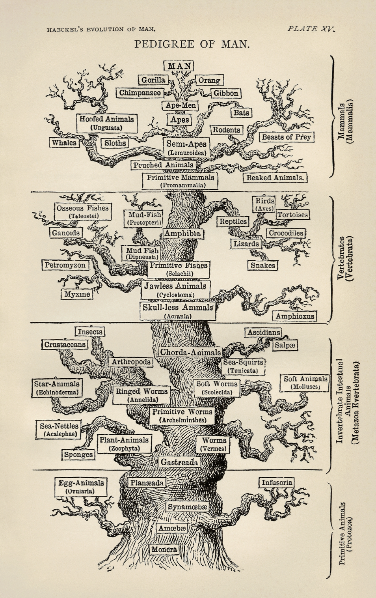

---
title: "Metagenomics Workshop NCGR"
site: bookdown::bookdown_site
documentclass: book
bibliography: [book.bib, packages.bib]
# url: your book url like https://bookdown.org/yihui/bookdown
# cover-image: path to the social sharing image like images/cover.jpg
description: |
  This is a minimal example of using the bookdown package to write a book.
  The HTML output format for this example is bookdown::gitbook,
  set in the _output.yml file.
link-citations: yes
github-repo: rstudio/bookdown-demo
---

# Community Profiling and Metagenomics

## Microbes were the first life forms on this planet

1. Earth declares its independence about 4600 MYA


{width=100%}
{width=100%}

2. First photosynthetic bacteria 3.4 billion years ago (BYA)
+ Used sunlight for energy to create biomass
+ Anaerobic (anoxic photosynthesis)

{width=100%}

{width=100%}

3. 2.7 BYA first oxygen producers emerge
+ Oxygen as waste product during respiration
+ Most of the oxygen was sequestered and not readily available
4. 2.3 BYA atmosphere has oxygen
5. 500 million year ago (MYA) first terrestrial plants
6. 200 MYA mammals emerged
7. 13 MYA one of us makes all of us proud by learning how to fly
8. 10 MYA the branch of life currently called homo emerges
9. 400 years ago humans observe the first microbe under
a simple scope

{width=80%}

https://education.nationalgeographic.org/resource/age-earth/#undefined


#### THERE WOULD BE NO LIFE WITHOUT MICROBES{-}

### Microbes enable habitability on Earth by catalyzing reactions of biogeochemical cycles

1. The amount or % of elements on Earth remains constant
2. Recycling of these elements, flux, and bio-availability is
largely taken care of by microbes
3. Best example to illustrate – nitrogen

+ 78% of Earths atm is N2
+ Required for important biological processes
+ In gaseous form it is unavailable
+ In fact many processes are N2 limited
+ Making N2 bioavailable in a form that can be
by eukaryotes is completely on the shoulders of microbes

#### Nitrogen Cycle
 
{width=80%}

https://cdn.britannica.com/37/6537-050-CF14602B/ammonia-Nitrogen-fixation-nitrogen-form-means-nitrates-1909.jpg

#### Carbon Cycle

{width=80%}

{width=80%}

https://www.pmel.noaa.gov/co2/story/Carbon+Cycle

How many microbes??

1. 40 million microbes in a gram of soil
2. One million microbes in a ml of fresh water
3. One trillion in a human body

#### MICROBES ARE ABUNDANT......AND EXTREMELY DIVERSE!{-}

## How many kinds of living beings are there?

1. Aristotle’s Scala naturae
= **350 BC**

{width=55%}
{width=40%}

https://sites.google.com/site/aristotlethebiologist/aristotle-s-biology/great-chain-of-being

{width=60%}

https://upload.wikimedia.org/wikipedia/commons/e/e9/Die_Leiter_des_Auf-_und_Abstiegs.jpg

2. 2000 yrs later

+ Edward Hitchcock
    + 1840
+ 

{width=80%}

https://upload.wikimedia.org/wikipedia/commons/8/8f/Edward_Hitchcock_Paleontological_Chart.jpg

+ Ernst Haeckel
    + 1879

{width=80%}

https://upload.wikimedia.org/wikipedia/commons/d/de/Tree_of_life_by_Haeckel.jpg

+ Charles Darwin 
    + 1837
    + The idea that species could have evolved from an ancestor
    + This could have happened through transmutations
    + Premise for trees today
    + ALL METHODS DEPEND ON **OBSERVABLE MORPHOLOGICAL TRAITS** FOR CATEGORIZATION

{width=80%}


## What happened when we found out about microbes?

{width=80%}

https://hms.harvard.edu/news/diet-gut-microbes-immunity

### Roadmap to where we are now with determining microbial diversity{-}

1. Leeuwenhoek
+ Father of microbiology
+ Late 1600’s
+ Microscope

{width=80%}

{width=80%}

2. Robert Koch
+ 1890
+ First time bringing microbes to the lab
+ Cultivation of microbes

{width=80%}

3. Discovery of DNA structure
+ Rosiland Franklin
    + 1951

{width=80%}

+ Frederick Sanger
    + 1975
    
{width=80%}

+ Carl Woese
    + 1977

{width=80%}

#### DNA Structure{-}

{width=80%}


## Tree of Life

{width=80%}

“Visible organisms represent the smallest sliver of life’s diversity. Bacteria are the true lords of the world. They have been on this planet for billions of years and have irrevocably changed it, while diversifying into endless forms most wonderful and most beautiful.” (The Atlantic)

Life just got weird!

{width=80%}

## What Makes Microbes so Special?

1. -15oC/4oF to 130oC/266oF temperatures
2. 0 to 12.8 pH acidity
3. More than 200 atm pressure
4. 4 miles deep into Earth’s crust
5. Up to 5kGy radiation

###  Grand Prismatic Spring – YNP – 183oC{-}

1. Validates the importance of microbes and sums up life on Earth with boundaries.

{width=80%}

2. Microbes are constantly trying to evolve and get deeper and deeper into the hot springs

3. Eukaryotes only surround this spring – cannot survive close to the hot spring

### The great “plate count” anomaly

1. Cultivation based cell counts are orders of magnitude lower than direct microscopic observation

{width=80%}

2. As microbiologists, we are able to cultivate only a small minority of naturally occurring microbes

3. Our nucleic acid derived understanding of microbial diversity has rapidly outpaced our ability to culture new microbes

### Total number of genomes at NCBI

1. Haploid genome
2. Single circular chromosome, plasmids
3. Metabolic diversity
4. Genetic malleability
5. No nucleus
6. Easy interspecies gene transfer

{width=80%}

https://www.ncbi.nlm.nih.gov/genome/browse/#!/overview/

## Roadmap to Culture Independent Techniques

1. rRNA as an evolutionary marker 
+ 1977 
+ (Woese and Fox, PNAS)
2. Polymerase Chain Reaction
+ 1985
+ (K. Mullis, Science)
3. “Universal Primers” for rRNA sequencing
+ 1985
+ (N. Pace, PNAS)
4. PCR amplification of 16S rRNA gene
+ 1989
+ (Bottger, FEMS Microbiol)
5. Curation and hosting of RDP
+ Early 1990’s
+ (rRNA database) FTP
6. Term ‘microbiome’
+ 2001
+ coined by Lederberg and McCray

## Microbiomes and their significance
+ Microbes do not work or function as a single entity
+ Most microbial activities are performed by complex communities of microorganisms
    + **Microbiome**

### What is a microbiome

1. Totality of microbes in a defined environment, and their intricate interactions with each other and the surrounding environment
+ A population of a single species is a culture(monoculture), extremely rare outside of lab and in some infections
+ A microbiome is a mixed population of different microbial species
+ MIXED COMMUNITY IS THE NORM!
 
### Why Study Microbiomes
 
1. Microbes modulate and maintain the atmosphere
+ Critical elemental cycles (carbon, nitrogen, sulfur, iron,...)
+ Pollution control, clean up fuel leaks
2. Microbes keep us healthy
+ Protection from pathogens
+ Absorption/production of nutrients in the gut
+ Role in chronic diseases (obesity, Crohn’s/IBD, arthritis...)
3. Microbes support plant growth and suppress plant disease
+ Most complex communities reside in soil
+ Crop productivity

### Why is Microbiome Research New?

1. Bias for microbes (especially pathogens) that are
cultivable
+ Culture-based methods do not detect majority of microbes
+ Only pathogens are easily detected
+ And most microbes are not pathogens
2. Availability of tools
+ Discovery of culture independent techniques
+ Amplicon sequencing and DNA sequencing


{width=80%}

{width=80%}

{width=80%}

1. Recovered over 150,000 microbial genomes from ~10,000 metagenomes

2. 70,178 genomes assembled with higher than 90% completeness

3. 3,796 SGBs (species-level genome bins) identified -77% of the total representing species without any publicly available genomes
 
### Microbiome Projects and Databases

1. American Gut Project
2. Earth microbiome Project
3. Human Oral Microbiome Database
4. CardioBiome
5. Human Microbiome Studies – JCVI
6. MetaSub – Metagenomics and metadesign of Subways and Urban Biomes
7. Gut microbiota for Health
8. NASA: Study of the impact of long term space travel in the Astronaut’s
microbiome
9. Michigan microbiome project
10. Coral microbiome project 
11. Seagrass microbiome project

## Structural and Functional Approaches to study microbiomes

{width=80%}

### 16S rRNA as an evolutionary chronometer

{width=80%}

1. Ubiquitous – present in all known life (excluding viruses)
2. Functionally constant wrt translation and secondary structure
3. Evolves very slowly – mutations are extremely rare
4. Large enough to extract information for evolutionary inference
5. Limited exchange – limited examples of rRNA gene sharing between organisms

### 16S rRNA vs rpoB (RNA polymerase β subunit gene)

{width=80%}

#### 16S rRNA hypervariable regions

{width=80%}

{width=80%}

Illustration of different hypervariable regions of 16S rRNA

## Basic Workflow for 16S Gene Based Sequencing

{width=80%}

## Addressing the ‘fine print’ while generating 16S rRNA gene amplicon libraries

1. Sample Collection
+ Sample collection significantly influences the microbiome profiler 
after sequencing
+ Sample storage
2. DNA isolation
+ Template concentration
+ Template extraction protocol
3. PCR amplification
+ PCR bias and inhibitors
+ Amplification of contaminants

J. Microbiol Methods (2018), App. Environ. Microbiol. (2014), Microbiome (2015)

## Steps Involved

1. Experimental Design: How many samples can be included in the sequencing run?
+ By using barcoded primers, numerous samples can be sequenced simultaneously (multiplexing)

{width=80%}

### Samples

1. More the number of samples, more cost effective the run (sequencing depth will be compromised)

Comparison of multiplexing capacity by sequencing system

{width=80%}

2. It is critical to have a ‘library prep manifest’ to document the position of each sample with its associated barcode along with additional metadata information

### Include Controls

1. Between run repeat (process any sample in duplicate per run to measure reproducibility across runs)
2. Within run repeat (process any sample in duplicate per plate to measure reproducibility)
3. Water used during PCR (water blank- to determine if any contaminant was introduced during PCR reaction)
4. Water spiked with known bacterial DNA (mock bacterial communities- enables quantification of sequencing errors, minimizes bias during sampling and library preparation )

### DNA extraction protocol

1. Effect of mechanical lysis methods for extraction
2. Presence of inhibitors such as organic matter, humic acid, bile salts, polysaccharides
3. DNA yield post extraction and reproducibility

Effect of bead beating was larger than sampling time over 5 months

{width=80%}

A. Percentage read abundance of the 11 most abundant phyla as a result of bead beating intensity 
B. PCA of samples with different bead beating intensities vs. samples taken at different dates

### Selection of primers and region of 16S gene influence microbial profile

V2, V4, V6-V7 regions produced consistent results

{width=80%}

1. V2, V3 and V6 contain maximum nucleotide heterogeneity
2. V6 is the shortest hypervariable region
with the maximum sequence
heterogeneity
3. V1 is best target for distinguishing
pathogenic S aureus
4. V2 and V3 are excellent targets for
speciation among Staph and Strep pathogens as well as Clostridium and Neisseria species
5. V2 especially useful for speciation of Mycobacterium sp. and detection of E coli O157:H7
6. V3 useful for speciation of
Haemophilus sp
7. V6 best target for probe based PCR assays to identify CDC select agents (bio-terrorism agents)

{width=80%}

### Purification of Amplicons

After one –step or two-step PCR, products are cleaned up using AMpure beads

{width=80%}

1. Gel Electrophoresis and quantification of cleaned amplicon products
+ Qubit
2. Sample pooling – equimolar concentrations (how many samples do you want to pool? How many reads per sample?
3. Gel extraction of pooled product
4. Final clean up (Qiagen kit) and QC

{width=80%}

[Amplicon Sequencing Library Prep - PacBio](https://www.pacb.com/wp-content/uploads/Multiplexed-Amplicon-Library-Preparation-Using-SMRTbell-Express-Template-Prep-Kit-2.0-–-Customer-Training.pdf)


#### Overview of generic amplicon workflow

{width=80%}


```
knitr::write_bib(c(
  .packages(), 'bookdown', 'knitr', 'rmarkdown'
), 'packages.bib')
```

